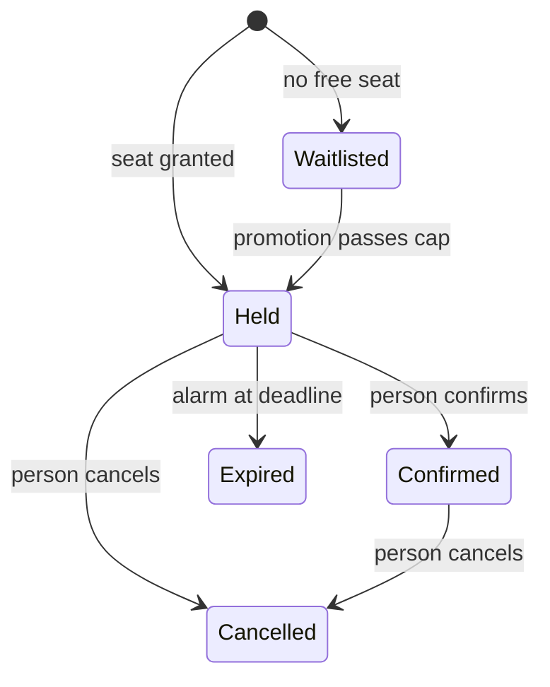

# Effect Endgame Starter Kit as the Full-Stack Exemplar - Plan

## Goal Capsule

- **Objective:** An engineer who clones `systemfsoftware/effect-endgame-starter-kit`, and an agent that visits its hosted site, get a full-stack Effect app and its Cloudflare deployment that beats every rat-stack bin and surface in a checkable way, and systemfsoftware's doctrine points at this app's worked example instead of `examples/inventory-fulfillment`.
- **Means:** Two verticals. systemfsoftware publishes the reusable runtime packages; Alchemy and its client `@distilled.cloud/cloudflare` are the whole Cloudflare stack (Ryan 2026-10-06), so there are no systemfsoftware Cloudflare resources. The starter composes them into one Worker on the current Cloudflare platform (Dynamic Workers, Containers, DO Facets, Artifacts, KV Instant, AI Search, AI Gateway, Email Service, Traces, Worker Previews; K2 and Basin once an Alchemy beta ships them), a CLI, and a worked example (workshop registration plus metered code-mode credits). systemfsoftware then deletes `examples/` and repoints its references.
- **Product authority:** Ryan Lee owns scope. Kiro (conductor) answers as co-partner. `repos/constitution/` is the law; where Effect idiom precedent (effect-torch, effect-solutions, rat-stack) conflicts with it, the constitution wins.
- **Execution profile:** Lakes in build order (see How This Work Fits Together). Each lake is one omp session shipped as a `gh stack` of PRs on trunk `main`, squash-merged. Every lake ships complete; nothing moves to a later list.
- **Open blockers:** None. Kiro holds the Cloudflare token and account ID, sets the CI secrets, files every private-beta access request, supplies the self-hosted runner labels at planning, and handles the npm bootstrap credential (see Dependencies / Assumptions).

---

## Product Contract

### Summary

The starter stops being a library seed and becomes the systemfsoftware-style rat-stack on the state-of-the-art Cloudflare platform: one Worker serving a TanStack Start app, Markdown-by-default pages and every agent surface; one contract per capability projected to seven surfaces (CLI, HTTP + OpenAPI, MCP, browser RPC, isolated code mode, A2A, gRPC); and a worked example that proves pure decisions hold under real concurrency on Cloudflare. It runs end to end from one local command and deploys from one command.

### Problem Frame

Agents write most code now, and they copy precedent. The strongest public precedent for an Effect + Alchemy app, rat-stack, is good and honest about its gaps: its own debt ledger counts 217 suppression directives (https://ratstack.sh/debt.md), its vision lists unproven claims (`VISION.md:105-107`: binding removal is not a type error, importing the stack is not proven inert, "No test swaps them yet"), its lifecycles branch outside any complexity gate (`packages/core/src/interest-machine.ts:232`), and its auth enables passwords (`packages/auth/src/auth.ts:13`, `packages/auth/src/devtools.ts:13`).

systemfsoftware has the opposite problem. Its doctrine is mechanised, but its exemplar is a separate example (`examples/inventory-fulfillment`) that runs on Node and Postgres, signs up with a password (`README.md:69`), and is not a product anyone uses, so nothing keeps it honest except its own tests. The starter's STRATEGY.md already says "No second exemplar: the starter is the exemplar" (`STRATEGY.md:39`), but the starter today is one `hello` function.

The gap: there is no app that is simultaneously the doctrine's reference, a live product, and a template, with every invariant carried by a gate.

---

### Key Decisions

- **Worked example is capacity-limited workshop registration, a live feature of the hosted site.** (session-settled: user-directed — chosen over two other offered domains: it is at least as hard as inventory-fulfillment and is a real flow.) Governs R1-R9.
- **Store: one SQLite Durable Object per workshop by default, Postgres SERIALIZABLE via Hyperdrive as a second adapter of the same port, deployable on PlanetScale Postgres; D1 holds identity only.** (session-settled: user-approved — chosen over D1 and DO-per-session: D1 has no interactive transactions; a per-session object cannot hold both contended rows. Deployability of the Postgres adapter: user-directed.) Governs R19-R24, R89.
- **The DO unit runs as `transactionSync(() => Effect.runSync(...))`.** Probe evidence: every `runPromise` variant oversold 3x, including one with no explicit gap, because Effect's auto-yield opens the input gate; an async gap inside `runSync` leaked 28 rows outside the transaction (`docs/brainstorms/.scratch/probe-results.md` section 2). Governs R20, R22.
- **Lifecycles are cells over tagged unions; no XState.** (session-settled: user-approved — chosen over XState and "both": XState guards escape the CC=1 gate and re-derive state by presence.) Governs R5, R10.
- **Durable orchestration uses Effect core `effect/workflow` on an owned DO-backed `WorkflowEngine`, re-confirmed against Workflows V2.** (session-settled: user-approved.) Workflows V2 allows 300 creates/s per account but 100 creates/s per workflow; every registration and execute starts one instance of the same workflow, so the register path would queue past 100/s while the race demo alone sends 300. The DO engine has no create ceiling and maps Effect's seam one-to-one; a V2 adapter would specify `DurableDeferred`, interrupt and resume twice. Dynamic Workflows is a tenant-routing library, not an engine. Governs R10-R14, R73.
- **Cross-workshop cap lives in one Allowance DO per person, joined by a register workflow.** (session-settled: user-approved — chosen over a single global DO: one object caps the whole site at roughly 500-1,000 req/s; the probe measured ~850 claims/s.) Governs R3, R11.
- **Second capability is metered code-mode credits.** (session-settled: user-directed.) Governs R15-R18.
- **Every projection ships: CLI, HTTP + OpenAPI, MCP, browser RPC, code mode, A2A and gRPC; the agent front door is its own bin.** (session-settled: user-directed.) gRPC is served as Connect/gRPC-web over the Worker's HTTP path only, in every environment. Ryan 2026-10-06: Alchemy + distilled are the whole Cloudflare stack. Native gRPC through the Worker `connect` handler behind a Spectrum application is out of the template: neither Alchemy nor distilled supports Spectrum-to-Worker TCP, and a template with no credentials cannot prove it. Governs R26-R33, R96.
- **Web: TanStack Start + React 19 + React Compiler in the one Worker, built by `Cloudflare.Website.Vite` with a custom `main`, without `@cloudflare/vite-plugin`.** (session-settled: user-directed; the plugin swap is a probe finding Kiro accepted — Alchemy's TanStack guide says it is "not compatible".) Governs R41, R53-R56, R117, R118.
- **Passwordless only: Better Auth on D1 with email OTP, magic link and passkey.** (session-settled: user-directed.) Governs R34-R39.
- **Runtime libraries live in systemfsoftware as published packages; the starter holds the app and thin bins at exact pins.** (session-settled: user-directed.) Governs R70-R76.
- **Abuse is bounded by email ownership, exact per-email counters in the identity store, the Workers Rate Limiting binding as the coarse throttle, and the per-person cap; the model-scored intake is cut.** (session-settled: user-directed — chosen over porting `packages/intake-live`'s abuse score.) The binding is "permissive, eventually consistent, and intentionally designed to not be used as an accurate accounting system", so it cannot carry an exact bound. Governs R40, R108.
- **Analytics is its own bin on Workers Analytics Engine, with no cookie.** (session-settled: user-directed — chosen over folding analytics into traces.) Governs R57-R58.
- **Peer discovery is kept and beaten.** (session-settled: user-directed — chosen over cutting it: staying at the frontier is in purpose.) Governs R61-R62.
- **Handlers run only in workerd; the CLI is a contract-derived client of a target Worker.** One isolate engine for code mode on every surface; `node:vm` is "not a security mechanism" (nodejs.org/api/vm.html), and DO-backed capabilities cannot run in Node anyway. Governs R26, R31.
- **Agents act for a person through OAuth 2.1 per the MCP authorization spec, backed by the same passwordless identity; the CLI signs in by device authorization.** Better Auth 1.7.7 ships `device-authorization` and `@better-auth/oauth-provider`. Governs R37-R38.
- **Credits use reserve, execute, settle, with hold expiry** — the registration pattern reused, which is the generalisation proof. Governs R15-R17.
- **Preview releases are npm snapshot versions under a PR dist-tag through sfs's existing OIDC publish path.** Effect itself publishes `0.0.0-snapshot-<sha>` under a `snapshot` tag; pkg.pr.new was rejected because its tarballs sit outside npm provenance and the release-age policy, and it needs an org app install. Governs R71.
- **Code mode is a Dynamic Worker with a deny-by-default Outbound Worker and a DO Facet per stateful program.** (session-settled: user-directed.) Probe: `globalOutbound: null` makes `fetch` throw; a `WorkerEntrypoint` with an allow-list in props returned 200 for the allowed host and 403 otherwise; facets gave each program its own persisted SQLite. Governs R31, R81.
- **Heavy jobs run in Containers driven from a Durable Object through native `ctx.container` when deployed; locally the same image runs as a process-compose service.** (session-settled: user-directed.) The faster start, image and instance choice, and snapshots exist only on `ctx.container`; the `Container` class is frozen after 2026-12-31. Probe (`docs/brainstorms/.scratch/probe-containers-artifacts-previews.md` section 1): under `alchemy dev` on this host a Durable Object-started container never runs (`Container failed to start`; netavark cannot set sysctls in the nested host), so exec and snapshot are unreachable locally, while the same image runs and execs under podman directly. One image, two runtimes; not an off switch. `@cloudflare/computer` is evaluated and not adopted: its docs say "APIs are unstable and the design is subject to change", which exact pins cannot hold. Governs R63, R82, R83.
- **Forge generates typed client SDKs, a reference CLI and API docs from our OpenAPI in CI; our kernel keeps the projections.** Forge consumes OpenAPI only and generates clients and MCP servers from it, but not Cell handlers, failure channels, A2A, gRPC or code-mode catalogs from Effect schemas. Governs R97.
- **The agent front door uses an Effect-native session store, not Agent Memory or Project Think.** Agent Memory is private beta and Think is experimental ("may evolve before Think graduates out of experimental"); the front door is request/response capabilities, not a chat harness, and both would put unversioned behaviour behind exact pins. Governs R101.
- **x402 / HTTP 402 is implemented natively in the agent front door (Effect, typed), settling against a public testnet facilitator by default; Monetization Gateway becomes a second adapter of the same payment port once access exists.** (session-settled: user-directed — chosen over waiting for Monetization Gateway, which is closed beta and U.S.-only with no testnet mode.) Governs R102-R104.
- **The site and mail sender run on `endgame.systemfsoftware.com`, a subdomain of Ryan's `systemfsoftware.com` zone, with Alchemy owning the DNS and Email records.** (session-settled: user-directed — chosen over `workers.dev`, which blocks Email Service to arbitrary recipients and every zone feature.) Governs R52, R112.
- **Exactly-once confirmation is our job: a transactional outbox in the DO, at-least-once delivery, and a per-confirmation dedupe key carried as `Message-ID` and an idempotency header.** (session-settled: user-directed — chosen over accepting duplicates or adding a second mail provider, because Email Service has no idempotency key.) Governs R8.
- **Private-beta products stay in scope with no off flag and no fallback design.** (session-settled: user-directed.) Planning sequences each beta-dependent item last in its lake, and Kiro escalates the exact access state if it has not landed by then. Worker Previews left this list: Cloudflare's changelog (2026-09-22) and docs (updated 2026-09-24) ship it to every plan with no access request. Governs R52, R84, R96, R99, R103.
- **Audit rows and capability receipts are signed with ML-DSA-65 through Workers Web Crypto.** Probe: Alchemy beta.80 ships workerd 1.20260918.1, which rejects the flag (`ConfigError: No such compatibility flag: webcrypto_modern_algorithms`); overriding workerd to 1.20261005.1 plus the flag signed and verified (3309-byte signature). Governs R105, R106.
- **Ryan 2026-10-06: Alchemy + distilled are the whole Cloudflare stack.** Every Cloudflare product the stack uses is an Alchemy resource (emulated by Alchemy) or a `@distilled.cloud/cloudflare` call; nothing is our own Cloudflare client or a dashboard step. sfs-alchemy checked the gaps against alchemy 2.0.0-beta.81 and distilled 1.0.0-rc.13 source (R110). Governs R51, R52, R57, R58, R60, R90, R103, R110.
- **The Cloudflare state-of-the-art bar is user-directed scope.** (session-settled: user-directed — Kiro's 26-item bar, Ryan: "Spare no expense"; chosen over cutting items that have no current consumer.) It is the source of R81-R112 and of the edits it folded into earlier requirements, among them Flagship flags, `forkKit` on Artifacts, Auto Router and User Insights, and the Web Search capability. Governs R81-R112.
- **Erasure is crypto-shredding: PII is encrypted under a per-person key, signed rows commit to the ciphertext's hash, and erasure destroys the key.** (session-settled: user-directed — chosen over deleting or rewriting signed audit rows, which would break the one-signed-row-per-decision invariant.) Governs R115, R116.
- **The human home page leads with the reader's problem and the result, then the proof, then how to start.** (session-settled: user-directed — chosen over deferring the page to Starter Lake 7 planning.) Governs R117, R118.
- **`forkKit` reaches Artifacts through one Effect port: the Artifacts binding when deployed, a git-compatible stand-in locally.** (session-settled: user-directed.) Probe (`probe-containers-artifacts-previews.md` section 2): Alchemy's local runtime binds Artifacts only remotely, and without credentials `create` and `import` fail with `WebSocket connection failed.` Governs R87, R88, R120.

---

### Actors

- A1. Adopter engineer: clones the kit, runs it, deletes example bins, builds an app.
- A2. Person: a visitor who signs in passwordless, registers for workshops, spends credits.
- A3. Agent: an MCP, A2A, HTTP, CLI or code-mode client, anonymous for public capabilities or acting for a person by OAuth consent.
- A4. Operator (Ryan): creates workshops and sessions, grants credits, deploys.
- A5. Coding agent: an omp session building in the repo under the harness.
- A6. systemfsoftware doctrine owner: owns compound packs, lint plugins and presets.

---

### Requirements

**Worked example: workshop registration**

- R1. A workshop has sessions; each session has a seat capacity and a FIFO waitlist.
- R2. A person requests N seats in one session and gets a decided outcome: seated K held seats, W waitlisted, and the remainder refused by the cap, with a typed refusal when nothing is granted.
- R3. A person may occupy at most C seats across all workshops; held and confirmed seats count, waitlisted entries do not.
- R4. A held seat expires unless the person confirms it before its deadline.
- R5. Registration state is a closed tagged union (`Held{expiresAt}`, `Confirmed`, `Waitlisted{position}`, `Cancelled`, `Expired`) with each transition a Cell whose decision has complexity 1.
- R6. Cancelling or expiring a seat promotes the next waitlisted entry, which must itself pass the cap; an entry blocked by the cap is skipped and keeps its place.
- R7. Every committed decision writes exactly one audit row.
- R8. Each hold's confirmation is written to a transactional outbox in the same DO unit as the decision, with one dedupe key per confirmation; the outbox delivers at least once through Cloudflare Email Service, carrying the key as `Message-ID` and an idempotency header, and a crash-between-send-and-ack test shows the person's mailbox collapses to one confirmation.
- R9. An agent-submitted registration creates a hold that only the person can confirm.

**Durable orchestration**

- R10. Every multi-step or long-running process (hold expiry, promotion, confirmation delivery, the register and promote cross-object steps, credit reservation expiry) runs as an `effect/workflow` workflow, and each deciding step is a Cell.
- R11. Register runs reserve on the person's Allowance DO, then seat on the Workshop DO, then confirm the reservation or release the unused part as compensation.
- R12. Workflows survive a workerd crash mid-workflow: resumed activities are not duplicated past their idempotency key.
- R13. Timers are DO alarms; alarms fire under `alchemy dev` and after a killed runtime (probe: fired 229 ms after due on restart).
- R14. A mermaid transition diagram is generated from the typed transition table, published on the example's lore page, and CI fails when it is stale.

**Metered code-mode credits**

- R15. Each account has a credit balance; sign-up grants an initial amount and the operator can grant more.
- R16. Each sandbox execute reserves its maximum cost, runs within that budget, settles the actual cost, and releases the rest; an unsettled reservation expires and returns its credits.
- R17. A balance is never negative under concurrent executes, and an execute that cannot reserve is refused with a typed refusal.
- R18. Every charge writes one ledger row, and grants equal balance plus settled charges at all times.

**Stores, adapters and proof**

- R19. Registration and credits each sit behind one store port with a DO SQLite adapter (deployed default) and a Postgres SERIALIZABLE adapter (local via process-compose, deployable on PlanetScale Postgres through Hyperdrive, R89).
- R20. The DO adapter's unit of work refuses every read and write after its transaction callback returns, and refuses any async step inside it.
- R21. One shared law and race suite runs over both adapters, selected by one value, which closes rat-stack's "No test swaps them yet" (`VISION.md:107`).
- R22. A test against real workerd goes red when an await or yield is injected inside the DO unit and green on the `transactionSync` adapter, named as the DO form of pin-dependency-semantics.
- R23. Negative controls ship as tests that must fail their checks: the split-sandwich DO variant, Postgres at READ COMMITTED, and register without the Allowance step (seat first, count later).
- R24. A race demo drives real concurrent requests through local workerd, through the Postgres adapter locally and on PlanetScale, and against the deployed Worker, prints one `ok`/`FAIL` verdict per check (every request decided; cap filled exactly and held; every seat counted once; no seat lost or double-assigned; seated equals reservations; one audit row per decision; FIFO promotion; one confirmation per hold; balance never negative), and exits non-zero on any FAIL.
- R25. Concurrency is also checked by linearizability against a pure model (`@systemfsoftware/conformance-spec`), workflow interleavings by `@systemfsoftware/effect-sim-kernel`, and command-sequence model tests that include the alarm path under real workerd.

**Contracts and projections**

- R26. Every capability is one contract (input, output, failure schemas) and one handler that is a Cell; handlers execute only inside the Worker.
- R27. Every capability is projected to CLI, HTTP + OpenAPI, MCP, browser RPC, code mode, A2A and gRPC, with no hand-written surface.
- R28. Differential tests run the same generated inputs through every projection and require the same outcome and failure tag.
- R29. MCP implements the 2026-07-28 specification (stateless, no `initialize`, `Mcp-Method`/`Mcp-Name` headers, MRTR, CIMD client registration), negotiates earlier revisions for legacy clients, exposes Code Mode `search` and `execute` tools beside per-capability tools, and is reachable through Cloudflare MCP server portals.
- R30. A2A exposes every capability as a skill in an agent card that validates against the A2A schema.
- R31. Code mode runs agent programs in a Dynamic Worker on every surface, including the CLI and local dev, with egress denied unless the capability's allow-list names the host. A program's environment holds only the capability's tool stubs, which meter and rate-limit, and its own Facet; tests prove that `fetch` and `connect` throw for anything else and that every other binding is unreachable.
- R32. Capability results carry next-action links, proven by tests (rat-stack's `VISION.md:110` lists this as unproven).
- R33. The CLI derives its commands from contracts, targets local dev by default or a deployed URL, and offers an MCP stdio bridge to the same Worker.

**Identity and abuse bounds**

- R34. Sign-in is email OTP, magic link or passkey; no password route exists, and the password sign-up endpoint answers 400 (probe section 4).
- R35. Identity lives in D1 through Better Auth and holds no contended invariant.
- R36. Tests sign in by reading a real OTP from a local mail sink.
- R37. Agents act for a person only through OAuth 2.1 consent per the MCP authorization spec.
- R38. The CLI signs in through device authorization.
- R39. Deployed mail goes through the Cloudflare Email Service `send_email` binding behind the delivery port, and the local mail sink receives the same messages under `alchemy dev`.
- R40. Per-email bounds on OTP sends and registrations are exact: an atomic counter in the identity store decides them. The Workers Rate Limiting binding (`Cloudflare.RateLimit`) is the coarse throttle on public capabilities, keyed by account or email, never by IP or location. Both results are read-phase data into the pure decision; a test under `alchemy dev` shows the fourth call within a 3-per-minute limit refused (probe: true, true, true, false, false), and a test shows concurrent requests for one email never pass the exact bound.

**Hosted front door**

- R41. The one Worker answers Markdown by default and HTML on `Accept: text/html`, with Markdown and agent routes ahead of the app router.
- R42. The Worker serves `llms.txt`, `llms-full.txt`, `/openapi.json`, `/mcp`, `/a2a`, and discovery documents (agent card, api-catalog, `mcp.json`, agent-skills index, robots, sitemap), each validated against its published schema in CI.
- R43. Skills are served at `/skills/<name>` and `/.well-known/agent-skills/<name>/SKILL.md`, and CI installs every skill with `npx skills add` against the local Worker.
- R44. The site serves lore pages (constitution articles, a pack-rule-to-code map, the example page with its generated diagram) as a content graph with `search`, `read`, `backlinks`, `neighbors`, `mentions` and `path` capabilities projected like any other.
- R45. Code quotes on pages are resolved by symbol from the current commit, and the build fails when a cited symbol is missing.
- R46. `/debt.md` is generated from every suppression directive in tracked source (lint, Effect diagnostics, TypeScript, mutation), and the build fails unless the count is zero.
- R47. `/pins.md` lists every resolved version from the lockfile with its release-age exclusion, and CI fails when a page names a version that differs from the lockfile.
- R48. `/log.md` lists changes newest first, each linked to its PR and CI run.
- R49. `/systems/<bin>` pages are generated from each bin's manifest: job, contracts, the gates that prove it, and its removal checklist.
- R50. Each page has a generated social preview image.
- R51. In adopter repos, CI scores the PR preview with Cloudflare's Agent Readiness check, calling distilled's URL Scanner client (v2 scan, `agentReadiness: true`), and requires 100. There is no resource of our own, and the check doesn't run in the template, which holds no credentials.
- R52. The stack creates, for `endgame.systemfsoftware.com`, the DNS records, DNS agent-discovery records (`_a2a._agents`, `_mcp._agents`, `_index._agents`), Email Service sending records, Markdown for Agents, Redirects for AI Training, shared-dictionary delta compression for static assets, and Cloudflare's WebMCP toggle beside our own WebMCP tools. No Spectrum application (Ryan 2026-10-06, R110).

**Web app**

- R53. Pages for workshops, registration, my registrations, credits and a code playground use file-based routing, streaming SSR, typed loaders over the RPC projection, auth-gated routes and typed forms.
- R54. Client state uses `@systemfsoftware/effect-atom` and `effect-atom-react`.
- R55. Components carry `@systemfsoftware/storybook-gherkin` specs.
- R56. Every page meets WCAG 2.2 AA and is mobile-first, verified by Playwright on its own cookie jar, including every documented flow.
- R117. The HTML home page, signed out, leads with the reader's problem and the result (agents write code that compiles, passes and still throws away the invariants; this kit makes the right shape the only shape that passes CI), then the proof (live counts from the race demo, the debt ledger at zero, the Agent Readiness score), then the one-command run, connect-an-agent (MCP and skills) and the workshops. Signed in, it shows the person's registrations, holds with countdowns, the credit balance and top-up.
- R118. Site copy states the reader's problem and the result first and the technology second, and review checks every page against this rule.

**Analytics and observability**

- R57. An analytics bin records request facts as declared, redacted dimensions in Workers Analytics Engine for live counters, sets no cookie, and stores no PII. History in Basin (Pipelines into an Iceberg table in Basin Catalog) is added as an Alchemy resource once the Alchemy bump that ships Basin lands (R110). No unit that has to land now uses Basin.
- R58. `/systems/analytics` shows live counts from the Analytics Engine SQL API, and historical series from Basin SQL once Basin lands (R57, R110).
- R59. Every surface emits OpenTelemetry spans declared in `@systemfsoftware/trace-taxonomy`, checked by `@systemfsoftware/trace-spec` tests.
- R60. Deployed traffic is traced end to end by Cloudflare Traces (rules, cache, Worker, DO, origin) with OTLP export, Workers Logs are on, local dev records traces in a collector with a trace UI, and Workers Issues stays on through Alchemy's Worker settings. Issues automations (webhooks that open GitHub issues) are out of the template (Ryan 2026-10-06, R110).

**Frontier and gardening**

- R61. A Deno + JSR `@std` script finds public repos on the exact Effect, Alchemy and TanStack pins through the GitHub code search API, ranks each peer by a usefulness tier citing the source line that earned it, and a scheduled job in this repo opens a dated findings issue or PR here only.
- R62. The site serves `/peers` generated from the latest run, and the `gardener` skill turns each bad pattern found into a lint rule before cleanup.

**Local run, CI and release**

- R63. One command starts the whole stack with readiness probes and no cloud credentials: `alchemy dev` (Worker, DOs, Facets, D1, KV, R2, Worker Loader, rate limits, email), Postgres, the heavy-job service (R83), the Artifacts stand-in (R120), the mail sink and the collector; CI's end-to-end jobs start the same definition.
- R64. One command deploys every resource with secrets from Secrets Store and a resource-scoped, scannable (`cfat_`) deploy token; tests prove that importing the stack deploys nothing and that removing a binding is a type error (rat-stack `VISION.md:105-106`, unproven there).
- R65. Each PR gets a Worker Preview. Cloudflare isolates only Durable Object and Container state per Preview, so the preview stack creates and binds its own D1, KV, R2, Hyperdrive config, Rate Limiting namespace and mail sink; CI runs the full Playwright QA, the race suite and the Agent Readiness check against it, posts the preview URL on the PR, and deletes the preview and every preview resource when the PR closes.
- R66. Mutation testing runs only at the release gate on `main`, sharded per package on the existing self-hosted fleet runners Ryan's repos use; `pnpm check:ci` no longer runs it (today it does, `package.json` `check:ci`).
- R67. Lint runs at `error` only with no `off` or `warn` overrides, removing today's two `off` overrides (`packages/starter/oxlint.config.ts:18,23`).
- R68. Each bin has a removal checklist, and a CI matrix deletes each bin and requires the build to stay green.
- R69. A cold-clone acceptance adds a throwaway capability and checks it on all seven projections, adds a lifecycle and a store adapter, and removes a bin.

**systemfsoftware runtime vertical**

- R70. Reusable runtime code is published from systemfsoftware under sfs doctrine (gates, schema laws, conformance specs, mutation floors at the release gate).
- R71. sfs PRs publish snapshot versions under a PR dist-tag through the OIDC publish path, and starter branches pin them exactly; no `link:`, `file:` or workspace hack.
- R72. Packages: `@systemfsoftware/effect-contract` (contract, Cell-shaped handler, one subpath entry point per projection, with gRPC/protobuf and A2A in separate packages because they bring heavy dependencies, confirmed by bundle numbers in planning), `@systemfsoftware/agent-front-door` (negotiation, `llms.txt`, discovery documents, skills, WebMCP, x402, Dynamic Worker sandbox with egress allow-list), `@systemfsoftware/effect-unit-of-work` (DO and Postgres adapters, law harness, input-gate kit), `@systemfsoftware/effect-workflow-durable-object`, `@systemfsoftware/debt-ledger`, `@systemfsoftware/transition-diagram`.
- R73. The DO `WorkflowEngine` passes Effect's own `WorkflowEngine` suite (`repos/effect/packages/effect/test/workflow/WorkflowEngine.test.ts`) ported to run in workerd, plus crash/resume and compensation suites.
- R119. The owned `WorkflowEngine` serializes events per execution: a single run loop guarded in the execution DO's storage, so a cross-object await cannot interleave two events of one execution. A workerd test injects concurrent resume and deferred-done events during a cross-object activity and proves one-at-a-time processing and no activity duplicated past its idempotency key.
- R74. sfs presets accept Gherkin step bodies and build-config files without per-repo `off` flags.
- R75. The starter consumes `@systemfsoftware/*` at exact pins, each with an exact `minimumReleaseAgeExclude` entry; `effect`, `@effect/*`, `effect-agent` and `@effect-agent/*` are name patterns there.
- R76. The starter adopts every sfs package that fits an app (see Superiority Map) and states the reason for each one it does not.

**systemfsoftware examples deletion**

- R77. sfs deletes `examples/` and repoints every live reference to the starter: `pnpm-workspace.yaml:118`, `README.md:297,308`, `STRATEGY.md:87`, `compound-packs/schema-laws/data-only-schema-classes.md:37`, `compound-packs/schema-laws/refusals-beside-generated-laws.md:50`, `compound-packs/cell-architecture/store-serializable-unit-of-work.md:13`, `.claude/hooks/guard-protected-writes.ts:33`, `packages/oxlint-presets/oxlint-config-recommended/src/index.ts:56`, `packages/toolchain/tsconfig/README.md:42`, the fixture paths in `trace-test-requires-taxonomy.test.ts:16,87,126`, and four `docs/solutions/` entries with `component: example-inventory-fulfillment`.
- R78. The starter publishes a pack-rule-to-code map covering every rule of the cell-architecture, boundary-testing and schema-laws packs before the deletion starts.
- R79. DO variants of the unit-of-work and pin-dependency-semantics rules are authored in the packs by the doctrine owner, not by the session that builds the example.
- R113. The deletion PR adds an explicit allow-list file naming the frozen sfs `docs/plans/` files that keep historical references; history is not rewritten.

**Strategy**

- R80. STRATEGY.md is updated per the Strategy Change section through `ce-strategy`.

**Compute and isolation**

- R81. A stateful sandboxed program gets its own DO Facet with its own SQLite, deleted when the program's lifetime ends.
- R82. When deployed, the e2e suite, the race demo against Postgres, and the fork-the-kit check run in Containers started from a Durable Object through `ctx.container`, choosing image and instance type and resuming from filesystem snapshots; image choice, instance type and snapshots are deployed-only.
- R83. Locally, the same jobs run in a process-compose service that runs the same image, by the digest CI built and pushed, under the host's container engine (podman here). The race demo's local leg and the e2e jobs use this service; the deployed path stays Containers. Probe: a Durable Object-started container never runs under `alchemy dev` on this host, and local image builds fail on its vfs storage.

**Storage, config and events**

- R84. Read-mostly config (Flagship feature flags, pins, rendered `llms.txt`, skills index) lives in Workers KV Instant, written at deploy.
- R85. Feature flags are Flagship flags read through the binding and evaluated as read-phase data.
- R86. Assets, generated images and job artifacts live in R2.
- R87. A `forkKit` capability, on every projection, forks the starter into an Artifacts repo through the Artifacts port (R120) and runs `pnpm check:ci` on the fork in the heavy-job runtime (R82, R83), returning the verdict and the repo's Git remote.
- R88. A fork only reports green when the check ran on that fork's exact commit.
- R120. `forkKit` reaches Artifacts through one Effect service port: the Artifacts binding when deployed, a git-compatible stand-in behind the same interface locally. The fork is an `.import()` of the public GitHub repository, and the token it uses is short-lived, held in Secrets Store, rotated by a workflow, and never a plain environment variable.
- R89. The Postgres adapter deploys on PlanetScale Postgres through Hyperdrive from the Alchemy stack, and the shared law and race suite runs against the deployed database.
- R90. Domain events (registration decided, confirmed, cancelled, expired, promoted; credits reserved, charged, released, topped up) are published to a K2 stream, one event per committed decision, once the Alchemy bump that ships K2 lands (R110). Until then, no unit that has to land now uses K2.

**AI**

- R91. Site search over lore, skills and docs is an AI Search instance with hybrid retrieval, exposed as the `search` capability on every projection.
- R92. Inference goes through AI Gateway with the Workers AI binding, uses Auto Router for open-ended model calls, and reports per-user usage to User Insights.
- R93. Bounded classification (abuse triage on registration and sign-in) uses a Clef model whose label enters the read phase as data; the pure decision never calls a model, and a negative control shows the cap and rate limits hold when the label is wrong.
- R94. The agent front door exposes the Cloudflare Web Search API as a capability.

**Agent surfaces**

- R95. The site registers every page-relevant capability as a WebMCP tool generated from its contract, so in-browser agents call capabilities on the page itself.
- R96. Protobuf definitions are generated from capability schemas, and the gRPC projection serves the same handlers with the same failure tags.
- R97. Forge generates typed client SDKs, a reference CLI and API docs from the OpenAPI document in CI, and a test calls one capability through each generated SDK.
- R98. Authenticated MCP tools publish RFC 9728 protected-resource metadata and use OAuth with passwordless sign-in only.
- R99. Each MCP tool is classified read or write, and write tools require per-tool approval through WriteGuard policies on the MCP server portal.
- R100. Markdown responses carry token-count and content-signal headers matching Cloudflare's Markdown for Agents format.
- R101. The front door keeps agent session state in an Effect-native store with the same law suite as other stores.

**Money**

- R102. An agent tops up credits by paying an HTTP 402 x402 challenge served natively by the agent front door; the default settlement is a public testnet facilitator (Base Sepolia through the x402.org facilitator). Credits are granted only after a successful facilitator settle whose payer, amount, asset and pay-to address match the challenge the front door issued, keyed once on the EIP-3009 authorization nonce, and a test proves that a replayed or altered payment payload grants nothing.
- R103. Monetization Gateway is a second adapter of the same payment port once access exists. Without access there is nothing to build, and x402 stays the payment path (R102, R110).
- R104. A top-up is a reservation-free credit grant decided by a Cell, recorded once per settled payment, and the never-negative invariant and its race checks are unchanged.

**Security**

- R105. Every audit row and capability receipt is signed with ML-DSA-65 using Workers Web Crypto under `webcrypto_modern_algorithms`.
- R106. Signature verification is a capability on CLI, HTTP and MCP.
- R107. Every secret lives in Secrets Store and is bound, never inlined.
- R108. Abuse bounds are email ownership, the exact per-email counters and the Rate Limiting binding (R40), and the per-person cap; Account Abuse Protection is not available on this account (Bot Management Enterprise only).
- R114. Every HTML response carries a nonce-based strict Content-Security-Policy (`'strict-dynamic'`, no `'unsafe-inline'`, no `'unsafe-eval'`) and Trusted Types (`require-trusted-types-for 'script'`); violation reports go to the observability bin (R59, R60), and the Playwright suite asserts the policy and zero violations on every HTML route.
- R115. Retention: OTP codes expire after 10 minutes; sessions last 30 days, rolling; accounts never verified are purged after 7 days; outbox and mail-sink messages are purged 30 days after delivery; workshop data, registrations and the audit trail are kept for 2 years after the workshop ends; capability receipts carry a `not-after` of 1 year. A test proves each one.
- R116. Erasure is crypto-shredding: a person's PII fields (email, display name) are stored encrypted under a per-person key wherever they are stored, each signed audit row commits to the ciphertext's hash so its ML-DSA signature stays valid, and erasure destroys the key and tombstones the identity, leaving the row verifiable and anonymous. An `erase` capability ships on CLI, HTTP and MCP, and a test proves that after erasure no read path returns the PII and every signature still verifies. Analytics holds no PII by construction (R57).

**Delivery and ops**

- R109. The `cf` CLI is the documented path for any operation Alchemy does not own, and the documented local-data path under `alchemy dev` is the `cf` CLI plus the devtools bin (Local Explorer is Wrangler-only; probe returned 404).
- R110. Ryan 2026-10-06: Alchemy + distilled are the whole Cloudflare stack. No systemfsoftware Cloudflare resources, and no client of our own. sfs-alchemy checked each gap against alchemy 2.0.0-beta.81 and `@distilled.cloud/cloudflare` 1.0.0-rc.13 source:
  - K2 streams and Basin namespaces and tables are in neither yet. They arrive through the normal Alchemy bump once alchemy-run/alchemy#2010 is in a published beta past release age, as Alchemy resources emulated by Alchemy. Until then, no unit that has to land now uses either.
  - Agent Readiness is covered by distilled's URL Scanner client (v2 scan, `agentReadiness`).
  - Monetization Gateway is R103's second payment adapter once access exists. With no access there is nothing to build, and x402 stays the payment path.
  - Workers Issues automations and Spectrum-to-Worker inbound TCP are out of the template. Neither Alchemy nor distilled supports them, and a template with no credentials cannot prove them. Workers Issues stays on through Alchemy's Worker settings, and gRPC uses only the Worker's HTTP path (Connect/gRPC-web).
- R111. workerd is pinned to 1.20261005.1 by an exact override with a single exact-version `minimumReleaseAgeExclude` entry, the Worker sets `webcrypto_modern_algorithms`, CI fails when a flag is unknown, and the Lake 8 deploy check proves the deployed runtime accepts the flag.
- R112. The site and mail sender serve from `endgame.systemfsoftware.com`.

---

### Superiority Map

Each row: rat-stack today, our equivalent, and the checkable way ours beats it. "Cell" means the handler is a five-phase Cell with a CC=1 decision.

| rat-stack bin / surface                                                                                | Ours (sfs packages)                                                                                                          | Checkably better                                                                                                                                               |
| ------------------------------------------------------------------------------------------------------ | ---------------------------------------------------------------------------------------------------------------------------- | -------------------------------------------------------------------------------------------------------------------------------------------------------------- |
| `packages/capability` (5 projections, per-projection tests)                                            | `effect-contract`, `effect-cell-types`, Forge for client SDKs                                                                | Seven projections incl. A2A and gRPC, differential parity tests across all, generated SDKs tested (R27, R28, R96, R97); no casts (rat-stack `implement.ts:55`) |
| `apps/cli` (Node handlers, `node:vm` subprocess sandbox)                                               | CLI bin over `effect-contract`                                                                                               | One isolate engine everywhere; device-flow identity (R31, R33, R38)                                                                                            |
| `apps/mischief` + `apps/web` (two Workers, `env.BACKEND.fetch`, `backend.ts:7`)                        | One Worker, `agent-front-door`                                                                                               | One deployable, one trace, one auth context (R41)                                                                                                              |
| Agent front door "Coming" as a cartridge (`VISION.md:101`)                                             | `agent-front-door` package                                                                                                   | Shipped and reused; discovery docs schema-validated (R42)                                                                                                      |
| MCP `/mcp` + `LegacyMcp` DO                                                                            | MCP projection on the 2026-07-28 spec, Code Mode tools, portals                                                              | Same protocols plus RFC 9728 OAuth, per-tool write approval, Code Mode search/execute (R29, R37, R98, R99)                                                     |
| A2A: one hand-built Q&A skill (`a2a.ts:55`)                                                            | A2A projection                                                                                                               | Every capability a typed skill (R30)                                                                                                                           |
| No WebMCP, no gRPC                                                                                     | WebMCP tools and gRPC projection from the same contracts                                                                     | In-page agent tools and a protobuf contract generated from schemas (R95, R96)                                                                                  |
| Code mode: Worker Loader hosted, `node:vm` in CLI; per-IP rate limits                                  | Dynamic Worker, deny-by-default Outbound Worker allow-list, DO Facets, credits                                               | Same isolate on every surface, per-capability egress, per-program SQLite, metered and never negative (R16-R17, R31, R81)                                       |
| No heavy-job runtime; no fork flow (`gh repo create --template` in README)                             | Containers via `ctx.container` deployed, the same image as a process-compose service locally; `forkKit` on an Artifacts port | One call forks the kit and proves the fork green (R82, R83, R87, R88, R120)                                                                                    |
| `packages/core` XState machines (`interest-machine.ts:232` if-chain, `:303` I/O between transitions)   | Registration + credits bins; `effect/workflow`                                                                               | CC=1 cells, tagged unions, crash/resume tests (R5, R10, R12)                                                                                                   |
| `packages/database` (D1/PG; tests on sql.js and PGlite; swap untested; PlanetScale planned)            | `effect-unit-of-work`, Hyperdrive to PlanetScale                                                                             | Real workerd and Postgres, input-gate test, negative controls, swap tested, Postgres deployed and raced (R20-R24, R89)                                         |
| No concurrency control (`add-a-store`: no atomic multi-write)                                          | DO unit + SERIALIZABLE                                                                                                       | Race demo with verdicts locally and deployed (R24)                                                                                                             |
| `packages/auth` (password enabled, test password)                                                      | Identity bin, Better Auth on D1                                                                                              | Passwordless, OTP from real mail sink, OAuth for agents (R34-R38)                                                                                              |
| `packages/intake-live` (model abuse score)                                                             | Cut                                                                                                                          | Rate Limiting binding per IP and email plus cap (R40)                                                                                                          |
| `packages/subscriber-delivery` (DROVR, recording fake)                                                 | Delivery port on Cloudflare Email Service with a DO outbox                                                                   | One confirmation per hold under crash, proven by a crash-between-send-and-ack test (R8, R39)                                                                   |
| `packages/events` (`rat_vid` cookie)                                                                   | Analytics bin on Analytics Engine + Basin; K2 domain events                                                                  | No cookie, no PII, live and historical counts, one event per decision (R57, R58, R90)                                                                          |
| Content search over a build-time `search.json`                                                         | AI Search, hybrid retrieval                                                                                                  | Search is a capability on every surface (R91)                                                                                                                  |
| No inference path                                                                                      | AI Gateway + Workers AI, Auto Router, Clef triage as data, Web Search                                                        | Model output never inside a decision; negative control (R92-R94)                                                                                               |
| No payments                                                                                            | x402 top-ups, testnet default                                                                                                | Agents pay over 402 with the never-negative invariant intact (R102-R104)                                                                                       |
| Unsigned audit and results                                                                             | ML-DSA-65 receipts                                                                                                           | Post-quantum signed, verifiable on CLI, HTTP, MCP (R105, R106)                                                                                                 |
| `packages/devtools` (`rat_*` call log)                                                                 | Devtools bin over local OTel spans, `trace-taxonomy`, `trace-spec`                                                           | Same data as production, declared spans tested (R59, R60)                                                                                                      |
| `packages/lore` graph                                                                                  | Lore bin                                                                                                                     | Graph capabilities on all seven surfaces; constitution and pack map as content (R44)                                                                           |
| `packages/code-snippets` (git-pinned quotes)                                                           | Content build                                                                                                                | Quotes resolved by symbol; build fails on a missing symbol (R45)                                                                                               |
| `/debt.md` (217 directives)                                                                            | `debt-ledger`                                                                                                                | Zero, enforced at error (R46)                                                                                                                                  |
| `/pins.md` (from manifests)                                                                            | Pins page                                                                                                                    | From the lockfile, with doc-version check (R47)                                                                                                                |
| `/log.md`                                                                                              | Change log                                                                                                                   | Each entry linked to PR and CI run (R48)                                                                                                                       |
| `/systems` (hand-written)                                                                              | Generated `/systems/<bin>`                                                                                                   | Generated, with gates and removal checklist (R49)                                                                                                              |
| `llms.txt`, `llms-full.txt`, OpenAPI                                                                   | Front door                                                                                                                   | Schema-validated, generated from contracts (R42)                                                                                                               |
| Skills via `.well-known/agent-skills` (no install test)                                                | Same paths                                                                                                                   | `npx skills add` tested in CI (R43)                                                                                                                            |
| `find-peers` (Sourcegraph) + `gardener` + `/peers`                                                     | Deno script, scheduled job, gardener, `/peers`                                                                               | Exact-pin search, tier with earning line, dated findings in-repo (R61, R62)                                                                                    |
| `keep-or-cut` skill                                                                                    | Removal checklists + CI deletion matrix                                                                                      | Removal proven by CI, not prose (R68)                                                                                                                          |
| `uncomplect` skill                                                                                     | `uncomplect` skill over cells, ports, workflows and bins                                                                     | Its separations are gated by the cell-architecture lint, not advice                                                                                            |
| `add-a-capability` / `-lifecycle-machine` / `-store`, `learn-*`, `rat-stack-mode`, `write-a-wiki-page` | Starter counterparts; `add-a-lifecycle` (tagged union, one cell per transition, alarm commands, model test)                  | Executed by the cold-clone acceptance (R69)                                                                                                                    |
| `acceptance-cold-clone.sh` (CLI, HTTP, MCP, code-mode type only)                                       | Cold-clone acceptance                                                                                                        | All seven projections, plus lifecycle, store, bin removal (R69)                                                                                                |
| `apps/infra` (DNS, DNSSEC, email routing; dashboard steps for unsupported products)                    | Alchemy stack and distilled calls only                                                                                       | Inert import and binding-removal tests; every product declared in code (R52, R64, R110)                                                                        |
| Fence: oxlint with `off` rules, in-repo plugins, lefthook, oxfmt                                       | sfs presets at exact pins, husky + lint-staged, dprint                                                                       | No `off`/`warn`; rules owned outside the graded repo (R67, R74)                                                                                                |
| CI: one job, no mutation, no release workflow                                                          | CI + release gate + Worker Previews                                                                                          | Mutation floors at release gate; per-PR preview with QA, race and readiness 100 (R51, R65, R66)                                                                |
| Workers Logs only                                                                                      | Cloudflare Traces end to end, OTLP, Workers Issues on                                                                        | Every hop traced; Issues on through Alchemy's Worker settings (R60)                                                                                            |
| `vendor/`, `.pi/`, `/tokenmaxx`, `/--no-verify`                                                        | Pin policy; AGENTS.md + omp rules + sfs agent plugins + worktrunk; registration; fence page                                  | No tarball bridges ever (R71)                                                                                                                                  |

**Where rat-stack breaks the constitution, and what we do instead.** State by presence and if-chains in `hydrating.always` (CONST-D4, CONST-P2) become tagged unions and CC=1 cells (R5). I/O between transitions inside one machine run (CONST-B3) becomes one synchronous unit per transition (R20). Unchecked casts in `implement.ts:55` (CONST-B5) and 217 suppression directives (CONST-T3) become zero (R46, R67). The gardener writes lint rules in the repo they grade (`skills/gardener/SKILL.md:56`, CONST-E9); ours lands each rule in a published sfs plugin owned outside the starter (R62, R74). DO tests on a fake state (boundary-testing real-system-oracles) become real workerd tests (R22).

**What rat-stack lacks entirely and we ship:** property and schema-law tests (`effect-schema-vite`, `effect-schema-law`), linearizability checks and deterministic simulation (R25), mutation floors at the release gate (R66), the constitution as gates, generated diagrams (R14), the race demo with negative controls (R23, R24), declared traces (R59), durable workflows with crash tests (R12), metered credits with x402 top-ups (R15-R18, R102), per-PR previews (R65), a proven-green fork (R87), post-quantum receipts (R105), WebMCP and gRPC (R95, R96).

**sfs packages adopted:** `effect-cell-types`, `effect-gherkin-spec`, `effect-spec-runtime`, `vitest`, `storybook-gherkin`, `effect-atom`, `effect-atom-react`, `trace-taxonomy`, `trace-spec`, `conformance-spec`, `differential-spec`, `effect-sim-kernel`, `effect-readiness`, `effect-schema-law`, `effect-schema-vite`, `effect-schema-discovery`, `effect-schema-recursion-budget`, `tsconfig`, `oxlint-config-recommended` and its plugins, the sfs stryker packages, `agent-plugins/oxlint-guard`, `agent-plugins/git-subtrees`, `omp-typescript-discipline`, the gritlint packs where they apply. **Not adopted:** `discern` (model-shaped matching cannot sit in a pure decision), `rx-effect` (no RxJS), `hex-schema` and `effect-schema-extensions` (no hex wire formats), `npm-package` (apps are not published), `effect-memfs` (no filesystem in workerd), `effect-microsandbox` and `effect-daemon-*` (local oracles run under process-compose).

---

### Key Flows

- F1. Person registers in the browser
  - **Trigger:** A signed-in person submits N seats for a session.
  - **Steps:** Register workflow reserves on Allowance, seats on Workshop, compensates the unused part; confirmation delivered once; person confirms.
  - **Covered by:** R2, R3, R8, R11
- F2. Agent registers for a person
  - **Trigger:** An MCP or A2A client with the person's OAuth consent calls `register`.
  - **Steps:** Hold created; confirmation sent; person confirms the exact registration or the hold expires.
  - **Covered by:** R9, R37, R4
- F3. Expiry or cancel promotes the waitlist
  - **Trigger:** A DO alarm fires at a hold deadline, or the person cancels.
  - **Steps:** Seat freed; promote workflow reserves on the next person's Allowance; seats or skips.
  - **Covered by:** R4, R6, R13
- F4. Metered execute
  - **Trigger:** Any surface calls `execute` with a program.
  - **Steps:** Reserve max cost; run in an isolate with no egress; settle; release remainder.
  - **Covered by:** R16, R17, R31
- F5. Adopter
  - **Trigger:** A fresh clone.
  - **Steps:** One command runs the stack; the adopter deletes example bins by checklist; build stays green.
  - **Covered by:** R63, R68
- F6. Co-development across repos
  - **Trigger:** A starter lake needs an unreleased sfs change.
  - **Steps:** sfs PR publishes a snapshot; starter pins it exactly; after the sfs release the pin moves to the stable version.
  - **Covered by:** R71, R75

---

### Acceptance Examples

- AE1. **Covers R2, R3.** Given C = 4, a person holding 1 seat, and 2 free seats in session S, when they request 5 seats, then 2 are held, 1 is waitlisted, and 2 are refused by the cap.
- AE2. **Covers R6.** Given a waitlist [P1, P2] and P1 at the cap, when a seat frees, then P2 is seated and P1 keeps position 1.
- AE3. **Covers R8, R12.** Given workerd is killed after the provider accepts a confirmation but before the journal records it, when the workflow resumes, then the mail sink holds one message for that hold.
- AE4. **Covers R17.** Given a balance of 10 and a maximum cost of 3, when 10 executes run concurrently, then 3 succeed, 7 are refused, and the balance is never below 0.
- AE5. **Covers R22.** Given an injected `Effect.yieldNow` inside the DO unit, when 300 concurrent claims hit a 100-seat session, then the test fails; on the `transactionSync` adapter it grants exactly 100.
- AE6. **Covers R23.** Given the READ COMMITTED Postgres variant, when the race demo runs, then the cap check prints FAIL and the demo treats that as the expected result for the control.
- AE7. **Covers R41.** Given no `Accept` header, when `/` is requested, then the response is `text/markdown`; with `Accept: text/html` it is SSR HTML.
- AE8. **Covers R31.** Given a program calling `fetch`, when it runs through `execute` on the CLI or the hosted site, then it fails with a typed sandbox error.
- AE9. **Covers R68.** Given the CI matrix deletes the credits bin per its checklist, then typecheck, tests and build pass.
- AE10. **Covers R40.** Given the per-email limit is exhausted under `alchemy dev`, when another OTP is requested for that email, then a typed rate-limit refusal is returned and no mail is sent.
- AE11. **Covers R31.** Given a program whose capability allow-list names `allowed.test`, when it fetches `allowed.test` and `evil.test`, then the first succeeds and the second is refused by the Outbound Worker.
- AE12. **Covers R87, R88.** Given an agent calls `forkKit` over MCP, then it receives an Artifacts remote and a verdict whose commit equals the fork's head.
- AE13. **Covers R104.** Given a settled x402 top-up of 50 credits and 20 concurrent executes of maximum cost 3 on a zero balance, then at most 16 succeed and the balance is never below 0.
- AE14. **Covers R93.** Given the Clef label marks a sign-in as benign while the per-email limit is exhausted, then the request is still refused.
- AE15. **Covers R116.** Given a person with registrations, audit rows and receipts, when they call `erase` over MCP, then no read path on any projection returns their email or display name, and every audit row and receipt signature still verifies.
- AE16. **Covers R102.** Given a settled x402 payment payload, when it is submitted again or with its amount altered, then no credits are granted.
- AE17. **Covers R119.** Given a register workflow waiting on the Allowance DO, when a resume and a deferred-done event arrive concurrently, then the execution processes them one at a time and the seat activity runs once.
- AE18. **Covers R40.** Given 50 concurrent OTP requests for one email against a per-email limit of 3, then exactly 3 mails are sent.

---

### Strategy Change

For `ce-strategy` to apply to `STRATEGY.md`:

- **Purpose:** unchanged.
- **Positioning:** extend "one opinionated shape, enforced end to end" from the decision core to the deployed Cloudflare app and its agent front door: one contract per capability on seven surfaces, one Worker on the current Cloudflare platform, live on its own site, and the exemplar systemfsoftware's doctrine points at.
- **Users:** keep the primary user; add adopters building full-stack Effect apps on Cloudflare, and agents as users of the hosted front door.
- **Boundaries:** replace "No second exemplar ... a demo app would drift from doctrine" with: the worked example is the only exemplar and a live feature of the hosted site, so drift fails a gate; systemfsoftware's `examples/` is deleted. Add: Cloudflare is the one deploy target; no passwords; mutation runs only at the release gate.
- **Key metrics:** unchanged (stars, revisited 2026-12-12).
- **Tracks:** keep the three; add the worked example, the hosted front door, and the sfs runtime packages consumed at exact pins.
- **Milestones:** mark "On Effect 4 stable" reached (`effect` latest is 4.0.1); add exemplar handoff (sfs `examples/` deleted), front door live with isitagentready level 5, and every Superiority Map row green.
- **Brand:** keep the one-liner; key message says full-stack.

---

<!-- ce-section: work-relationships -->

### How This Work Fits Together

This Product Contract covers the whole target. Each lake is planned in its own session against these R-IDs; all lakes ship, and planning may re-slice only to respect dependencies. Every lake adds its bins' removal checklists (R68) and spans (R59).

- sfs Lake 1: snapshot preview releases (R71). Enables every co-developed starter lake.
  - sfs Lake 2: unit-of-work kit (R20, R22, R72). Depends on sfs Lake 1. Can proceed alongside sfs Lake 3.
  - sfs Lake 3: contract kernel with CLI, HTTP + OpenAPI and RPC projections and differential tests (R26-R28, R72).
  - sfs Lake 4: MCP (2026-07-28, Code Mode tools), code mode with egress allow-list and Facets, A2A, gRPC/protobuf, WebMCP and the agent front door (R29-R31, R42, R81, R95, R96, R98-R100). Depends on sfs Lake 3.
  - sfs Lake 5: DO `WorkflowEngine` with per-execution event serialization (R73, R119). Depends on sfs Lake 2.
  - sfs Lake 6: debt-ledger and transition-diagram generators; presets without `off` flags (R14, R46, R74).
  - sfs Lake 8: removed (Ryan 2026-10-06: Alchemy + distilled are the whole Cloudflare stack; #621 reverted in #642, #622 and #635 closed). K2 and Basin arrive through the Alchemy bump (R110).
- Starter Lake 1: foundation. Effect 4 stable, exact pins (R75), workerd pin (R111), mutation moved to the release gate (R66), lint without overrides (R67), the one-command stack with the heavy-job service (R63, R83), Secrets Store and scoped token (R64, R107), the empty one Worker with Markdown-first routes, observability base (R59, R60), STRATEGY change (R80). R67 depends on sfs Lake 6.
  - Starter Lake 2: registration core in one workshop on both adapters, laws, negative controls, input-gate test, race demo, Postgres on PlanetScale (R1, R2, R5, R7, R19-R25, R89). Depends on sfs Lake 2.
  - Starter Lake 3: identity, mail port on Email Service, exact per-email bounds and rate limits, abuse bounds, Clef triage, identity retention (R34-R40, R93, R108, R115). Can proceed alongside Starter Lake 2.
  - Starter Lake 4: durable orchestration, cross-workshop cap, expiry, promotion, outbox confirmation delivery, K2 domain events, signed receipts, crypto-shredded erasure, diagram, pack map (R3, R4, R6, R8-R14, R78, R90, R105, R106, R116). Depends on sfs Lake 5 and Starter Lakes 2-3.
    - Moved from Lake 2 (Kiro 2026-10-06, ordering by dependency, not deferral):
      - `cancel` Cell with promotion (R5, R6): AE2; `registration.integration.test.ts` "Cancelling a held or confirmed seat promotes the next waitlisted entry that passes the cap".
      - `expire` Cell fired by the hold's alarm (R4, R5, R13): `registration.integration.test.ts` "A hold past its deadline expires by alarm and promotes the waitlist", and the command-sequence model run with the alarm path under real workerd.
      - The Allowance negative control, register without the Allowance step (R23): a tripwire row in `store-laws.integration.test.ts` that must report `Broken` on the cross-workshop cap.
      - Race check "seated equals reservations" (R24, R11): a `pnpm race` verdict line, proven by `race-verdict.workflow.property.test.ts`.
      - Race check "FIFO promotion" (R24, R6): a `pnpm race` verdict line; AE2.
      - Race check "one confirmation per hold" (R24, R8): a `pnpm race` verdict line; AE3.
      - Workflow interleavings with alarms (R25, R119): `effect-sim-kernel` search over the register and promote workflows with alarm events; AE17.
  - Starter Lake 5: projections everywhere, front-door routes, WebMCP, Forge SDKs (R26-R33, R41-R42, R95-R100). Depends on sfs Lakes 3-4.
  - Starter Lake 6: credits, metered code mode, x402 top-ups (R15-R18, R81, R102-R104). Depends on Starter Lake 5.
    - Moved from Lake 2 (Kiro 2026-10-06, ordering by dependency, not deferral):
      - Race check "balance never negative" (R24, R17): a `pnpm race` verdict line over concurrent executes; AE4.
  - Starter Lake 7: web app, home page and copy rule, strict CSP with Trusted Types (R53-R56, R114, R117, R118). Depends on Starter Lakes 3, 5, 6.
  - Starter Lake 8: content, AI Search and inference, analytics, KV Instant and Flagship config, peers, deploy, Worker Previews, Traces and Workers Issues on (R43-R52, R57-R58, R60-R62, R64-R65, R84-R86, R91-R92, R94, R109, R112). Basin and K2 join when the Alchemy bump lands (R110). Depends on sfs Lake 6 and the prerequisites below.
  - Starter Lake 9: heavy jobs (Containers deployed, process-compose locally), `forkKit` on the Artifacts port, cold-clone acceptance, bin-removal matrix (R68, R69, R82, R87, R88, R120).
- sfs Lake 7: delete `examples/` and repoint (R77, R113), with pack DO rules by the doctrine owner (R79). Depends on Starter Lake 4: the example on both adapters with its race demo and tests, plus the published pack map (R78).

---

### Scope Boundaries

Outside this product's identity:

- Effect 3 compatibility, a light preset, `warn` severity, or opt-outs.
- Any deploy target other than Cloudflare.
- Passwords anywhere, including tests.
- XState or any lifecycle engine outside Effect core.
- A model call inside a decision, and external newsletter-list sync.
- Capabilities that need the user's local machine; handlers run in workerd.

---

### Dependencies / Assumptions

- The template holds no credentials (Ryan 2026-10-06). Each adopter repo sets its own `CLOUDFLARE_API_TOKEN` and `CLOUDFLARE_ACCOUNT_ID` secrets, and its deploy jobs fail naming any that are missing. For the hosted site, Kiro confirms Ryan's account is on Workers Paid (required by Dynamic Workers and Email Service) before Starter Lake 8. Fork PRs never receive secrets.
- If Redirects for AI Training needs a Pro zone, Kiro handles the plan change at Lake 8.
- Kiro files access requests for KV Instant, WriteGuard and Monetization Gateway. Agent Memory was evaluated and not adopted, and Worker Previews is available to every plan (Cloudflare changelog 2026-09-22, docs updated 2026-09-24), so neither needs a request. Spectrum and Workers inbound gRPC are out of the template (R110), so they need no entitlement or request.
- Mutation shards use labels Kiro supplies at planning; the npm bootstrap for new sfs package names goes through sfs's `publish-and-setup-npm-trust` path, with Kiro handling the credential.
- Alchemy is `2.0.0-beta.80` (latest is still beta); the probe ran it locally with every resource, overriding workerd to 1.20261005.1 for ML-DSA.
- The PlanetScale adapter needs a PlanetScale account and credential (Alchemy ships a `Planetscale/Postgres` provider).
- Agent Readiness 100 counts five categories; Commerce signals (x402) do not count toward the score.
- Local heavy jobs need a container engine on the host (podman here) and process-compose in the dev shell. Durable Object-started containers do not run under `alchemy dev` on this host, and local image builds fail on its vfs storage, so CI builds the image once and both paths use it by digest (`docs/brainstorms/.scratch/probe-containers-artifacts-previews.md`).
- `alchemy dev` behaviours relied on were probed locally: one-Worker TanStack + DO + D1, DO input gate vs Effect, alarms across a crash, passwordless Better Auth on D1, Worker Loader egress, DO Facets, Rate Limiting, ML-DSA with the workerd override. Artifacts has no local emulation (remote binding only), and Durable Object-started containers do not run on this host.
- Operator rule OP8 covers agent research sessions only, so the peers job in product CI may use the GitHub code search API (R61).

---

### Outstanding Questions

None. Every earlier question is resolved by a ruling recorded in Key Decisions, Requirements or Dependencies.

---

### Sources / Research

- Probes and POVs: `docs/brainstorms/.scratch/probe-results.md`, `probe-containers-artifacts-previews.md`, `pov-registration-store.md`, `pov-lifecycles.md`, `pov-workflow-engine.md`, `pov-cuts.md`, `claim-verdicts.md`, `doc-review-findings.md`.
- rat-stack at 54d3560 and https://ratstack.sh (`llms.txt`, `debt.md`, `pins.md`).
- systemfsoftware at 70c67890: `examples/inventory-fulfillment/README.md`, `compound-packs/`, `repos/effect/packages/effect/src/workflow/WorkflowEngine.ts:460`.
- Cloudflare: Dynamic Workers open beta (2026-03-24), egress control and DO Facets docs, Containers rebuilt (blog.cloudflare.com/faster-agent-sandboxes), Workflows V2 (blog.cloudflare.com/workflows-v2), KV Instant, Flagship, Artifacts open beta (2026-10-01), K2 and Basin (2026-10-01), "The next generation of MCP" (blog.cloudflare.com/mcp-v2), Agent Readiness, inbound gRPC (blog.cloudflare.com/grpc-workers), Forge, AI Search GA, Auto Router, Clef, Web Search API, Monetization Gateway beta, ML-DSA in Workers, Worker Previews, Cloudflare Traces, `cf` CLI, Registrar API. Verdicts in `docs/brainstorms/.scratch/cf-verify-a.md`, `cf-verify-b.md`, `cf-bar-findings.md`.
- Garry Tan, "Boil the Ocean" (garryslist.org/posts/boil-the-ocean).
