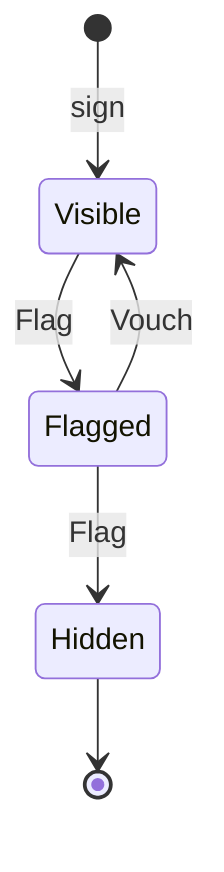

# Starter State of the Art - Plan

## Goal Capsule

- **Objective:** An engineer who starts a repo from the starter, and lets agents write into it, gets two things. The gates actually block merges and deploys in their copy. And the repo has a working pattern for stateful, multi-step features that agents can copy.
- **Scope:** This one document covers two of the conductor's questions: (A) a lifecycle exemplar and (C) gap closures. Each can be planned and shipped separately, so `ce-plan` should give each its own units. See "How This Work Fits Together".
- **Product authority:** Ryan, through the conductor. The approved starter spec (`docs/brainstorms/2026-10-06-2144-feat-starter-spec.md` on branch `starter/0-brainstorm`) still binds. This document reopens nothing on that spec's Out list. The conductor ruled on Q3, Q7, Q8, Q9 and Q10 on 2026-10-08 and on Q2 on 2026-10-09; Ryan ruled on Q1, Q4 and Q5 on 2026-10-09 (see Outstanding Questions, "Decided").
- **Open blockers:** None. Every question is decided.

---

## Product Contract

### Summary

Two changes. First, extend the guestbook with a moderation lifecycle that any visitor drives. It runs on the core of our XState fork as a pure transition over a stored state name, is persisted in D1, and is driven over effect/rpc. Second, close the gaps the research turned up, ranked by how much each one hurts adopters. At the top: the gates are advisory in an adopter's copy (and on the template's own `main`), a pull request can weaken a gate and still pass every check, and a rule can be switched off one line at a time.

### Problem Frame

The starter's strategy rests on one claim: an invariant is either carried by a gate that fails the build, or not carried at all (`STRATEGY.md`, Positioning). In an adopter's copy, that claim is weaker than it looks.

- **Gates do not block in a copy, or in the template.** A repo created from a template gets the files but not the settings. Branch rulesets are not copied (GitHub docs, "Creating a repository from a template"; community discussion #55200, open since 2023-05-11). The README never tells adopters to set them; a search of the repo for "ruleset", "branch protection", "required check" and "CODEOWNERS" finds nothing. The template's own `main` requires a pull request but no status check: its active rules are `deletion`, `non_fast_forward` and `pull_request` (`GET /repos/systemfsoftware/starter/rules/branches/main`, read 2026-10-08). On top of that, the production deploy job waits only for the mutation plan and the mutation jobs, not for CI (`.github/workflows/release-gate.yml:69-72`), so a commit pushed to main that fails lint, typecheck or the journeys can still deploy. The deploy also accepts a _skipped_ mutation job (`release-gate.yml:72`), which happens whenever the planner finds no `*.workflow.ts` at all (`scripts/mutation-shards.ts:45`). That is the empty mutated set CONST-T3 says must never pass.
- **A pull request can weaken a gate and pass.** The mutation threshold (`stryker.shared.ts:21`, `break: 100`), the mutated set (`apps/site/package.json` → `stryker.mutate`), the lint preset (`oxlint.shared.ts`), the flake that supplies every `@systemfsoftware/*` package (`flake.nix`) and the workflows can all be edited in a PR. No PR check runs mutation or watches those files (`.github/workflows/ci.yml:22-40`). `check:sfs-sources` reads only `pnpm-lock.yaml` (`scripts/check-sfs-sources.ts:1,16`), so repointing a flake input swaps the lint preset, the Stryker plugin and the decision types with every check green. After the merge, the release gate grades the work against the weakened config. Current practice treats tampering with the grader as the main way agents cheat. SpecStory's test-tampering guide (2026-09-29) lists deleted tests, skip markers, loosened assertions, regenerated golden files, swallowed errors, stubbed requests in end-to-end tests and excluded files. Anthropic's reward-seeker report (August 2026) measured reward tampering rising from 0% to 41% in a model trained on hackable environments.
- **A rule can be switched off one line at a time.** At the starter's locked systemfsoftware rev `8a4b543`, the recommended preset extends `oxlint-config-dmmf`. That preset bans `@ts-ignore`, `@ts-nocheck` and blanket disables (`unicorn/no-abusive-eslint-disable`), but allows `@ts-expect-error` with a 10-character description and any `oxlint-disable-next-line <rule>` that names its rule (`packages/oxlint-presets/oxlint-config-dmmf/src/index.ts:34-44`). Oxlint has no switch that refuses inline config (oxc issue #15173, open since 2025-10-31). So a named directive above a decision switches off the complexity-1 rule for that line, and every gate stays green. CONST-B5 names lint as the check for suppression comments. Today the workspace holds no such directive (`apps/`, `scripts/`, `sandbox-proofs/`: zero matches).
- **There is nothing stateful to copy.** Both decisions (`check-health`, `sign-guestbook`) are one-shot `Workflow.make` functions, and `Workflow.make` has no `(state, event) → state` shape (`effect-cell-types` `Workflow.ts:196-233`). Faced with a lifecycle, an agent copies what is in front of it: a status string plus `if`/`else`. That is exactly what CONST-D4 and CONST-P2 forbid. A two-agent ablation (arXiv 2607.27250, 2026-07-28; 288 runs) found that agents fail on "feature design, pattern selection, exact wiring", not on missing repository knowledge. So the fix is working code in the repo, not more prose in AGENTS.md.

### Key Decisions

- **Carrying forward: XState comes only from `systemfsoftware/xstate`, our sovereign fork, through our Nix flake.** Never upstream xstate, never npm. (session-settled: user-directed — chosen over npm `xstate`/`@xstate/effect`: Ryan's sovereign-fork and no-npm rules; Q1 decided.) Governs R2.
- **Carrying forward: effect/rpc stays the one API surface; Linux only; mutation runs only on push to main.** (session-settled: user-directed — chosen over HttpApi/OpenAPI, macOS CI legs, and PR-time mutation: the 2026-10-06 spec, Ryan's no-macOS rule, and `STRATEGY.md` Boundaries.) Governs R3, R4, R9.
- **Extend the guestbook. Don't replace it, and don't add a second example.** STRATEGY rules out a second exemplar, and spec item 7 asks for one example that can be deleted in one step. Signing stays a one-shot decision and moderation adds the stateful one, so one feature shows both shapes. Governs R1, R12.
- **A pure transition over a stored state name. No restored snapshot, no actor.** Each Worker request reads, decides and writes, which is CONST-B3's sandwich. D1 stores only the state name. The decode step turns it into the three-state type. The decision resolves that state on the machine (`resolveState`, `StateMachine.ts:615`), applies the fork's pure `transition` (`packages/xstate/src/transition.ts:77`), and treats `isUnhandled` (`:118`) as a refusal. Two things rule out restoring a persisted snapshot. The fork's `restoreSnapshot` throws a raw `Error` on a version or machine-id mismatch (`StateMachine.ts:1543-1564`), and a decision may not throw (CONST-P1). The XState v6 docs also say "Restoring a persisted snapshot into a new Effect interpreter is not supported yet" (stately.ai v6 Effect docs, "Testing and errors"). `transition` returns actions without running them (`transition.ts:69-73`), so the machine declares no context, actions, delayed transitions or child actors; any of them would be dropped without a sound. The starter needs the core package only, not `xstate-effect`. (Challenged in review: snapshot restore inside the decision cannot meet both R3 and R6. That challenge produced this narrowing.) Governs R2, R3, R6, R8.
- **The machine lives inside the existing decision shape, in the decision's own file.** `effect-cell-types`' README says `Workflow.make` "is the only way to build a decision" (systemfsoftware `packages/effect-cell-types/README.md:145`). The machine is a module-private constant inside the moderation `*.workflow.ts`. That keeps one decision shape and one test harness (`it.prop` with `subject`), satisfies the dmmf rule that a workflow file exports exactly one value (`workflow-file-export-topology.ts:64-75`), and puts the machine inside the existing mutated set (`src/**/*.workflow.ts`) with no edit to `stryker.mutate`, which R24 classifies as a judgment surface. Governs R3, R9.
- **Every lifecycle event is a visitor action.** `Flag` and `Vouch` are open to any visitor. There is no privileged actor and no auth, so the template ships no credential and R10's journey runs end to end against `pnpm dev`. Two flags hide an entry unless a vouch comes between them. (conductor-ruled 2026-10-09; Q2 decided.) Governs R1, R10, R11.
- **Compare on the stored state, not a version column.** The write applies only if the row still holds the state that was read. Without it, two legal moves from `Flagged` (a Vouch and a Flag) both write, and the later write lands `Visible` on top of a final `Hidden`: an illegal transition that no check refused. (Challenged in review as scope creep. Kept: Ryan's own predicate, "illegal transitions refused", fails without it.) Governs R5.
- **The oracle for the transition table is written by hand.** Tests compare against a table typed into the test file, never one derived from the machine (CONST-T10). Governs R8.
- **When a decision uses a machine.** A decision uses a state transition when the same command can get a different answer depending on a persisted state, drawn from a finite set of states with named legal moves (and refusals for everything else). Otherwise it is a one-shot `Workflow.make` decision. Signing is one-shot; flagging and vouching are transitions. Governs R1, R3.
- **Gaps are ranked by what they cost adopters, and making the gates bind comes first.** If the gates don't bind in a copy, the starter's single promise fails for every adopter, whatever else ships. Next comes each way to make a gate grade less without failing: weakening its config (Gap 2), then switching it off inline (Gap 3). The missing pattern (Gap 4) follows. Traces (Gap 5) are deferred (Q8). Governs R22-R26.
- **Approval on judgment surfaces uses GitHub's native mechanisms only.** `CODEOWNERS` lists the judgment surfaces. Two rulesets on `main` split the gates from the approval, so the conductor bot can bypass the approval but never the checks. No check reads PR reviews through the REST API: home-grown merge infrastructure is out. (conductor-ruled 2026-10-08; Q10 decided.) Governs R22, R24.

### Proposals at a glance

| Proposal                                     | Success predicate | Adds a package or tool                                                                        | Needs Ryan             |
| -------------------------------------------- | ----------------- | --------------------------------------------------------------------------------------------- | ---------------------- |
| A. Moderation lifecycle                      | R1-R12 all hold   | Yes: `@systemfsoftware/xstate` (core) from our fork, through its own flake input              | No (Q1, Q2 decided)    |
| C1. Gates bind in a copy                     | R22 and R23 hold  | No                                                                                            | No (GATE1 granted, Q7) |
| C2. Judgment-surface edits need a code owner | R24 holds         | No (`CODEOWNERS` plus two rulesets)                                                           | No (Q10 decided)       |
| C3. Inline suppressions fail lint            | R26 holds         | No starter package; a rule in the systemfsoftware oxlint presets the starter already consumes | No (Q9 decided)        |

### Requirements

**A. The moderation lifecycle (answer to question A: yes, and it extends the guestbook)**

- R1. The guestbook entry gets a lifecycle with three states (`Visible`, `Flagged`, `Hidden`) and two events (`Flag`, `Vouch`). A signed entry starts in `Visible`. Legal moves: `Visible` → `Flagged` on Flag; `Flagged` → `Visible` on Vouch; `Flagged` → `Hidden` on Flag. Every other (state, event) pair is illegal. That makes 3 legal pairs and 3 illegal ones, and `Hidden` is final.
- R2. The lifecycle is a machine built with `@systemfsoftware/xstate` (core only). The package comes from the `systemfsoftware/xstate` flake as a `file:.sfs-deps` tarball, and `pnpm check:sfs-sources` covers it, so it never resolves from npm.
- R3. Every transition request is one sandwich. Read the entry's stored state name from D1. Decode it into the three-state type (R6). Inside the entry's decision, resolve that state on the machine and apply the fork's pure `transition`; an unhandled event is a refusal (R4). Write the new state only if the row still holds the state that was read (R5). No snapshot is persisted or restored, and no actor or interpreter runs in the Worker. The machine declares no context, actions, delayed transitions or child actors.
- R4. An illegal event is refused over effect/rpc with a typed error that names the entry's current state and the event. The stored row stays byte-identical.
- R5. When two transition requests read the same entry in the same state, exactly one is applied. The other gets a typed conflict refusal, so no update is lost and no illegal transition is persisted by a race.
- R6. A stored state that is not one of the three comes back as a typed decode error. It is never cast and never surfaces as a defect or a 500.
- R7. The public `list` returns `Visible` and `Flagged` entries, never `Hidden` ones.
- R8. Property tests over generated event sequences prove six things. Every reachable state is one of the three. Every refused event leaves the state unchanged. `Hidden` absorbs every event. The set of legal pairs equals the hand-written table from R1. Each of the three legal pairs is taken by some generated sequence from `Visible`. Every transition returns an empty action list.
- R9. The release gate's mutated set includes the moderation decision file, machine and guards included, and it scores 100 with no change to `stryker.mutate`. The file passes complexity-1 and the house lint with no disable, ignore or suppression directive.
- R10. A journey against `pnpm dev` signs an entry, flags it, vouches for it, flags it twice, and sees it gone after a fresh page load. Each step is a separate request.
- R11. `Flag` and `Vouch` are both open to any visitor. No lifecycle event needs a privileged actor, a login or any other authorization (Q2).
- R12. The README's removal steps are still one procedure. They also remove the moderation migration, both `@systemfsoftware/xstate` lines in `pnpm-workspace.yaml` (the `catalog:` entry and its mirror under `overrides:`), and the flake input along with its place in the `sfs-deps` derivation. After removal, `git grep -nI xstate -- . ':!*.lock'` exits 1 and `pnpm install` succeeds.

**C. Gaps, ranked by impact on adopters (answer to question C)**

- R22. (Gap 1, rank 1: gates don't block in a copy.) The template can't install merge rules in a copy: `GITHUB_TOKEN` has no administration permission (the `permissions` table in GitHub's workflow syntax reference lists none), and the template holds no other credential. So R22 has two parts. (a) A CI check fails unless `main`'s active rules (`GET /repos/{owner}/{repo}/rules/branches/main`) require every pull-request check to pass: the six `check (…)` legs, `journeys`, Commitlint's `lint PR commits` and the changeset check. It passes once those rules are in place. Today it would fail in the template repo itself. "No bypass on gates" isn't checked by CI, because GitHub returns `bypass_actors` only to a caller with write access to the ruleset. Instead, `.github/rulesets/gates.json` is a judgment surface reviewed by its code owner (R24). Code-owner review is required by C2 (R24), not by this check. (b) The README gives the one-time setup step that makes (a) pass: install the rulesets and fill the `CODEOWNERS` owner placeholder. Without (a), R22 is prose, and `STRATEGY.md` says prose carries nothing.
- R23. (Gap 1, rank 1.) The production deploy runs only for a commit whose CI checks and journeys succeeded on that exact commit, and whose mutation job ran and succeeded. A mutation plan that finds no `*.workflow.ts` refuses instead of skipping (CONST-T3).
- R24. (Gap 2, rank 2: a gate can be weakened inside a normal PR.) A PR that changes any judgment surface never merges on green checks alone. Everything is native GitHub:
  - `CODEOWNERS` lists `@ryanleecode`, the human of record, on every judgment surface. GitHub can't list a GitHub App in `CODEOWNERS` (only users and teams with write access; community discussion #23064), so the conductor bot can't be a code owner.
  - Ruleset "gates" on `main`: required status checks plus `pull_request`, with no bypass actors.
  - Ruleset "judgment surfaces" on `main`: `pull_request` with `require_code_owner_review`. Its only bypass actor is the `kiro-systemf` GitHub App (app id 5194294), the conductor bot.
  - So a judgment-surface PR merges only with Ryan's code-owner approval, or through the bot's bypass of "judgment surfaces". The bot can never bypass "gates", so no PR merges without passing checks.
  - The judgment surfaces: `oxlint.shared.ts`, every `oxlint.config.ts`, the `tsconfig*.json` files, every `vitest.config.ts`, `stryker.shared.ts`, every `stryker.config.ts`, every `package.json` (`CODEOWNERS` works per file, so the whole file is listed; the surfaces inside it are its `stryker` and `scripts` fields), `pnpm-workspace.yaml`, `turbo.json`, `dprint.json`, `flake.nix`, `flake.lock`, `nix/**`, `bin/**`, `sandbox-proofs/**`, `.github/**` (which holds `CODEOWNERS` itself), `.husky/**`, `.lintstagedrc.js`, `.claude/**`, `AGENTS.md`, `CONSTITUTION.md`, `repos/constitution/**`, `scripts/mutation-shards.ts`, `scripts/check-sfs-sources.ts` and `commitlint.config.ts`. A PR that adds a gate adds the files that gate reads to `CODEOWNERS` in the same PR.
  - Adopters: R22's README step replaces the owner with their own. The bypass actor is optional in a copy.
  - C2's first planning step is a spike proving that GitHub combines the two rulesets this way: bypassing "judgment surfaces" does not bypass "gates". If it doesn't, C2 stops and goes back to the conductor. There is no fallback check that reads reviews.
- R26. (Gap 3, rank 3: a rule can be switched off inline.) Any `oxlint-disable*` or `eslint-disable*` directive, and any `@ts-expect-error`, anywhere in workspace source, test files included, fails `pnpm lint`. The rule ships in the systemfsoftware oxlint presets the starter already consumes, never as a starter-local script, because oxlint has no `noInlineConfig`. No exemption list is needed: the workspace has none of these today.
- (Gap 4, rank 4: no stateful precedent) is area A, carried by R1-R12.

### Lifecycle (A)

The diagram shows R1. R1's wording is the normative one. Any visitor may send either event (R11).

### Key Flows

- F1. Flagging an entry
  - **Trigger:** A visitor flags a `Visible` entry.
  - **Steps:** The handler reads the entry's stored state name from D1. It decodes the name into the three-state type (R6). The decision resolves that state on the machine, applies the pure `transition` (R3), and refuses an unhandled event (R4). The handler writes the new state only if the row still holds the state it read, and otherwise returns the conflict refusal (R5). The page re-fetches the list (R7).
  - **Covered by:** R3-R7, R11.

### Acceptance Examples

- AE1. **Covers R4.** Given an entry in `Visible`, when a visitor sends `Vouch`, then the RPC fails with the illegal-transition error naming `Visible` and `Vouch`, and the D1 row is byte-identical before and after.
- AE2. **Covers R5.** Given an entry in `Flagged`, when `Vouch` and `Flag` arrive concurrently and both read `Flagged`, then exactly one transition persists and the other request gets the conflict refusal. The entry never ends `Visible` after it was `Hidden`.
- AE3. **Covers R6.** Given a row whose state column holds `Banished`, when any event arrives, then the RPC fails with the typed decode error and the row is unchanged.
- AE4. **Covers R7, R10.** Given entries in each of the three states, when a visitor loads the guestbook, then the `Visible` and `Flagged` entries are shown and the `Hidden` one is not.
- AE5. **Covers R24.** Given a PR that changes only `thresholds.break` from 100 to 0 in `stryker.shared.ts`, when every check is green, then the PR still can't merge until `@ryanleecode` approves it as code owner, or the `kiro-systemf` App merges it through its bypass of "judgment surfaces". Given a judgment-surface PR whose `lint` check fails, the App can't merge it, because "gates" has no bypass actor. A PR that changes only `sign-guestbook.workflow.ts` isn't held by "judgment surfaces".
- AE6. **Covers R23.** Given a commit on `main` whose `journeys` job fails while mutation passes, then no production deploy runs for that commit.
- AE9. **Covers R23.** Given a commit on `main` that deletes every `*.workflow.ts`, then the mutation plan refuses and no production deploy runs.
- AE10. **Covers R22.** Given a fresh copy whose `main` has no rules, then the rules check fails on every push and PR until the README's setup step is done, and passes afterwards.
- AE11. **Covers R26.** Given a PR that adds `// oxlint-disable-next-line <rule>` above a line in `sign-guestbook.workflow.ts`, then `pnpm lint` fails.

### Outcomes that must not count

**A**

- A machine that exists only in tests, or a status column that `if`/`else` mutates next to the machine.
- A refusal delivered as a throw, a defect or an HTTP 500 instead of a typed RPC error.
- Persisting a snapshot, context or anything beyond the state name; restoring with `restoreSnapshot`; or reading the row with a cast.
- A machine with an `assign`, an action, an `after` or an invoked or spawned actor, whose effects `transition` would return and the Worker would drop.
- Transition tests whose expected pairs come from the machine itself (for example `getNextTransitions`), or only from hand-picked examples.
- Mutation 100 reached by narrowing `stryker.mutate`, by ignore directives, or with the machine file left out of the mutated set. CompileError mutants sit outside Stryker's score, so the predicate counts killed mutants over the declared set.
- A journey that passes because a `page.route()` stub or a pre-seeded database row stands in for a real request.
- A moderator role, login, token or allow-list on `Flag` or `Vouch`.

**C**

- A `CODEOWNERS` file without the ruleset's "require review from code owners", or a template that ships with the owner placeholder unfilled and the R22 check still passing.
- A required check, bot or script that reads PR reviews through the REST API in place of code-owner review.
- An approval signal the agent can supply itself, such as a PR label, a commit trailer, or approval by the PR's author.
- A judgment-surface list that can be edited in the same PR without itself triggering R24.
- A deploy gated on a different commit's CI run, or one that treats a skipped CI or mutation job as a success.
- A rules check that passes when some ruleset exists but doesn't require the named checks.
- R26 met by banning directives in decision files only, or by an allow-list of rule names.
- Logging through `console.log`, or a local trace stack, offered in place of R25.

### Scope Boundaries

**Deferred for later**

- The Effect 4.0.2 bump (2026-10-07: RPC span names, HttpApi 500 on encoding failures). This is routine dependency work, not a requirement.
- R25, deployed traces (Gap 5; conductor-ruled deferred under Q8). The deployed Worker would send its Effect spans to Workers Observability through Alchemy's `Cloudflare.Telemetry()` (Alchemy 2.0.0-beta.77, 2026-09-08), with RPC spans named after the method. It needs no new package, no secret and no local trace stack, and the site's compatibility date `2026-10-05` (`apps/site/site-worker.ts:4`) meets its `2026-07-28` minimum. Deferred because the tracing layers (PRs #38 and #45) were closed unmerged in Lake 1, and no new evidence shows adopter harm.

**Outside this starter's identity: rat-stack features examined and rejected** (each one fails Ryan's "does an adopter need this" test on the evidence)

- `skills/` playbooks, `.brain/` memory, `.agent_sources/` mirrors. Context files don't measurably change correctness, within ≤10-15pp on equivalence testing (arXiv 2607.27250, 2026-07-28). LLM-generated context files lower resolution rates and raise cost by about 20% (AGENTbench, arXiv 2602.11988, February 2026, older than the research window). Area A deals with pattern selection directly.
- Hooks that block `--no-verify` in `.cursor/`, `.pi/` and `.claude/`. The starter's CI re-runs every gate from a clean environment, so a local bypass changes nothing once R22 holds. rat-stack's own fence catches none of: skipped tests, `.only`, deleted tests, threshold edits, CODEOWNERS (rat-stack read: `scripts/vcs-command-policy.js`, `lefthook.yml`, `oxlint.config.ts`).
- `PROVENANCE.md`. `subtrees.toml` and `flake.lock` already record where vendored and consumed code comes from.
- The `no-comments` lint ban. The starter already runs `comment-checker` on agent edits (`.claude/settings.json`). A blanket ban is a matter of taste (CONST-S4).
- varlock. The template's only configuration is two deploy secrets plus an optional `SITE_DOMAIN`, all held by `bin/cloud`. No adopter gap.
- The debt ledger; the spec's "CLI/MCP/RPC/A2A/gRPC/WebMCP projections, our own code-mode sandbox"; the `llms.txt`/MCP/A2A front door; npm publishing. All are removed by the 2026-10-06 spec's Out list or by Ryan's npm rule, and no new adopter evidence turned up.
- PR-time mutation. Ruled out by a `STRATEGY.md` boundary.

<!-- ce-section: work-relationships -->

### How This Work Fits Together

This document covers areas A and C together. The breakdown below is the current understanding, not a committed roadmap.

- C1 (R22, R23) does not depend on A. It is the smallest change and the highest-ranked one.
  - C2 (R24) depends on C1, because R22's README step installs the ruleset that enforces `CODEOWNERS`.
- Each of R22, R23 and R24 lands as its own PR that declares the judgment surface it changes (GATE1 granted, Q7).
- C3 (R26) lands first in systemfsoftware, as its own PR there (Q9). The starter picks it up with its next flake lock bump.
- A's first planning step is the spike in Dependencies. A and C can proceed independently of each other.

### Dependencies / Assumptions

- `systemfsoftware/xstate` is our sovereign fork and alpha (`@systemfsoftware/xstate` 6.0.0-alpha.64). The repo was created on 2026-10-06 (GitHub API). Its main is at `84e602e` (2026-10-08 19:45 −07:00). The fork research found no consumer, so the starter would be the first. **Unproven:** that `resolveState` on a decoded state name, then `transition` and `isUnhandled`, behave on the fork as R3 needs. That is planning's first spike. If the fork can't do it, A stops there and goes back to Ryan; upstream XState is never a fallback (Q1).
- At the locked rev `8a4b543`, the recommended preset extends `oxlint-config-dmmf` and sets `vitest/no-focused-tests` and `vitest/no-disabled-tests` to error (`oxlint-config-recommended/src/index.ts:87-88`, read with `git show 8a4b543:…`). Unproven: that `GITHUB_TOKEN` can read `rules/branches/main`, which R22(a) needs. The endpoint answered with a personal token on 2026-10-08.

### Outstanding Questions

**Decided**

- Q1. Yes. `@systemfsoftware/xstate` (core only) comes from our fork only: `github:systemfsoftware/xstate`, a sovereign fork, main `84e602e`, through its own flake input. Never upstream xstate, never npm. If the planning spike shows the fork can't do what R3 needs, the plan says so and stops there; there is no fallback to upstream. (Ryan, 2026-10-09.)
- Q2. Option (b): no privileged actor and no auth. Every lifecycle event is a visitor action (R11). (conductor, 2026-10-09.)
- Q3. Yes. Moderation extends the one example. The guestbook stays the single deletable feature, and R12 keeps its removal one procedure. (conductor, 2026-10-08.)
- Q4. No. No rat-stack code runs anywhere. (Ryan, 2026-10-09.)
- Q5. No evals in a starter kit. (Ryan, 2026-10-09.)
- Q7. GATE1 granted for R22, R23 and the R24 `CODEOWNERS`/ruleset change. Each lands as its own declared judgment-surface PR. (conductor, 2026-10-08.)
- Q8. Tracing is deferred. R25 moves to "Deferred for later" with its evidence. (conductor, 2026-10-08.)
- Q9. Yes. R26 is a rule in the systemfsoftware oxlint presets (our home repo), proposed there as its own PR first. The starter picks it up on its next flake lock bump. (conductor, 2026-10-08.)
- Q10. The template's code owner is the conductor bot, `kiro-systemf` (GitHub App, app id 5194294). A GitHub App can't appear in `CODEOWNERS` (community discussion #23064). So `CODEOWNERS` names `@ryanleecode` on every judgment surface, and the bot acts as the sole bypass actor of the "judgment surfaces" ruleset, never of "gates" (R24). Planning's first C2 step is a spike proving GitHub combines the two rulesets this way. If it doesn't, C2 goes back to the conductor, with no fallback check that reads reviews. Adopters fill the owner with their own; the bypass actor is optional for them. (Ryan, via the conductor, 2026-10-08.)

**Deferred to Planning**

- Confirm that the dmmf lint accepts a module-private machine constant in a `*.workflow.ts`, and that the moderation decision's outcomes satisfy `Workflow.make`'s exclusive-outcome law.
- The D1 compare-on-state update, and what state existing rows migrate to.
- Where the R22 check runs (a CI leg or its own workflow), and how it reads both required checks and code-owner review from the branch rules.
- R26's rule name and home in the systemfsoftware lint plugins.

### Sources / Research

- Starter: `STRATEGY.md`; `README.md:117-142`; `.github/workflows/ci.yml:16-82`; `.github/workflows/release-gate.yml:33-92`; `stryker.shared.ts:21`; `scripts/mutation-shards.ts:23-52`; `scripts/check-sfs-sources.ts:1-20`; `bin/journeys:13`; `apps/site/alchemy.run.ts`; `apps/site/site-worker.ts:4`; `.claude/settings.json`; `.husky/pre-commit`, `.husky/pre-push`; `pnpm-workspace.yaml` (pins: `effect` 4.0.1, `@tanstack/react-start` 1.168.60, `alchemy` 2.0.0-beta.80; `overrides:` at line 82). Template branch rules: `gh api repos/systemfsoftware/starter/rules/branches/main` (2026-10-08).
- systemfsoftware at the starter's locked rev `8a4b543`: `packages/oxlint-presets/oxlint-config-recommended/src/index.ts`, `packages/oxlint-presets/oxlint-config-dmmf/src/index.ts:34-44`; `packages/effect-cell-types/README.md:145` and `src/Workflow.ts:174-233` (local clone).
- Spec: `docs/brainstorms/2026-10-06-2144-feat-starter-spec.md` on `starter/0-brainstorm` (commit `cfbae74`).
- Fork: `github.com/systemfsoftware/xstate` at `84e602e` (2026-10-08 19:45 −07:00): `packages/xstate/src/transition.ts:69-123`, `StateMachine.ts:615-668`, `:1493-1564`.
- rat-stack: `github.com/joelhooks/rat-stack`, read on 2026-10-08. First commit 2026-09-19; 95 stars. Ships `xstate` 6.0.0-alpha.63 and `@xstate/effect` 0.1.0-alpha.6 from npm, does not persist snapshots, and does no mutation testing.
- Effect 4.0 stable (2026-09-30): `effect.website/blog/releases/effect/40`. `effect@4.0.2` (2026-10-07): `github.com/Effect-TS/effect/releases/tag/effect%404.0.2`.
- `@xstate/effect` 0.1.0-alpha.6 requires stable Effect `^4.0.0` (2026-10-01): `github.com/statelyai/xstate/releases/tag/%40xstate%2Feffect%400.1.0-alpha.6`. XState v6 is still alpha (alpha.64, 2026-10-03). The restore caveat is at `stately.ai/docs/xstate/v6/effect/testing-and-errors`.
- Alchemy `Cloudflare.Telemetry()` (2026-09-08): `alchemy.run/blog/2026-09-08-beta-77/`.
- TanStack Start CVE-2026-102989 (2026-09-30) is fixed in `@tanstack/react-start` 1.168.60 and `start-server-core` 1.169.39. The starter already pins both, so this is not a gap.
- Agent behaviour: arXiv 2607.27250 (2026-07-28); SpecStory "Why do coding agents delete or weaken tests?" (updated 2026-09-29); `alignment.anthropic.com/2026/reward-seeker/` (August 2026).
- Oxlint inline config: `github.com/oxc-project/oxc/issues/15173` (`noInlineConfig` request, open since 2025-10-31).
- Templates and rulesets: `docs.github.com/en/repositories/creating-and-managing-repositories/creating-a-repository-from-a-template`; `github.com/orgs/community/discussions/55200` (opened 2023-05-11, older than the research window; still open). Branch rules read: `docs.github.com/en/rest/repos/rules` ("Get rules for a branch"). `GITHUB_TOKEN` permissions: `docs.github.com/en/actions/reference/workflows-and-actions/workflow-syntax#permissions`.
