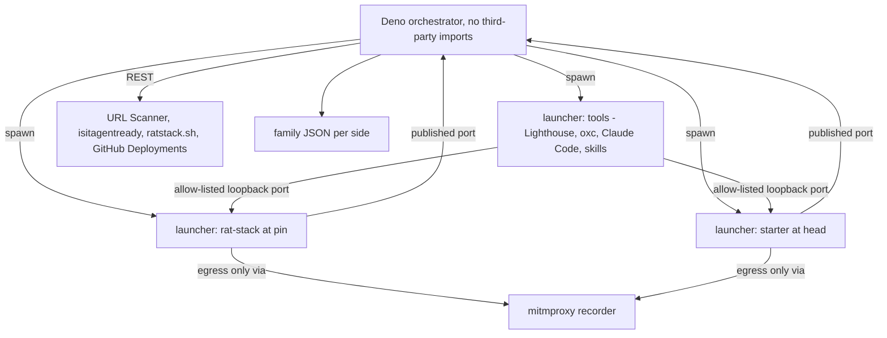
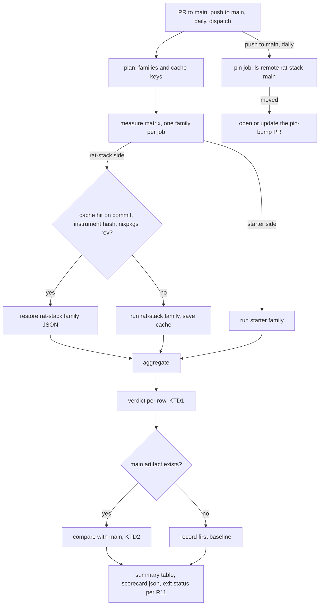

# rat-stack Scorecard - Plan

## Goal Capsule

- **Objective:** Kiro and Ryan can read, on every PR and on `main`, a table showing which rat-stack bins the starter beats. Each verdict is backed by numbers measured on both sides from running code, and comes with its provenance, so anyone can reproduce it. The same published JSON is what the site's later `/scorecard` page renders.
- **Means:** a verifier-owned Evaluator instrument in `evals/ratstack-scorecard/`. A zero-dependency Deno orchestrator drives sandboxed runs of both sides and publishes JSON plus a Markdown table from one CI workflow with a ratchet gate (KTD3, KTD12).
- **Authority:** Kiro rules scope and findings. `repos/constitution/` is the law. Requirements are in `docs/brainstorms/inputs/requirements-final.md` (Superiority Map), and the sandbox ruling is in `docs/brainstorms/inputs/ruling-nix-distribution-sandbox.md`. Builders never edit the instrument (R9).
- **Execution profile:** one `gh stack` on trunk `main`, branches `verify/scorecard-<slug>`, one PR per unit in U1-U9 order, each inert until the layer that wires it. The verifier session (`starter-verify`) builds and ships it; Kiro merges.
- **Stop conditions:** the same error three times, or a launcher capability that is missing (Dependencies). Either one stops the work and goes to Kiro with the exact error. No unsandboxed fallback, no off flag.

---

## Product Contract

### Summary

The scorecard defines one or more metrics for each rat-stack bin and surface, runs both stacks to measure them, and records every number with its provenance. CI publishes the table as a job summary and the JSON as an artifact on every PR to `main` and every push to `main`. The job fails on instrument errors and on regressions against `main`. rat-stack runs as untrusted code inside the shared sandbox launcher.

### Problem Frame

The Superiority Map in `requirements-final.md` claims a checkable win over every rat-stack bin, but nothing checks it yet. Builders grading their own claims is the defect CONST-E9 names, and a number with no baseline or provenance certifies nothing. The starter on `main` today is one `hello` package, so almost every row starts as `absent`. The instrument has to report that honestly, then track each lake as it lands.

### Key Decisions

- **Local rows run the current rat-stack pin, and networked rows run live sites.** Local rows measure rat-stack at its pinned commit (main HEAD, `54d3560` today). Agent Readiness and home-page Lighthouse measure live `ratstack.sh` against the starter's deployed URL: the preview on PRs, production on `main`. Each networked row records the commit the live site serves and is flagged when that commit differs from the pin. (session-settled: user-directed — chosen over running the stale pin behind a tunnel, or scanning live only: "beat the CURRENT rat-stack, not a stale pin".) Governs R5, R6, R7.
- **rat-stack measurements are cached by rat-stack commit + instrument hash + nixpkgs rev, and the starter runs every time.** (session-settled: user-directed — chosen over measuring both sides on every PR.) Governs R12.
- **The gate fails on instrument errors, on starter regressions beyond the noise band, and on bins that lose beaten status.** (session-settled: user-directed — chosen over a report-only job; this answer is Kiro's GATE1 sign-off, 2026-10-05.) Governs R11.
- **The concurrency bin gets two race rows.** (a) The same workload on both sides wherever rat-stack has an analog: N concurrent redemptions of one single-use page ticket. (b) Each side's strongest invariant: the starter's 300 claims for 100 seats. rat-stack shows as `unsupported`, citing `packages/core/src/join-interest-contract.ts:22-26`, and counts as beaten only with that citation. (session-settled: user-directed — chosen over racing only each side's own invariant, or only the shared workload.) Governs R4, M11, M12.
- **Cloudflare URL Scanner `agentReadiness` is the primary readiness row, and isitagentready.com `/api/scan` is a cross-check.** When the two disagree, the row is flagged, not averaged. (session-settled: user-directed — chosen over isitagentready as primary: first-party, reproducible JSON through our token, matches R51's Agent Readiness 100.) Governs M1, M2.

### Requirements

**Measurement contract**

- R1. Every rat-stack bin and surface in the origin's Superiority Map maps to at least one metric in the Metric Catalog, measured on both sides by running code. Reading documentation never produces a number.
- R2. A row is `beaten` only when the starter is strictly better and the comparison reproduces under KTD1.
- R3. Every value carries provenance: side, commit, instrument hash, nixpkgs rev, runner name, every run's raw value, UTC timestamp, and the versions of the tools that measured it.
- R4. Absence is explicit. A bin or surface the starter lacks is `absent`, with the reason. An invariant rat-stack lacks is `unsupported`, with a `file:line` citation that the instrument re-verifies at the pin. A row a side cannot be run for is `unmeasurable`, with the exact error, and Kiro rules on it.

**Subjects**

- R5. Local rows run rat-stack at the commit in `evals/ratstack-scorecard/ratstack.pin.json` and the starter at the commit under test.
- R6. Networked rows (M1-M3) measure `https://ratstack.sh` against the starter's deployed URL. They record the live commit each site serves and flag a rat-stack row whose live commit differs from the pin.
- R7. When rat-stack `main` moves past the pin, the scorecard opens a pin-bump PR in this repository.

**Trust and ownership**

- R8. Every process that loads third-party code runs in the shared sandbox launcher: both sides' dependencies, the instrument's npm tools, Claude Code, Lighthouse, and the debt counter. Only the orchestrator, which has no third-party imports, runs outside it.
- R9. `evals/ratstack-scorecard/**` and `.github/workflows/scorecard.yml` are verifier-owned Evaluator surfaces. The AGENTS.md line that records this goes to Kiro as a proposal in `docs/brainstorms/REFLECTION.md`.

**Publication and gate**

- R10. CI writes the table to `$GITHUB_STEP_SUMMARY` and uploads the JSON as an artifact on every PR to `main` and every push to `main`. The JSON validates against `evals/ratstack-scorecard/scorecard.schema.json`, the contract the site will render at `/scorecard`.
- R11. The scorecard job fails on any instrument error, on any starter metric regressing against `main` beyond its noise band (KTD2), and on any bin beaten on `main` that the PR no longer beats.
- R12. rat-stack values are reused from cache while the key from Key Decisions holds. The starter side is measured on every run.

### Metric Catalog

Each row names the rat-stack bin it grades, the unit, and the better direction. Kind `count` means three runs that must agree exactly. Kind `measurement` means N runs compared under KTD1. Every row runs on both sides.

| ID  | rat-stack bin / surface                  | Metric                                                                                                                                                                                                           | Better         | Kind / runs     | Family         |
| --- | ---------------------------------------- | ---------------------------------------------------------------------------------------------------------------------------------------------------------------------------------------------------------------- | -------------- | --------------- | -------------- |
| M1  | `apps/mischief` front door               | URL Scanner `agentReadiness`: checks passed, plus level 0-5                                                                                                                                                      | higher         | count / 3       | networked      |
| M2  | `apps/mischief` front door               | isitagentready `/api/scan` level, as a cross-check against M1                                                                                                                                                    | higher         | count / 3       | networked      |
| M3  | `apps/mischief` home page                | Lighthouse on `/` with `Accept: text/html`: performance score, LCP ms, CLS, TBT ms, total byte weight, failed accessibility audits (one row each)                                                                | per sub-row    | measurement / 5 | networked      |
| M4  | `/pins.md`                               | Versions named on the served pins page that differ from the side's lockfile                                                                                                                                      | lower          | count / 3       | agent-surfaces |
| M5  | `/log.md`                                | Share of served change-log entries that link both a PR and a CI run                                                                                                                                              | higher         | count / 3       | agent-surfaces |
| M6  | `apps/web`                               | Gzipped client JS bytes emitted by the web build                                                                                                                                                                 | lower          | count / 3       | cold-path      |
| M7  | `apps/mischief` Worker                   | Gzipped Worker script bytes emitted by the deploy build                                                                                                                                                          | lower          | count / 3       | cold-path      |
| M8  | `packages/capability`                    | Mean projections per read-only capability whose output for one input equals the HTTP output (CLI, HTTP, MCP, RPC, code mode, A2A, gRPC)                                                                          | higher         | count / 3       | agent-surfaces |
| M9  | `apps/cli`                               | Milliseconds from CLI process start to a correct answer for one read capability                                                                                                                                  | lower          | measurement / 5 | agent-surfaces |
| M10 | MCP + agent front door                   | Claude Code seconds to a correct answer through the side's MCP only: each of the 5 runs asks all 3 lockfile-derived questions, and the value is the median of the 15 answer times. Correctness rate is a sub-row | lower / higher | measurement / 5 | agent-surfaces |
| M11 | `packages/core` + `packages/intake-live` | Successes above 1 when 300 concurrent requests redeem one single-use token                                                                                                                                       | lower          | count / 3       | running-stack  |
| M12 | `packages/core` lifecycles               | Seats granted beyond capacity for 300 concurrent claims on 100 seats; rat-stack `unsupported` with citation                                                                                                      | lower          | count / 3       | running-stack  |
| M13 | `packages/database`                      | Share of declared store adapters whose side's own store suite passes when that adapter is selected                                                                                                               | higher         | count / 3       | gate-mutation  |
| M14 | `packages/auth`                          | Auth endpoints that accept a password credential (2xx on email + password sign-up or sign-in)                                                                                                                    | lower          | count / 3       | running-stack  |
| M15 | `packages/events`                        | Distinct cookies set on anonymous GETs of every sitemap page                                                                                                                                                     | lower          | count / 3       | agent-surfaces |
| M16 | `packages/lore`                          | Operation × surface pairs (`search`, `read`, `backlinks`, `neighbors`, `mentions`, `path` × the seven surfaces) returning a schema-valid result                                                                  | higher         | count / 3       | agent-surfaces |
| M17 | `packages/subscriber-delivery`           | Requests whose confirmations in the local mail sink are not exactly one, after the runtime is killed mid-burst (50 requests) and restarted                                                                       | lower          | count / 3       | running-stack  |
| M18 | `packages/devtools`                      | Share of 20 scripted calls retrievable afterwards from the side's local devtools store with surface, capability and outcome                                                                                      | higher         | count / 3       | agent-surfaces |
| M19 | `packages/intake-live` abuse bounds      | Requests accepted beyond the side's own declared per-email bound, under 50 concurrent requests for one email                                                                                                     | lower          | count / 3       | running-stack  |
| M20 | `packages/code-snippets`                 | Whether the build fails after a symbol quoted on a page is renamed (1 or 0)                                                                                                                                      | higher         | count / 3       | gate-mutation  |
| M21 | `apps/infra`                             | Outbound connection attempts while importing the stack module, with no egress allowed                                                                                                                            | lower          | count / 3       | gate-mutation  |
| M22 | `apps/infra`                             | Whether removing one binding from the stack fails typecheck (1 or 0)                                                                                                                                             | higher         | count / 3       | gate-mutation  |
| M23 | fence: debt ledger                       | Suppression directives in tracked source, counted by the neutral counter (KTD8)                                                                                                                                  | lower          | count / 3       | static         |
| M24 | fence: tests                             | Sabotage kill rate: verifier sabotages of shared published behaviours that turn the side's own gate red (KTD9)                                                                                                   | higher         | count / 3       | gate-mutation  |
| M25 | `keep-or-cut` / bin removal              | Share of the side's documented bin removals after which its gate stays green                                                                                                                                     | higher         | count / 3       | gate-mutation  |
| M26 | `acceptance-cold-clone.sh`               | Seconds from fresh clone to green documented gate under KTD7                                                                                                                                                     | lower          | measurement / 3 | cold-path      |
| M27 | install                                  | HTTP requests during the cold install, counted by the recording proxy (KTD7), with hosts listed                                                                                                                  | lower          | count / 3       | cold-path      |
| M28 | install                                  | Distinct `name@version` packages in the side's lockfile                                                                                                                                                          | lower          | count / 3       | static         |
| M29 | `skills/*` + `/.well-known/agent-skills` | Share of served skills that `skills add` (npm `skills` 1.7.0) installs and whose `SKILL.md` frontmatter validates                                                                                                | higher         | count / 3       | agent-surfaces |

Local rows run each side with its documented local defaults plus throwaway values for every declared secret that switches a feature on, for example rat-stack's `INTEREST_TOKEN_SECRET` and `EVENTS_ENABLED`. They never use real credentials.

### Acceptance Examples

- AE1. **Covers R2.** Given Lighthouse LCP runs of rat-stack [410, 420, 455, 430, 418] and starter [380, 395, 412, 390, 401], the row is `not-beaten`, because the starter's worst run (412) is not below rat-stack's best (410).
- AE2. **Covers R2.** Given M23 counts of 217, 217, 216 on one side, the row is `instrument-error`, because a count must reproduce exactly.
- AE3. **Covers R4, M12.** Given rat-stack at a pin where `join-interest-contract.ts:22-26` no longer contains the cited "Confirmation is not a seat" text, the row is `instrument-error` and not `beaten`.
- AE4. **Covers R11.** Given `main` beats rat-stack on M14 and a PR re-enables a password route, the scorecard job fails and names M14.
- AE5. **Covers R11.** Given `main`'s M9 runs [120, 131, 140, 125, 128] ms and the PR's median is 139 ms, the job passes, because 139 is inside the band. A PR median of 141 ms fails.
- AE6. **Covers R6.** Given `ratstack.sh/log.md` lists `ed63ba3` as its newest commit and the pin is `54d3560`, the M1-M3 rat-stack cells carry a `live≠pin` flag that shows in the table.
- AE7. **Covers R4.** Given a fork PR with no preview deployment, M1-M3 starter cells are `absent` with the reason "no deployment for `<sha>`", and the ratchet treats that as neutral.
- AE8. **Covers R8.** Given the rat-stack stack is running, a probe inside its sandbox fails to read `~/.ssh` and fails to connect to an undeclared host, and the scorecard records the probe in its provenance.

### Scope Boundaries

- Job 2 (stack review and QA on Kiro's prompt) is outside this plan. It runs per request and writes `docs/reviews/<stack>-findings.md`.
- The `/scorecard` page is the site's work in a later starter lake. This plan publishes only its data contract (R10).
- R51's absolute floor (Agent Readiness 100 on the PR preview) is the starter's own CI gate, owned by the lake that ships R51. The scorecard reports M1 and fails only per R11. Duplicating R51 here would be a second gate on the same number and would need its own GATE1 approval.
- The instrument never edits starter or rat-stack source in place. Sabotage and removal edits apply to throwaway clones.

#### Outside this product's identity

- Averaging disagreeing scanners, weighting rows into one composite score, or ranking bins by importance. Each row stands alone, as Kiro ruled for M1/M2.
- Running untrusted code outside the launcher for any reason, including speed.

### Dependencies

- D1. **Shared sandbox launcher** (`packages.<system>.sandbox`, branch `prm/nix-packaging` of systemfsoftware/pnpm-release-management, at `180122866dd537fa728b5563fb1820fbd2af88cc` on 2026-10-05, pinned by rev while its PR is open). It already provides `--allow-host HOST[:PORT]` (HTTPS `CONNECT` egress through its allow-list proxy, which can also target a host-loopback port), `--pass-env NAME`, `--pnpm-store DIR`, and a stderr line per refused connection (`nix/sandbox/sandbox.sh`, `nix/sandbox/egress-proxy.mjs`). Two capabilities the scorecard needs are missing: (a) visibility of allowed requests, either a log of each one or chaining its proxy to an upstream recording proxy, without which M27 can count only `CONNECT` tunnels and their hosts; (b) publishing a sandbox loopback port to host loopback, without which local rows cannot reach a running side. Both go to Kiro as requests to the launcher owner, and this plan never builds a second launcher.
- D2. **Starter deployment contract** (Lake 1 U13): the preview job records its URL and deployed sha as a GitHub Deployment (`environment: preview-pr-<N>`, `environment_url`), and production does the same for `endgame.systemfsoftware.com`. The scorecard reads these over REST (KTD11). The request goes through Kiro to the Lake 1 builder.
- D3. **CI secrets from Kiro:** `CLOUDFLARE_URLSCANNER_API_TOKEN` (Account > URL Scanner, Edit) with `CLOUDFLARE_ACCOUNT_ID`, `ANTHROPIC_API_KEY` for M10, and a GitHub App token for pin-bump PRs, because PRs opened with `GITHUB_TOKEN` do not trigger `pull_request` workflows.
- D4. **Fleet runners** (`[self-hosted, systemfsoftware-runner, large]`) able to run the launcher. Lake 1 reports that this omp container's nix bubblewrap 0.12.0 fails `--proc /proc`, while this session's `/usr/sbin/bwrap` 0.11.2 ran `--unshare-all --proc /proc` with exit 0. U4 probes the fleet first.
- D5. **systemfsoftware flake packages** (systemfsoftware PR C, the same input Lake 1 U11b consumes) for the instrument's mutation leg: `@systemfsoftware/stryker-js` 15.0.1 and `@systemfsoftware/stryker-js-vitest-runner` 8.0.3, the versions the starter pins on Lake 1. Only U3's release-gate mutation job needs them.

---

## Planning Contract

### Key Technical Decisions

- KTD1. **Beaten means the starter's worst run beats rat-stack's best.** A `measurement` row is `beaten` when every starter run is strictly better than every rat-stack run, so the two ranges do not overlap. A `count` row needs three identical runs on each side; any disagreement is an instrument error. Ties are `tie`, and a rat-stack value at a bound the starter cannot pass (0 bytes, level 5) stays `tie`. Range non-overlap over 3-5 runs is reproducibility a reviewer can check by eye, and it follows Lighthouse's own variability guidance (median of 5 is about twice as stable as 1 run, `GoogleChrome/lighthouse/docs/variability.md`).
- KTD2. **The noise band is `main`'s own run range.** A `measurement` regresses when the PR's median is worse than `main`'s worst run. A `count` regresses on any worse value. A row that goes from present to `absent` regresses. `no-secret` and fork-PR `absent` rows are neutral. The ratchet compares a row only when its metric-definition hash (the registry entry plus the files its family reads under `evals/ratstack-scorecard/`) matches `main`'s; a changed definition is reported as `re-baselined` and stays neutral until `main` carries it. A deliberate bin retirement is a verifier change to the registry, never a builder edit. This instantiates the gate Key Decision for R11 (session-settled: user-directed — chosen over a report-only job: Kiro's gate ruling, GATE1 sign-off 2026-10-05).
- KTD3. **The orchestrator is Deno with zero third-party imports, and everything else runs sandboxed.** `evals/ratstack-scorecard/src/**` imports only Deno APIs and `node:` builtins, and `deno.json` declares no import map. The decision modules (`*.workflow.ts`) import nothing at all, so Deno runs them and vitest tests them unchanged. Tools with npm code come from the instrument's own `package.json` and pnpm lockfile, are fetched through the lockfile-hash fixed-output derivation Lake 1 U11b adopts, and only ever run inside the launcher (R8). The tools are Lighthouse 13.5.0, oxc-parser 0.153.0, yaml 2.9.1, skills 1.7.0, plus, for tests, vitest 5.0.3, fast-check 4.10.2, `@fast-check/vitest` 0.5.0 and ajv 8.20.0. Deno and `node:` follow the repo's standalone-script rule without pulling JSR code that would itself need sandboxing.
- KTD4. **The instrument gets its own flake at `evals/ratstack-scorecard/flake.nix`.** It has its own `flake.lock`: nixpkgs at the root's current rev `4975466d324710c576dc11ad614684e6bd8cad8e`, plus the prm launcher input. It exposes `scorecard`, `ratstack-src`, `ratstack-toolchain` and `scorecard-tools`. The root `flake.nix` belongs to the Lake 1 builder, and a separate flake avoids co-ownership and keeps Dependabot from moving the instrument's nixpkgs. The instrument hash is the git tree hash of `evals/ratstack-scorecard/`.
- KTD5. **The pin is a file, bumped by the scorecard workflow.** `ratstack.pin.json` holds `{ repo, commit, narHash }`, and `ratstack-src` fetches it with a fixed-output fetch. A `pin` job runs on a daily schedule and on every push to `main`. It compares `git ls-remote` of `joelhooks/rat-stack` `main` with the pin and opens or updates one PR that changes only `ratstack.pin.json`, using the App token (D3), which is installed on this repository alone with `contents: write` and `pull-requests: write`. Kiro merges the bump like any other PR. The root Dependabot `nix` entry runs weekly and would double-bump a flake input, so the pin is not a flake input.
- KTD6. **Each side is measured through its documented entry points.** `src/sides/ratstack.ts` and `src/sides/starter.ts` hold, as data: install, gate, dev-stack start and readiness URL, ports, MCP endpoint, CLI entry, lockfile path, bins with their documented removal, the fake-secret env list, the vendored-path exclusions, and each command's egress allow-list. Provenance records the allow-list each run used. rat-stack's entries come from its README, AGENTS.md and CI (`pnpm install --frozen-lockfile`, `pnpm sources:fetch`, `pnpm turbo run check test build --concurrency=1`, `pnpm infra:dev` on `:1337`). The starter's come from its README and AGENTS.md (`pnpm check:ci`, `pnpm dev` / `bin/local-stack`). When an entry point drifts, the row reports `instrument-error`, and the verifier updates the adapter.
- KTD7. **Cold means nothing project-specific is cached on either side.** Each run uses a fresh clone, a fresh chroot Nix store (`--store` under that job's `RUNNER_TEMP`), an empty pnpm store and empty build caches, all deleted when the run ends, with toolchains from the scorecard flake (Node 24.20.0; pnpm 11.3.0 for rat-stack, fetched as a fixed-output tarball because rat-stack's `devEngines` fails on any other pnpm; the starter's own pinned pnpm). The sandbox's only egress is one mitmproxy 12.2.3 recording proxy, trusted through `NODE_EXTRA_CA_CERTS`, `SSL_CERT_FILE` and `NIX_SSL_CERT_FILE`, with the hosts the documented install needs on its allow-list (needs D1a). This makes the starter's Nix-fetched dependencies count against it exactly as rat-stack's registry fetches do.
- KTD8. **The debt counter is comment-aware and neutral.** It parses every tracked `*.{c,m,}{j,t}s{x,}` file with oxc-parser and counts comment directives in rat-stack's three families (`oxlint-disable*`, `@effect-diagnostics*`, `@ts-expect-error|ignore|nocheck`, rat-stack `scripts/oxlint-plugin-debt-ledger.ts:6-13`), plus `stryker-disable*`, `eslint-disable*`, `biome-ignore`, `dprint-ignore`, and `c8`/`istanbul`/`v8 ignore`. Exclusions are vendored trees only, each declared with its reason in the side adapter: rat-stack `tools/oxlint/anti-slop/`, `vendor/`; starter `repos/**`. Parsing comments rather than regex-matching bytes keeps a regex literal, such as the one inside rat-stack's own plugin, from counting as debt. The instrument never runs either side's counter, so the subject never produces the oracle (CONST-T10).
- KTD9. **Sabotages and removals are verifier-authored patches.** `sabotage/<side>/<behaviour>.patch` breaks one published behaviour present on both sides, such as Markdown-by-default negotiation, `/llms.txt`, MCP `tools/list`, or `/openapi.json`. M24's denominator is the intersection of behaviours both sides have. `removal/<side>/<bin>.patch` encodes the side's documented removal: rat-stack's README "Keep or cut" table and `skills/keep-or-cut/SKILL.md`, and the starter's R68 checklists. A patch that no longer applies is an `instrument-error` naming the patch.
- KTD10. **The agent row uses pinned Claude Code headless.** Claude Code 2.1.280 from nixpkgs runs in the launcher with `-p --bare --strict-mcp-config`, an `--mcp-config` naming only the side's HTTP MCP endpoint, `--max-turns 12`, a pinned `--model` id recorded in the metric definition, and `--json-schema` forcing `{ "answer": string }`. Its sandbox's project directory is an empty scratch directory, it has no built-in tools (`--tools ""`), so the side's MCP tools are its only tools, and `ANTHROPIC_API_KEY` reaches that sandbox alone through `--pass-env`. Questions live in `questions/agent-mcp.json`, and each oracle is computed from the side's lockfile (resolved `effect`, `typescript` and `alchemy` versions), so neither side's content authors the expected answer. A wrong answer or a timeout scores the cap (120 s).
- KTD11. **Networked subjects are found over REST.** The starter URL and served sha come from the GitHub Deployments API for the head sha (D2). The networked job finds the head sha's previews workflow run first, waits for it, and records `absent` immediately when none exists. rat-stack's served commit is the newest commit listed in `https://ratstack.sh/log.md`, the site's own build-time statement, compared with the pin for R6's flag.
- KTD12. **One workflow; families are data.** `.github/workflows/scorecard.yml` runs on `pull_request` to `main`, `push` to `main`, a daily `schedule` and `workflow_dispatch`. A `plan` job (`small`) prints the family list and cache keys from the registry. A `measure` matrix (`large`, one family per job, `fail-fast: false`) restores or produces each side's family JSON. Runs on `main` write the rat-stack cache that PR runs restore, because an Actions cache written on a PR ref is invisible to other PRs. An `aggregate` job (`small`) merges them, fetches the latest successful `main` artifact for the ratchet, writes the summary, uploads `scorecard.json` with `actions/upload-artifact@v7`, and fails per R11. Adding a family never changes the workflow. Lighthouse family jobs never share a machine with another Lighthouse run.
- KTD13. **Lighthouse is npm `lighthouse` 13.5.0 driving nixpkgs `chromium` 153.0.8010.52** (through `CHROME_PATH` and `--chrome-flags=--headless=new`) with default simulated throttling. nixpkgs' `lighthouse` attribute is sigp's Ethereum client, and `@lhci/cli` 0.15.1 pins Lighthouse 12.6.1, so neither is used.
- KTD14. **Readiness calls URL Scanner v2 with `agentReadiness: true`, then polls the result.** It submits `POST /accounts/{account_id}/urlscanner/v2/scan` with `agentReadiness: true` and polls `GET …/v2/result/{scan_id}` every 15 s. The first live call fixes where the option sits in the request (top level or `options`) and the result path. The cross-check posts `{ "url": … }` to `https://isitagentready.com/api/scan` and reads `level`, as rat-stack's `apps/mischief/scripts/smoke.sh` does. When the levels differ, the row is flagged. This implements the scanner Key Decision (session-settled: user-directed — chosen over isitagentready as primary: first-party reproducible JSON through our token).
- KTD15. **Tests are admitted by layer, with refusal as the default** (`skill://test-layer-selection`). Every decision lives in a `*.workflow.ts` module with a colocated `*.workflow.property.test.ts`, mutated at break 100 by sfs stryker-js in CI on push to `main` (D5), never locally. Family runners, harness, side adapters and REST clients are executors and adapters: they get no tests of their own, and each unit's family smoke run plus its PR sabotage proves them. Three process-isolated journeys under `evals/ratstack-scorecard/journeys/` observe what only the seam can see: J1 launcher isolation (U4), J2 the static family over a fixture tree through the real parser in the sandbox (U2), and J3 the CLI's exit status and schema-valid JSON on a ratchet failure (U3). Refused: tests of `registry.ts` (a declaration), unit tests of runners (they would spawn processes or mock the subject), and assertions on rendered Markdown wording.
- KTD16. **A mutated gate is graded only against a green baseline.** Every family that edits a clone and runs a gate (M13, M20, M22, M24, M25) first runs the unmodified gate on that side over warm caches, and a red baseline makes those cells `unmeasurable` with the first failing task. The cold path (M26) is its own baseline: a red cold gate makes M26 `unmeasurable` and leaves the other families alone. This keeps a kill rate or removal rate from being computed over a gate that was already failing.

### High-Level Technical Design

Run topology: the orchestrator is the only process outside the sandbox. It reads results and never imports subject code.



CI flow and the ratchet:



Row status and verdict, as a directional sketch, not a specification:

```text
CellStatus = Measured{runs[]} | Absent{reason} | Unsupported{citation} | Unmeasurable{error}
           | NoSecret{name} | InstrumentError{error}
Verdict    = match (ratstack, starter):
  (Measured, Measured)        -> compare per KTD1 -> Beaten | NotBeaten | Tie
  (Unsupported, Measured)     -> Beaten when the citation re-verified at the pin, else InstrumentError
  (_, Absent | NoSecret)      -> NotBeaten (neutral for the ratchet when NoSecret or fork-Absent)
  (InstrumentError, _) | (_, InstrumentError) -> InstrumentError
  (Unmeasurable, _)           -> NotBeaten, surfaced for Kiro
```

### Output Structure

```text
evals/ratstack-scorecard/
  README.md                  what each metric measures, how to run it, who owns it
  flake.nix  flake.lock      KTD4
  deno.json                  no import map (KTD3)
  package.json  pnpm-lock.yaml  pnpm-workspace.yaml   instrument tools and test runner (KTD3)
  vitest.config.ts  stryker.config.ts                 KTD15
  scorecard.schema.json      R10 data contract
  ratstack.pin.json          KTD5
  questions/agent-mcp.json   KTD10
  sabotage/{ratstack,starter}/*.patch   KTD9
  removal/{ratstack,starter}/*.patch    KTD9
  src/
    main.ts                  CLI: plan, measure --family, aggregate, render, pin
    model/cell.ts            tagged unions (declaration)
    model/*.workflow.ts      every decision, zero imports
    model/*.workflow.property.test.ts   colocated properties (KTD15)
    metrics/registry.ts
    sides/{ratstack,starter}.ts
    harness/{sandbox,proxy,stack,store}.ts
    families/{static,cold-path,gate-mutation,running-stack,agent-surfaces,networked}.ts
    tools/{count-directives,parse-lockfile,lighthouse-run}.mjs   run only inside the launcher
  journeys/                  J1-J3, process-isolated, run inside the launcher (KTD15)
.github/workflows/scorecard.yml
```

### Assumptions

These are the inferred bets the scoping confirmation would have covered. Kiro's plan approval confirms or redirects them.

- The 29 metric families in the Metric Catalog are the per-bin metrics, extending Kiro's examples to every bin the Superiority Map names.
- Run counts are 3 for counts and cold clones, and 5 for Lighthouse, CLI latency and the agent row.
- rat-stack runs locally with throwaway values for every feature-enabling secret it declares, so its features are on (rat-stack `apps/mischief/src/worker.ts:96-166`).
- M11's starter analog is one hold-confirmation token redeemed 300 times. Until that capability exists, the starter cell is `absent`.
- M17 on rat-stack needs a local delivery endpoint. If rat-stack's delivery adapters (DROVR, POSTSHIBA) take a configurable base URL, the instrument serves a recording fake there. If they do not, the rat-stack cell is `unmeasurable` with the exact reason, and Kiro rules.
- The agent model id is the current Claude Sonnet id when U8 lands, recorded in the registry. Changing it changes the instrument hash and so re-baselines.

### Sequencing

U1 → U2 → U3 → U4 → U5 → U6 → U7 → U8 → U9. Each is one PR layer on the previous one. U3 wires CI once static rows exist. Every later unit only adds a family to the registry, so the published table grows one family per PR without the workflow changing. U2 onward waits on D1. U9's starter cells wait on D2.

---

## Implementation Units

### U1. Model the scorecard: cells, verdicts, ratchet, schema, rendering

- **Goal:** The pure core decides every verdict and ratchet outcome from data and renders the table and JSON.
- **Requirements:** R2, R3, R4, R10, R11; KTD1, KTD2.
- **Dependencies:** D1 for running the tests (no unsandboxed mode); no unit dependency.
- **Files:** `evals/ratstack-scorecard/src/model/cell.ts`, `src/model/verdict.workflow.ts`, `src/model/ratchet.workflow.ts`, `src/model/render.workflow.ts`, `src/metrics/registry.ts` (M1-M29 definitions as data: id, bin, unit, direction, kind, runs, family, citations), `scorecard.schema.json`, `deno.json`, `package.json`, `pnpm-lock.yaml`, `pnpm-workspace.yaml`, `vitest.config.ts`, `stryker.config.ts`, `README.md`, `src/model/verdict.workflow.property.test.ts`, `src/model/ratchet.workflow.property.test.ts`, `src/model/render.workflow.property.test.ts`.
- **Approach:**
  1. Cells and verdicts are closed tagged unions, and every decision is one exhaustive dispatch with complexity 1 (CONST-D4, CONST-P2).
  2. `render.workflow.ts` emits Markdown under 1 MiB (the per-step summary cap), putting provenance in the JSON and only flags in the table.
  3. The schema has `schemaVersion: 1`, and every JSON the renderer emits validates against it.
- **Patterns to follow:** `repos/constitution/CONSTITUTION.md` Article I. The standalone-script shebang style from `scripts/check-changeset.ts`, with scoped `--allow-*` flags (OP15).
- **Test scenarios** (all properties over generated cells; the AEs are spec literals pinned beside them):
  - AE1: overlapping ranges give `not-beaten`. Shifting the starter so its worst run is 409 gives `beaten`.
  - AE2: unequal count runs give `instrument-error`.
  - Swapping sides of a strictly separated `measurement` turns `beaten` into `not-beaten`, and identical ranges are always `tie`.
  - Direction `higher` mirrors direction `lower` under negation.
  - AE3: an `Unsupported` cell whose citation check failed gives `instrument-error`, and one that passed gives `beaten`.
  - AE5: a PR median inside `main`'s run range passes the ratchet, and a median just past `main`'s worst run fails, naming the metric.
  - AE4: `beaten` on `main` and `not-beaten` on the PR fails the ratchet, and the failure names the metric and the cell status that caused it (for example a rat-stack `Unmeasurable` cell, or a changed live commit).
  - Present on `main` and `absent` on the PR fails, while `NoSecret`, fork `Absent`, or a changed metric-definition hash (`re-baselined`) is neutral.
  - With no `main` artifact, the ratchet records a first baseline and passes.
  - Every rendered JSON validates against `scorecard.schema.json` (ajv), and the hand-written refusal holds: a document without `provenance.commit` fails validation.
- **Verification:** `pnpm vitest run` from `evals/ratstack-scorecard` under the launcher is green. One sabotage, flipping `<` to `<=` in the KTD1 comparison, turns a property red.

### U2. Pin rat-stack and measure the static rows

- **Goal:** The pin, the instrument flake and the static family produce M23 and M28 for both sides, plus the citation check that M12 relies on.
- **Requirements:** R1, R3, R4, R5, R8; KTD3, KTD4, KTD5, KTD8.
- **Dependencies:** U1, D1.
- **Files:** `evals/ratstack-scorecard/flake.nix`, `flake.lock`, `ratstack.pin.json` (commit `54d356037c994f89698760a4727be71d0005a087`), `src/sides/ratstack.ts`, `src/sides/starter.ts`, `src/harness/sandbox.ts`, `src/families/static.ts`, `src/tools/count-directives.mjs`, `src/tools/parse-lockfile.mjs`, `src/main.ts`, `src/model/directives.workflow.ts`, `src/model/citation.workflow.ts`, `src/model/directives.workflow.property.test.ts`, `src/model/citation.workflow.property.test.ts`, `journeys/static.journey.test.ts` (J2), `journeys/__fixtures__/debt-tree/`.
- **Approach:**
  1. `ratstack-src` fetches the pin as a fixed-output derivation.
  2. `scorecard-tools` builds the tools' `node_modules` through the same lockfile-hash fixed-output derivation Lake 1 U11b adopts.
  3. `sandbox.ts` wraps the launcher. Both tools run inside it read-only over the checkout.
  4. `parse-lockfile.mjs` reads the `packages` keys in both pnpm 11 and pnpm 12 lockfile formats.
- **Patterns to follow:** `bin/dprint` for the nix-run wrapper idea. rat-stack `apps/mischief/scripts/content-lib.ts:866-895` for which files count as source, adapted per KTD8.
- **Test scenarios:**
  - Property (`directives.workflow`): a comment text carrying any directive from the KTD8 families classifies to that family, and a generated text with none classifies to nothing.
  - Property (`directives.workflow`): a path under a declared vendored root is excluded and carries its reason, whatever its extension.
  - Property (`citation.workflow`): a citation verifies only when the cited line range of the given file bytes contains the declared text. Shifting the text one line outside the range fails it.
  - J2: a fixture tree with a directive in a comment, the same text in a string, a regex literal, and a vendored path counts only the comment, through the real oxc-parser in the launcher. Its pnpm 11 and pnpm 12 lockfile fixtures yield the same distinct `name@version` set through the real yaml parser.
- **Verification:**
  - `nix run ./evals/ratstack-scorecard#scorecard -- measure --family static` prints M23 and M28 for both sides, identical across three runs.
  - The PR body records M23 for rat-stack at the pin beside its published `/debt.md` total (217 on 2026-10-05), with the extra KTD8 families broken out.
  - Sabotage evidence: invoking the counter with the launcher wrapper removed is refused, because `sandbox.ts` has no unsandboxed path.

### U3. Publish the table in CI with the ratchet and the pin-bump job

- **Goal:** Every PR to `main` and every push to `main` publishes the table and JSON. The job fails per R11, and a moved rat-stack `main` opens a pin-bump PR.
- **Requirements:** R7, R10, R11, R12; KTD2, KTD5, KTD12.
- **Dependencies:** U2, D3 (App token), D4, D5.
- **Files:** `.github/workflows/scorecard.yml`, `evals/ratstack-scorecard/src/main.ts` (`plan`, `aggregate`, `pin` commands), `src/harness/store.ts` (`main` artifact fetch), `src/model/pin.workflow.ts`, `src/model/cache-key.workflow.ts`, `src/model/pin.workflow.property.test.ts`, `src/model/cache-key.workflow.property.test.ts`, `journeys/aggregate.journey.test.ts` (J3), `journeys/__fixtures__/families/`.
- **Approach:**
  1. Permissions are `contents: read` and `actions: read`; only the `pin` job adds `contents: write` and `pull-requests: write` through the App token.
  2. Actions are tag-pinned as the repo does: `actions/checkout@v7`, `actions/cache@v6`, `actions/upload-artifact@v7`, `cachix/install-nix-action@v31`.
  3. Fleet labels follow Lake 1 KTD2. Concurrency is `scorecard-<ref>`, cancelling superseded PR runs and never `main` runs.
  4. A `mutation` job on push to `main` runs sfs stryker-js over `src/model/*.workflow.ts` at break 100 (KTD15, D5). It never runs on PRs or locally.
  5. The PR body declares the Evaluator change and cites Kiro's 2026-10-05 gate ruling as its GATE1 approval.
- **Patterns to follow:** Lake 1 `.github/workflows/ci.yml` and `release-gate.yml` (`plan` job then matrix, `upload-artifact`).
- **Test scenarios:**
  - Property (`pin.workflow`): an `ls-remote` commit equal to the pin plans nothing, and any other commit plans a bump carrying that commit and the prefetched `narHash`.
  - Property (`cache-key.workflow`): the rat-stack key changes when the instrument tree hash, the rat-stack commit or the nixpkgs rev changes, and stays the same when only the starter commit changes.
  - J3: `main.ts aggregate` over fixture family JSONs where `main` beats M14 and the PR does not exits non-zero, names M14, and writes a `scorecard.json` that validates against the schema (AE4).
- **Verification:** The PR's own scorecard run publishes M23 and M28, with the starter side being the `hello` seed. actionlint is clean. Sabotage evidence: a registry entry with unequal count runs turns the job red, and reverting it turns the job green.

### U4. Run both sides in the sandbox launcher

- **Goal:** The harness starts, probes, and stops each side's documented local stack inside the launcher, with published ports, fake secrets and the recording proxy.
- **Requirements:** R5, R8; KTD6, KTD7; AE8.
- **Dependencies:** U2, D1, D4.
- **Files:** `evals/ratstack-scorecard/src/harness/stack.ts`, `src/harness/proxy.ts`, `src/sides/ratstack.ts`, `src/sides/starter.ts`, `flake.nix` (`ratstack-toolchain`: Node 24.20.0, pnpm 11.3.0 tarball), `journeys/sandbox.journey.test.ts` (J1).
- **Approach:**
  1. Probe the fleet first: `--unshare-all` plus whatever `/proc` mode the launcher uses. A failure goes to Kiro with the exact error (D4).
  2. Readiness: rat-stack `:1337/llms.txt` under `pnpm infra:dev`; the starter's readiness URL from its adapter. An `absent` starter stack gives `absent` rows.
- **Test scenarios:**
  - J1 (AE8): from inside the rat-stack sandbox, reading `~/.ssh` fails, writing outside the project fails, and a connection to an undeclared host fails.
- **Verification:**
  - Both stacks reach ready on the fleet, and the J1 probe results appear in the run's provenance.
  - A request to an allow-listed host appears in the proxy log with its host.
  - Sabotage evidence: running the J1 probes without the launcher succeeds, which turns J1 red.

### U5. Measure the cold path: clone to green, install requests, build sizes

- **Goal:** M26, M27, M6 and M7 for both sides under KTD7.
- **Requirements:** R1, R3; KTD7.
- **Dependencies:** U4.
- **Files:** `evals/ratstack-scorecard/src/families/cold-path.ts`, `src/model/cold.workflow.ts`, `src/model/cold.workflow.property.test.ts`.
- **Approach:**
  1. One cold run yields all four metrics: time from clone to green gate, proxy request count with hosts, and gzipped bytes of the side's declared client JS and Worker outputs (rat-stack `apps/mischief/dist/startup/worker.bundle`, `apps/web` build JS; starter outputs from its adapter).
  2. rat-stack's gate is its CI triple, including `pnpm sources:fetch`, whose `github.com` egress is allow-listed. A red unmodified gate makes M26 `unmeasurable` (KTD16).
- **Test scenarios** (`cold.workflow` properties):
  - A store listing that contains any path from the side's declared dependency closure is judged not cold, and the run is refused.
  - A gate outcome with a non-zero exit becomes `unmeasurable` carrying the failing step, never a time.
  - Any generated proxy log reduces to a request count equal to its entry count and a host set equal to its distinct hosts.
- **Verification:** Three cold runs per side complete on `large`, and the times and request counts land in the family JSON.

### U6. Grade gates by breaking things: sabotage, removal, quotes, bindings, adapters

- **Goal:** M13, M20, M21, M22, M24 and M25 for both sides.
- **Requirements:** R1, R4; KTD9.
- **Dependencies:** U5.
- **Files:** `evals/ratstack-scorecard/src/families/gate-mutation.ts`, `src/model/gate-mutation.workflow.ts`, `src/model/gate-mutation.workflow.property.test.ts`, `sabotage/ratstack/*.patch`, `sabotage/starter/*.patch`, `removal/ratstack/*.patch` (CLI-only, no code mode, no HTTP, no MCP, no analytics, no XState, no devtools, per rat-stack README "Keep or cut"), `removal/starter/*.patch`.
- **Approach:**
  1. Each side first runs its unmodified gate (KTD16). Each case then runs in a throwaway clone from U5's cold tree (warm caches allowed; timing is not measured here).
  2. M21 imports the stack module inside a sandbox with no egress and counts refused connections from the launcher log.
  3. M13 flips the side's documented adapter switch (rat-stack `DatabaseVendor`).
  4. Cases with no counterpart on a side record `absent` or `unsupported` per R4.
- **Test scenarios** (`gate-mutation.workflow` properties):
  - A patch that fails to apply becomes `instrument-error` naming the patch.
  - A red baseline makes every case on that side `unmeasurable`, whatever the case outcomes.
  - Over a green baseline, a case whose gate stays green is survived (M24) or kept (M25), and a red one is killed (M24) or broken with its first failing task (M25).
  - M24's denominator is the intersection of behaviours both sides declare, so adding a behaviour on one side never changes the other side's rate.
- **Verification:** All rat-stack cases run once and are cached under the R12 key, and starter cases on `main` report `absent` where the bin does not exist yet.

### U7. Race and break the running stacks

- **Goal:** M11, M12, M14, M17 and M19 for both sides.
- **Requirements:** R1, R4; Key Decision on race rows.
- **Dependencies:** U4.
- **Files:** `evals/ratstack-scorecard/src/families/running-stack.ts`, `src/model/running-stack.workflow.ts`, `src/model/running-stack.workflow.property.test.ts`.
- **Approach:**
  1. M11: on rat-stack, mint one page ticket from `/tokenmaxx` agent Markdown and send 300 concurrent `POST /api/joinInterest` with distinct submissions (rat-stack `apps/mischief/src/interest/page-ticket.ts:12-35`, `packages/intake-live/src/hmac-tickets.ts:139-163`).
  2. M12: the starter's documented claim capability; rat-stack is `Unsupported` with the cited text re-verified at the pin.
  3. M14: probe both sides' auth with email + password sign-up and sign-in on their documented auth base paths.
  4. M17: SIGKILL the side's runtime process at a random point in a 50-request burst, then tear down that sandbox (its PID namespace dies with it) and start a fresh one over the same project state, drain, and count messages per request in the mail sink.
  5. M19: overshoot is measured against the bound read from the side's own configuration.
- **Test scenarios** (`running-stack.workflow` properties):
  - For any response set, M11 equals the number of successful redemptions minus one, floored at zero.
  - M12 equals seats granted minus capacity, floored at zero.
  - M14 counts a 2xx as one and a 4xx as zero, and any 5xx makes the cell `unmeasurable`.
  - M17 counts a request with 0 or 2+ sink messages, never one with exactly 1.
  - M19 equals accepted requests minus the side's declared bound, floored at zero.
- **Verification:**
  - Three runs agree on every count for rat-stack at the pin, and the results are cached.
  - Sabotage evidence in the PR body: M11 pointed at a stub endpoint that accepts every redemption reports 299, which proves the race can see oversell.

### U8. Measure the agent surfaces

- **Goal:** M4, M5, M8, M9, M10, M15, M16, M18 and M29 for both sides.
- **Requirements:** R1, R8; KTD10.
- **Dependencies:** U4, D3 (`ANTHROPIC_API_KEY`).
- **Files:** `evals/ratstack-scorecard/src/families/agent-surfaces.ts`, `src/model/agent-surfaces.workflow.ts`, `src/model/agent-surfaces.workflow.property.test.ts`, `questions/agent-mcp.json`.
- **Approach:**
  1. Surfaces are driven over HTTP, MCP 2026-07-28 (with the `Mcp-Method` and `Mcp-Name` headers rat-stack's smoke uses), CLI, RPC, code mode, A2A and gRPC where the side serves them.
  2. M8's inputs come from each capability's OpenAPI examples. A capability without an example scores 0 surfaces.
  3. M10 runs Claude Code in its own sandbox with egress to `api.anthropic.com` and the side's published MCP port only.
  4. M15 crawls the side's own `/sitemap.xml`.
  5. M29 runs `skills add` in a sandbox per skill.
- **Test scenarios** (`agent-surfaces.workflow` properties):
  - An M10 answer scores its elapsed seconds only on exact string equality with the lockfile oracle. Any other answer, or a timeout, scores 120 s.
  - A missing `ANTHROPIC_API_KEY` yields `NoSecret` for M10 on that side.
  - M4 counts exactly the served versions that differ from the lockfile resolution, so `effect 4.0.0` served against `4.0.1` locked counts one.
  - M8 counts a surface only when its normalized output deep-equals HTTP's, and normalization is idempotent.
  - M5 is the share of entries with both a PR link and a CI-run link, in the range 0 to 1.
- **Verification:** rat-stack rows are measured at the pin and cached, and the starter's are `absent` until its surfaces exist.

### U9. Measure the networked rows against live sites

- **Goal:** M1, M2 and M3 against live `ratstack.sh` and the starter's deployment, with live-commit flags.
- **Requirements:** R6; KTD11, KTD13, KTD14; AE6, AE7.
- **Dependencies:** U3, D2, D3 (URL Scanner token).
- **Files:** `evals/ratstack-scorecard/src/families/networked.ts`, `src/tools/lighthouse-run.mjs`, `src/model/networked.workflow.ts`, `src/model/networked.workflow.property.test.ts`.
- **Approach:**
  1. Lighthouse runs five times serially inside the launcher, with egress limited to the target host.
  2. The rat-stack networked cache key uses the live served commit in place of the pin.
  3. URL Scanner calls respect its 1-per-10 s limit.
- **Test scenarios** (`networked.workflow` properties):
  - AE6: a `log.md` text whose newest listed commit differs from the pin sets the `live≠pin` flag, and an equal commit clears it.
  - AE7: an empty previews-run list for the head sha yields `Absent` immediately, with no wait.
  - Different URL Scanner and isitagentready levels set the disagreement flag, and M1 keeps the URL Scanner value.
  - Decoding a URL Scanner result without the agent-readiness payload yields `instrument-error` quoting the keys it received. The first live response is saved as `src/model/__fixtures__/url-scanner-result.json`, the Cloudflare-authored oracle the decode property runs over together with generated key deletions.
- **Verification:** The first live run against `ratstack.sh` records level, checks and Lighthouse values. The starter cells read `absent` until Lake 1 U13 deploys.

---

## Verification Contract

| Gate                  | Command                                                                               | Applies to                                     |
| --------------------- | ------------------------------------------------------------------------------------- | ---------------------------------------------- |
| Format (START-1)      | `pnpm format:check` (dprint covers `evals/**`)                                        | every unit                                     |
| Instrument properties | `pnpm vitest run --project model` under the launcher, from `evals/ratstack-scorecard` | every unit                                     |
| Journeys J1-J3        | `pnpm vitest run --project journeys` under the launcher                               | U2 (J2), U3 (J3), U4 (J1) and every later unit |
| Family run            | `nix run ./evals/ratstack-scorecard#scorecard -- measure --family <f>`                | U2, U5-U9                                      |
| Workflow lint         | `actionlint`                                                                          | U3                                             |
| Repo gate (START-4)   | `pnpm check:ci`                                                                       | every unit before its PR                       |
| Sabotage              | break one decision or one probe, show the test red, revert                            | every unit; recorded in the PR body            |

Mutation testing never runs locally; it runs only in the scorecard workflow's `mutation` job on push to `main` (KTD15). PR bodies carry commands, outputs and sabotage evidence, and the verifier runs every check in this session (VER1).

## Definition of Done

- U1-U9 are merged to `main` as one stack, each PR green on its own gate with sabotage evidence in its body.
- On `main`, the scorecard run publishes all 29 families. Every rat-stack cell is `Measured`, `Unsupported` with a verified citation, or `Unmeasurable` with an exact error that Kiro has ruled on. No row is missing.
- A PR to `main` shows the summary table and a `scorecard.json` artifact that validates against the schema, and AE4's sabotage turns that PR's scorecard job red.
- The pin-bump job has opened at least one PR, or shows "pin current" against `git ls-remote`.
- Each PR appended its surprise and one proposed AGENTS.md line to `docs/brainstorms/REFLECTION.md`, including the R9 ownership line.
- No experimental or abandoned code remains under `evals/ratstack-scorecard/`.

---

## Risks

| Risk                                                                                                                                                                                                                                                                    | Mitigation                                                                                                                                                                                                                                                                                          |
| ----------------------------------------------------------------------------------------------------------------------------------------------------------------------------------------------------------------------------------------------------------------------- | --------------------------------------------------------------------------------------------------------------------------------------------------------------------------------------------------------------------------------------------------------------------------------------------------- |
| Some rows sit at a bound the starter cannot pass. rat-stack's home page ships no application scripts (rat-stack `.brain/projects/ratstack-sh/plain-svelte-content-compiler.svx:93`) and it claims readiness level 5, so a TanStack home page may lose or tie M3 and M6. | The instrument reports `tie` or `not-beaten` truthfully (KTD1). Kiro sees which Superiority Map claims the numbers contradict. The instrument is never tuned to make them pass.                                                                                                                     |
| The ratchet turns PRs red when live `ratstack.sh` deploys an improvement.                                                                                                                                                                                               | This is intended ("beat the current rat-stack"). The cache key includes the live commit, so a flip happens once per rat-stack deploy, and the table names the new live commit.                                                                                                                      |
| The undocumented isitagentready API changes shape.                                                                                                                                                                                                                      | It is a cross-check row only. A shape change is an `instrument-error` quoting the keys it received.                                                                                                                                                                                                 |
| The launcher lacks port publishing or visibility of allowed requests (D1a, D1b). The scorecard runs on the Linux fleet only, so the launcher's macOS profile is not on its path.                                                                                        | D1 lists the exact capabilities. The gap goes to Kiro for the launcher owner. No parallel launcher.                                                                                                                                                                                                 |
| Fleet hardware varies between the rat-stack baseline and starter runs.                                                                                                                                                                                                  | Provenance records the runner name. Timing rows need non-overlapping ranges (KTD1). A re-baseline is one instrument-hash change away.                                                                                                                                                               |
| Verifier-authored patches rot as the starter changes.                                                                                                                                                                                                                   | A non-applying patch is a loud `instrument-error` (KTD9) that the verifier fixes. Builders never touch it (R9).                                                                                                                                                                                     |
| Per-PR runtime. The starter side runs every family on every PR (Key Decisions), including three cold clones and one gate run per sabotage and per removal.                                                                                                              | Families run in parallel on separate `large` runners. Each family job has a `timeout-minutes` ceiling recorded in the registry, and a timeout is an `instrument-error` naming the family, never a silent skip. Provenance records each family's wall time so Kiro can re-rule on cost with numbers. |

## Sources

- Origin: `docs/brainstorms/inputs/requirements-final.md` (Superiority Map; R46, R51, R68, R69), `docs/brainstorms/inputs/ruling-nix-distribution-sandbox.md`, `docs/brainstorms/inputs/2026-10-05-starter-ratstack-brief.md`.
- Lake 1 plan (sibling worktree `brainstorm`): `docs/plans/2026-10-05-2014-feat-starter-lake-1-foundation-plan.md`, KTD2 (fleet labels), KTD14 (local stack), U11b (sandbox), U13 (previews), Kiro Rulings item 6 (bubblewrap probe).
- rat-stack at `54d3560`: `package.json` (pnpm 11.3.0, `devEngines`), `.github/workflows/ci.yml:18-23`, `scripts/acceptance-cold-clone.sh`, `scripts/oxlint-plugin-debt-ledger.ts:6-13`, `apps/mischief/scripts/content-lib.ts:866-895`, `apps/mischief/src/app.ts:510-556`, `apps/mischief/src/worker.ts:96-166,363`, `apps/mischief/scripts/smoke.sh`, `packages/core/src/join-interest-contract.ts:22-26`, `apps/mischief/src/interest/interest-durable-object.ts:60-75`, README "Keep or cut".
- Live: `https://ratstack.sh/debt.md` (217 directives), `https://ratstack.sh/log.md` (newest `ed63ba3`, 2026-10-03); `git ls-remote https://github.com/joelhooks/rat-stack` HEAD `54d356037c994f89698760a4727be71d0005a087`.
- Versions verified 2026-10-05: npm `lighthouse` 13.5.0, `oxc-parser` 0.153.0, `yaml` 2.9.1, `fast-check` 4.10.2, `skills` 1.7.0, `pnpm` 11.3.0; nixpkgs `4975466d` `chromium` 153.0.8010.52, `claude-code` 2.1.280, `mitmproxy` 12.2.3, `nodejs_24` 24.20.0, `deno` 2.9.6, `bubblewrap` 0.12.0; GitHub `actions/upload-artifact` v7.0.1, `actions/checkout` v7.0.1.
- Cloudflare URL Scanner: `developers.cloudflare.com/api/resources/url_scanner/subresources/scans/methods/create/`, scan limits `developers.cloudflare.com/security-center/investigate/scan-limits/`, Agent Readiness levels `blog.cloudflare.com/agent-readiness/`. Lighthouse variability: `github.com/GoogleChrome/lighthouse/blob/main/docs/variability.md`. Job summary limit: `docs.github.com/en/actions/reference/workflows-and-actions/workflow-commands`. Claude Code headless flags: `code.claude.com/docs/en/cli-reference`.
