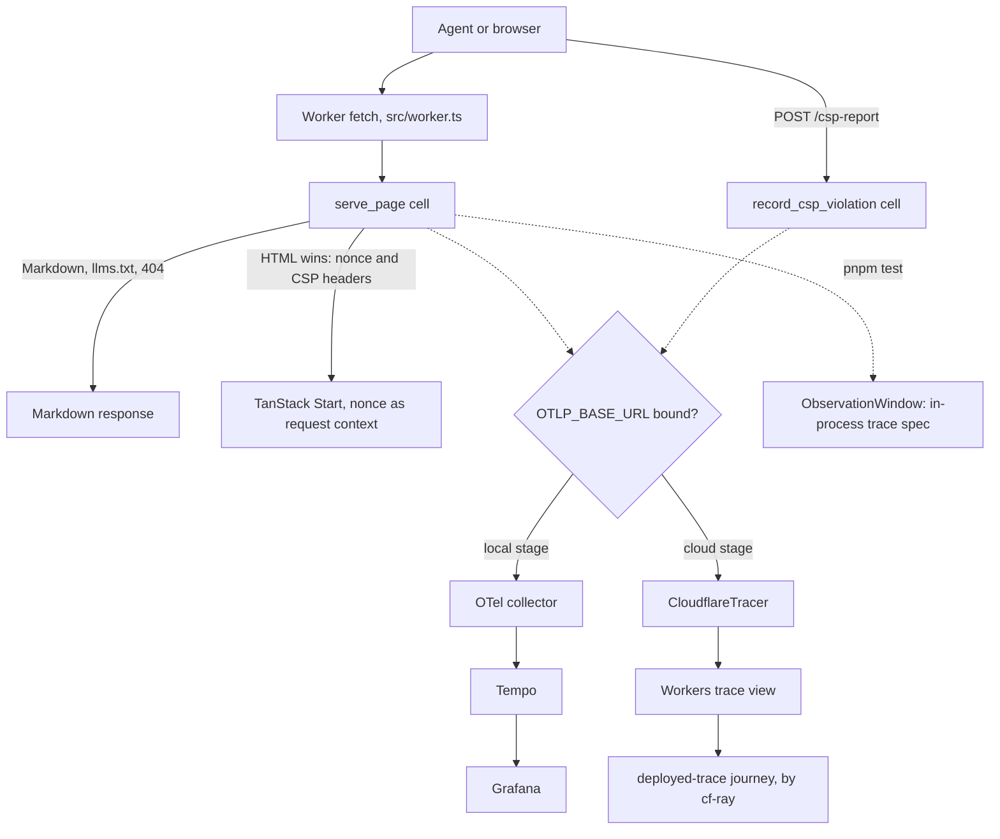
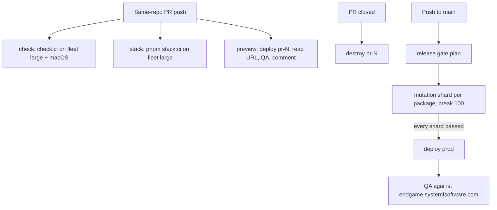

# Starter Lake 1: Foundation - Plan

## Goal Capsule

- **Objective:** An engineer can run the kit's whole stack with one command and deploy it with another, every same-repo PR gets a preview that CI checks over HTTP and in a browser, and `endgame.systemfsoftware.com` serves the kit's home page as Markdown to agents and as strict-CSP HTML to browsers, with the Worker's Effect spans in Cloudflare's trace view.
- **Means:** One `gh stack` of fourteen PRs on trunk `main`: toolchain and gates first, then the local stack and the one Worker, then deploys and previews (KTD1).
- **Product authority:** Ryan Lee owns scope. Kiro (conductor) answers as co-partner and holds the Cloudflare credentials, the runner fleet and the merges. `repos/constitution/` is the law. The origin plan's Product Contract governs every R-ID this plan cites.
- **Execution profile:** One omp session builds U1-U13 in order in a fresh worktree off `origin/main`, opening each PR once its local gate is green. Kiro prompts review separately and merges bottom-up with squash merges. U14 starts only after the first production deploy. Mutation testing never runs on a developer host, and the session does not review its own PRs.
- **Stop conditions:** Stop and hand Kiro the evidence when a preset rule rejects a shape the platform requires (R67: wait for the sfs fix, never add an override), a fleet runner lacks a capability a job needs, the deploy token lacks a permission the first preview reveals, Cloudflare rejects `webcrypto_modern_algorithms` at deploy, TanStack Start's request context cannot carry the nonce into `ssr.nonce`, a framework inline script cannot carry the nonce without `'unsafe-inline'` (KTD11), or bubblewrap cannot build the sandbox U11b requires (there is no unsandboxed mode).
- **Open blockers:** None. The template holds no credentials (Ryan 2026-10-06): Kiro deleted its `CLOUDFLARE_API_TOKEN` and `CLOUDFLARE_ACCOUNT_ID` Actions secrets. Credentialed jobs run only in adopter repos, with each repo's own secrets.
- **Who finishes:** This session builds every layer and opens its PR with QA evidence. Kiro reviews, checks each preview in a browser, and merges.

---

## Product Contract

### Summary

Lake 1 turns the starter's library seed into the foundation every later lake builds on. The toolchain moves to Effect 4 stable at exact pins, lint runs with no overrides, mutation moves to a release gate on `main`, and CI runs on the self-hosted fleet. One Worker serves the home page, written once as the README's opening, as Markdown by default and as HTML to browsers, plus `/llms.txt`, under a strict CSP. The stack runs locally from one command with its traces in Grafana, deploys from one command, gets a QA'd preview on every PR, and reaches `endgame.systemfsoftware.com` only after every mutant dies.

### Problem Frame

The origin plan scopes the starter as the full-stack exemplar across nine lakes, and every later lake needs a Worker to grow, a local stack to test it on, a deploy path to prove it, and gates that hold it. Today the starter is one `hello` function (`packages/starter/src/index.ts:1`). CI runs mutation on every PR (`package.json` `check:ci`), lint carries two `off` overrides (`packages/starter/oxlint.config.ts:14-25`), Effect is a release candidate (`pnpm-workspace.yaml:20`), and nothing deploys. Platform drift is cheapest to fix when the first deploy happens before anything depends on it.

### Key Decisions

Inherited from the origin:

- **Web: TanStack Start + React 19 + React Compiler in the one Worker, built by `Cloudflare.Website.Vite` with a custom `main`, without `@cloudflare/vite-plugin`.** (origin, session-settled: user-directed.) Governs R41, R117.
- **The site serves from `endgame.systemfsoftware.com`.** (origin, session-settled: user-directed — chosen over `workers.dev`.) Governs R64, R122.
- **The human home page leads with the reader's problem and the result, then the proof, then how to start.** (origin, session-settled: user-directed.) Governs R117, R118.
- **Runtime libraries live in systemfsoftware as published packages; the starter holds the app at exact pins.** (origin, session-settled: user-directed.) Governs R75.

Settled while planning this lake:

- **Lake 1 ships a one-command deploy, a QA'd preview per same-repo PR, and production on push to `main` as adopter workflows.** (session-settled: user-directed; amended by Ryan 2026-10-06 — the template is public and holds no credentials.) Every credentialed job carries `!github.event.repository.is_template`, so it runs only in repos created from the template, with that repo's own secrets, and fails naming any secret that is missing. In this repo, `check:ci` proves the deploy against Alchemy's own emulation (`alchemy dev`). Governs R64, R65, R122.
- **A surviving mutant blocks the production deploy, not the merge.** (session-settled: user-approved — chosen over mutation in the PR gate.) Governs R66.
- **The Worker's Effect spans reach Cloudflare's deployed trace view in Lake 1.** (session-settled: user-directed — chosen over waiting for Lake 8.) Governs R60.
- **Strict CSP with Trusted Types and violation reports ships in Lake 1.** (session-settled: user-approved — chosen over Lake 7: the deployed QA checks every HTML page from the first deploy.) Governs R114.
- **The home page is the README's opening, written once in Markdown and rendered as HTML from that source; Lake 7 replaces it.** (session-settled: user-approved — chosen over a separate page source.) Governs R117.
- **Lint runs without repo overrides now, on preset 4.0.0.** (session-settled: user-approved — chosen over waiting for the sfs Lake 6 presets: 4.0.0 already accepts Gherkin step bodies and build-config files.) Governs R67.
- **The `hello` seed package is deleted and the Worker app becomes the gated example.** (session-settled: user-approved.) Governs R121.
- **A service with nothing to run in Lake 1 lands with its first consumer: the heavy-job service (R83) with Lake 2's race demo, Secrets Store bindings (R107) and the mail sink with Lake 3's mail.** (session-settled: user-directed — chosen over building them inert now: it is ordering, not deferral.) Governs R63, R64.

### Requirements

Each R-ID below is the slice of the origin requirement that Lake 1 delivers; the origin's text governs the rest, and Scope Boundaries names where the remainder lands. R121 and R122 are new.

**Toolchain and gates**

- R75. Every catalog entry is an exact version. `pnpm-workspace.yaml` sets `minimumReleaseAge: 1440` explicitly, which makes the policy strict, and `minimumReleaseAgeExclude` holds the name patterns `effect`, `@effect/*`, `effect-agent` and `@effect-agent/*`, and one exact entry for every other registry package younger than the policy when it is pinned. From U11b, `@systemfsoftware/*` packages come from the systemfsoftware flake input as `file:` tarballs, not from npm, so they carry no exclude entries; a PR snapshot pin is a flake rev, a stable pin a release tag (R71).
- R123. Every entry point that executes dependency code (install build scripts, build, test, lint, dev, process-compose processes, deploy CLIs) runs through the shared sandbox launcher from the systemfsoftware flake: bubblewrap on Linux, `sandbox-exec` on macOS, loopback-only network unless the command declares its egress hosts. Proof tests fail the gate when, inside the sandbox, reading `~/.ssh` or `~/.config` succeeds, writing outside the project succeeds, or an undeclared outbound connection succeeds; the dev stack and the suites still pass. They run on the fleet and on macOS.
- R111. workerd is pinned to 1.20261005.1 by an exact override, the Worker sets the `webcrypto_modern_algorithms` flag, and an unknown compatibility flag fails the PR's stack job and any deploy. While 1.20261005.1 is younger than the policy, `workerd` and each of its five `@cloudflare/workerd-*` platform binaries carry an exact exclude entry.
- R66. Mutation runs only in the release gate on push to `main`, as one fleet job per package that declares a `mutation` script, at `break: 100`. `pnpm check:ci` no longer runs it, an empty package list fails the gate, and production deploys only after every shard passes.
- R67. Lint runs every rule at `error` from one root configuration, with no `off` or `warn` override anywhere in the repository.
- R121. The `hello` seed package (`packages/starter`) is deleted with every reference to it, and the Worker app is the gated example a new package follows.

**Local run**

- R63. `pnpm dev` starts the local stack under process-compose with readiness probes and no cloud credentials: the OpenTelemetry collector, Tempo, Grafana reading Tempo, and the Worker under `alchemy dev`. `pnpm stack:ci` starts the same definition detached, waits until every service is ready, runs the e2e journeys against it (KTD15), and stops the stack; CI's stack job runs that command.

**Front door**

- R41. The Worker negotiates before the app router. A request gets HTML only when its `Accept` header gives `text/html` a higher q-value than `text/markdown`, each read from the most specific matching range (the full type, then `text/*`, then `*/*`) and 0 when none matches. Every other request gets Markdown, including one with no `Accept` header or an unparsable one. Negotiated responses carry `Vary: Accept`, and an unknown path gets a Markdown 404 unless HTML wins, when the app router answers.
- R42. `/llms.txt` is generated from the site's page catalog in the llmstxt.org shape (one H1, a blockquote summary, link lists), with absolute links under the request's origin, and is always `text/markdown`.
- R117. The home page is the README's opening (the reader's problem, the result, how to run it), held between `<!-- home:start -->` and `<!-- home:end -->` in `README.md`. A Markdown response carries that text verbatim and an HTML response renders it.
- R118. The README opening states the reader's problem and the result before it names any technology.
- R114. Every HTML response carries a Content-Security-Policy with a fresh per-request nonce, `'strict-dynamic'`, no `'unsafe-inline'` or `'unsafe-eval'`, and `require-trusted-types-for 'script'`, and reports violations to `/csp-report`, where the Worker records each report as a declared span and a log line. The browser journey asserts the policy and zero violations on every HTML route.

**Observability**

- R59. Every front-door interaction (serving a page, `/llms.txt`, recording a violation report) emits spans declared in `@systemfsoftware/trace-taxonomy`, and an in-process `@systemfsoftware/trace-spec` suite checks the declared spans, their attributes and their parentage.
- R60. Workers Logs and Workers traces are on for the deployed Worker, and its Effect spans appear in Cloudflare's trace view inside the trace of the request that produced them. Locally, every span reaches the collector and shows in Grafana.

**Deploy and previews**

- R64. `pnpm cloud:deploy` deploys the whole stack for the stage named in `ALCHEMY_STAGE`, with production at `endgame.systemfsoftware.com`, and a test proves that importing the stack module sends no request and writes no state.
- R65. Every same-repo PR gets a preview at its own URL, posted to the job summary and as one PR comment updated in place. CI runs the e2e journeys (agent, browser, deployed trace) against it and keeps the screenshots as artifacts, and closing the PR destroys the preview with every stage-scoped resource. Once production exists, previews are Cloudflare Worker Previews of the production Worker. Fork PRs get none of it.
- R122. After each production deploy, the release gate runs the e2e journeys against `https://endgame.systemfsoftware.com`.

**Strategy**

- R80. `STRATEGY.md` is updated through `ce-strategy` per the origin's Strategy Change section.

### Acceptance Examples

- AE7. **Covers R41.** (origin) Given no `Accept` header, when `/` is requested, then the response is `text/markdown`; with `Accept: text/html` it is SSR HTML.
- AE19. **Covers R41.** Given `Accept: text/html;q=0.5, text/markdown`, when `/` is requested, then the response is Markdown.
- AE20. **Covers R41.** Given curl's default `Accept: */*`, when `/` is requested, then the response is Markdown; given Chromium's default navigation `Accept`, it is HTML.
- AE21. **Covers R41.** Given no `Accept` header, when `/nope` is requested, then the response is a 404 in `text/markdown`.
- AE22. **Covers R114.** Given the home page loads in a fresh browser context, then no `securitypolicyviolation` event fires, and assigning a string to `innerHTML` throws a Trusted Types `TypeError`.
- AE23. **Covers R60.** Given the deployed site, when an agent requests `/`, then within 3 minutes the Workers trace found by the response's `cf-ray` holds the `front_door.serve_page` span with `app.front_door.route = home`.
- AE24. **Covers R64.** Given no Cloudflare credentials and a `fetch` that records every call, when `apps/site/alchemy.run.ts` is imported, then no call was made and no `.alchemy/` state exists.
- AE25. **Covers R66.** Given a merged change that leaves a mutant alive, then the release gate fails and production keeps its previous version; the merge stays.
- AE26. **Covers R111.** Given an unknown flag in the Worker's compatibility flags, when `pnpm stack:ci` runs, then the Worker never becomes ready and the command fails.

### Scope Boundaries

#### Deferred to Follow-Up Work

Each item lands with its first consumer in a later lake:

- Postgres in the local stack (R63): Lake 2, with the Postgres adapter (R89), by the same first-consumer rule as the heavy-job service.
- The local heavy-job service and its image (R83): Lake 2, with the race demo.
- Secrets Store bindings (R107) and the mail sink (R63): Lake 3, with mail.
- The Artifacts stand-in (R63, R120): Lake 9, with `forkKit`.
- The binding-removal type test (R64): Lake 2, with the Worker's first binding.
- Per-preview D1, KV, R2, Hyperdrive, Rate Limiting and mail sink (R65): each with the lake that binds it; every such resource is stage-scoped, so `pr-<N>` creates and destroys its own.
- The race suite and the Agent Readiness score on previews (R65, R51): Lakes 2 and 8.
- `llms-full.txt`, `/openapi.json`, `/mcp`, `/a2a` and the discovery documents (R42): Lake 5.
- The full home page with its proof and signed-in view (R117) and site-wide copy review (R118): Lake 7.
- Cloudflare Traces across rules, cache, Durable Objects and origin (R60): Lake 8. The OTLP export destination stays Cloudflare Observability plus the local collector. Workers Issues stays on through Alchemy's Worker settings, and the Issues-to-GitHub automation (U13b) is out of the template (Ryan 2026-10-06: Alchemy + distilled are the whole Cloudflare stack, R110).
- Removal checklists (R68): from Lake 2's first example bin. Lake 1's front door, observability base and CSP are the platform every bin builds on, not removable bins.

#### Outside this product's identity

Carried from the origin:

- Effect 3 compatibility, a light preset, `warn` severity, or opt-outs.
- Any deploy target other than Cloudflare.
- Passwords anywhere, including tests.
- XState or any lifecycle engine outside Effect core.
- A model call inside a decision, and external newsletter-list sync.
- Capabilities that need the user's local machine; handlers run in workerd.

#### Considered and not built

- A Dependabot `cooldown`: a bump younger than the release-age policy fails its own PR's install, which shows on that PR. Add `cooldown.default-days: 1` if those PRs become noise.
- Rate limiting on `/csp-report`: a report costs one span and one log line. Lake 3's Rate Limiting binding covers it if reports turn into abuse.
- Timing-based mutation sharding, as in sfs `.github/workflows/mutation.yml`: one job per package is the requested shard. Adopt timings when one package's shard outgrows its timeout.

### Dependencies / Assumptions

- The deploy token lets Alchemy bootstrap its Cloudflare state store, which deploys a Worker and keeps its secrets in Secrets Store (alchemy beta.80 `src/Cloudflare/StateStore/State.ts:795-831`). It also attaches a custom domain in the `systemfsoftware.com` zone and runs telemetry queries, whose accepted permission is `Workers Observability Write`. U13's first preview run proves all three.
- Fleet runners carry `[self-hosted, systemfsoftware-runner, small|medium|large|xlarge]`, can install nix, and run one job each. Because the repository is public and fork PRs run on the fleet, the repo's Actions setting holds fork-PR runs for maintainer approval (Kiro).
- Alchemy stays at `2.0.0-beta.80`, the probed version. `2.0.0-beta.81` (published 2026-10-05) arrives through Dependabot.

---

## Planning Contract

### Key Technical Decisions

- KTD1. **One stack; graders change only in Evaluator PRs.** Workflows, lint, test and mutation configs, and the turbo task graph change only in PRs that carry no graded code (U2, U3, U5, U8, U13), each citing Kiro's approval of 2026-10-05 (GATE1). `AGENTS.md` marks `.github/workflows/` read-only for makers, and Kiro's ruling is the operator approval these PRs carry. Grader package majors move in U4 because preset 4.0.0 and stryker-js 15 require Effect 4 stable; U4's PR body declares it (CONST-W3). (session-settled: user-directed — chosen over mixing workflow changes into feature PRs: an Evaluator change goes in its own commit and PR.)
- KTD2. **Every Linux job runs on the fleet; the macOS `check:ci` leg stays on `macos-latest`.** `small` runs commitlint, changeset-check, force-release, release planning and the release-gate plan; `medium` runs npm publish and the preview and production deploy-and-QA jobs; `large` runs `check:ci`, the stack job and mutation shards. `AGENTS.md` records the macOS exception, its reason (the fleet has no macOS and adopters develop on it), and its trigger (move the leg when the fleet gains macOS). (session-settled: user-directed.)
- KTD3. **The release gate is one workflow, `.github/workflows/release-gate.yml`, on push to `main`.** A `plan` job runs `scripts/mutation-shards.ts`, which lists every workspace package whose `package.json` declares a `mutation` script and fails on an empty list. One `mutation` job per package restores its `reports/stryker-incremental.json` from the Actions cache and runs `pnpm --filter <pkg> run mutation`; U13 adds `deploy`, which needs every shard, and `qa`. Concurrency queues runs and never cancels a running one, so no Alchemy apply is interrupted. U3 also drops the checker's `prioritizePerformanceOverAccuracy`, which stryker-js 15 removes and 13 accepts absent.
- KTD4. **Pins follow the strict release-age policy.** U4 pins each catalog entry to its newest release at pin time (Appendix: Pins as of 2026-10-05) and rebuilds `minimumReleaseAgeExclude` from the lockfile: the four name patterns, every resolved `@systemfsoftware/*` version, and each package pnpm's strict check names. A probe on pnpm 12.4.2 showed the check names every `@cloudflare/workerd-*` binary on its own and rejects a name pattern with a version (`ERR_PNPM_INVALID_MINIMUM_RELEASE_AGE_EXCLUDE`), so a fresh workerd pin takes six exact entries.
- KTD5. **Shared configs live at the root.** U5 adds `oxlint.config.ts` (the preset plus today's strict TypeScript tier, no overrides), `vitest.shared.ts` and `stryker.shared.ts`, and each package's config extends them and declares only its own files. Turbo's `lint`, `test` and `mutation` inputs add the root files, and `build` inputs cover every tracked package file outside `tests/` plus the root `README.md`, which the site's build reads. sfs's shared configs are private packages (`packages/toolchain/*/package.json`), so the starter cannot consume them. (session-settled: user-approved — chosen over copying the seed package's configs into each new package.)
- KTD6. **`apps/site` (`@endgame/site`) is the one Worker.** `alchemy.run.ts` declares stack `Endgame` with resource `Site`, a `Cloudflare.Website.Vite` with `main: 'src/worker.ts'`, compatibility date `2026-10-05` and flag `webcrypto_modern_algorithms`. The Worker's `fetch` runs the front door first, an `effect/http` handler whose page cell answers Markdown, `/llms.txt` and the Markdown 404 itself and hands HTML to TanStack Start's server entry through a port the composition root binds. The probe ran this shape under `alchemy dev` (`docs/brainstorms/.scratch/probes/oneworker/`).
- KTD7. **The home page compiles at build time.** `apps/site/readme-opening-plugin.ts` serves the virtual module `virtual:readme-opening`: it slices `README.md` between the home markers, exports the slice as `markdown`, and compiles it with `@mdx-js/mdx` (`format: 'md'`) into a React component. The Worker ships no Markdown parser and assigns no HTML strings, so content needs no Trusted Types policy. A runtime renderer behind `dangerouslySetInnerHTML` was rejected because every client navigation would need a policy.
- KTD8. **Cells name their spans from declarations.** `src/front-door/FrontDoorTaxonomy.ts` declares `front_door.serve_page` and `front_door.record_csp_violation`, and each cell is `Sandwich.named(<span>.name)`. `effect-cell-types` then emits the declared span, its `.read` and `.write` children, the decision tag and the command fields mapped by `[Workflow.InstrumentationBrand]`, and each declaration types its attrs with `Workflow.SpanAttributes` (sfs `packages/effect-cell-types/README.md:250-255`). Phases follow the five-phase sandwich (sfs `compound-packs/cell-architecture/sandwich-phase-order.md`).
- KTD9. **The composition root picks the span exporter.** When the Worker's `OTLP_BASE_URL` is bound, which only non-cloud stages do, `Otlp.layerJson` from `effect/observability` exports to the local collector. Otherwise the per-invocation `layer` from `alchemy/Cloudflare/Workers/CloudflareTracer` mirrors Effect spans into Workers tracing, and the Website's `observability` turns logs and traces on, persisted, sampled at 1. Alchemy's public `Cloudflare.Telemetry()` needs Alchemy's Effect-native Worker host (`src/Cloudflare/Workers/Telemetry.ts:152-170`), which a Vite website with a custom `main` is not, so the Worker imports the tracer it wraps through the package's published `./*` subpath (`package.json:40-44`; typed `Layer<never>`), built per invocation as its contract requires. (session-settled: user-directed — Kiro: deployed spans in Lake 1, through whatever route works on the pinned Alchemy.)
- KTD10. **The deployed span check correlates by Ray ID.** Workers tracing neither continues an incoming `traceparent` nor exposes `spanContext()` yet (Cloudflare docs: Known limitations; Custom spans, Limitations), so trace-spec cannot own a deployed trace id. `apps/site-e2e/tests/deployed-trace.integration.test.ts` reads the response's `cf-ray`, polls `POST /accounts/{account_id}/workers/observability/telemetry/query` every 5 seconds for up to 3 minutes for events whose `$metadata.rayId` matches, then reads that trace and looks for the `front_door.serve_page` span. U13's first preview run confirms the field keys against the telemetry keys endpoint.
- KTD11. **The front door owns the CSP; TanStack Start receives the nonce.** The serve-page cell's read phase draws 16 random bytes for the nonce. On `ServeHtmlPage`, its shape phase builds `Content-Security-Policy` from the pure `content-security-policy.workflow.ts` plus `Reporting-Endpoints: csp="/csp-report"`, and its write phase hands the request and the nonce to the HTML port and sets both headers on the port's response. `src/worker.ts` binds the port to TanStack Start's `handler.fetch(request, { context: { nonce } })`, typed by registering `server.requestContext` (`@tanstack/start-server-core` 1.169.39 `dist/esm/request-handler.d.ts:56-70`), and `src/router.tsx` reads that context into the router's `ssr.nonce`. The policy is `default-src 'self'; script-src 'nonce-<n>' 'strict-dynamic'; style-src 'self'; img-src 'self' data:; object-src 'none'; base-uri 'none'; frame-ancestors 'none'; form-action 'self'; require-trusted-types-for 'script'; trusted-types 'none'; report-to csp; report-uri /csp-report`. `trusted-types` names a policy only when shipped code creates one. Owning the header in the front door keeps the policy on every HTML response whichever renderer answers, and puts it in reach of the in-process suite; TanStack's global request middleware was rejected because only a served build reaches it. Two TanStack issues are known risks, and the browser journey's zero-violation check catches both: #5511 (an inline script rendered without the nonce) and #8550 (with the nonce sent in a header, browser nonce hiding makes hydration re-append inline scripts).
- KTD12. **Stages pick their state store.** `prod` and `pr-<N>` use `Cloudflare.state()`, and every other stage uses `Alchemy.localState()`, so `alchemy dev` and the stack-import test never need credentials. Only `prod` attaches `endgame.systemfsoftware.com`. `pnpm cloud:deploy` and `pnpm cloud:destroy` run `alchemy deploy` or `alchemy destroy` with `--no-input --yes` in `apps/site` for `ALCHEMY_STAGE`.
- KTD13. **Previews start as stack copies and become Worker Previews.** U13 deploys `pr-<N>` as its own copy of the stack, because a Preview must belong to an existing production Worker. After the first production deploy, U14 sets `preview: { of: Cloudflare.Worker.ref('Site', { stage: 'prod' }), message, tag }` on `pr-<N>`'s Website (alchemy beta.80 `src/Cloudflare/Workers/Worker.ts:461-491,1938-1961`). The stage keeps owning every stage-scoped resource a later lake binds, so each preview keeps its own. Jobs read the URL from `alchemy state cat Endgame/pr-<N>/Site` (`attr.url`). (session-settled: user-directed — Kiro: a per-PR copy stays only on evidence that it is strictly better.)
- KTD14. **The local stack comes from the flake.** `flake.nix` adds a `local-stack` package, a `writeShellApplication` over `process-compose`, `opentelemetry-collector-contrib`, `tempo` and `grafana` from the locked nixpkgs, and `bin/local-stack` copies the `bin/dprint` wrapper. `process-compose.yaml` holds the collector (ready at `:13133`), Tempo (`:3200/ready`), Grafana (`:3000/api/health`) and, from U7, `site` (`alchemy dev --stage local --no-input`, ready at `:1337/llms.txt`), with configs under `local-stack/`. On Linux the dev shell sets `PLAYWRIGHT_BROWSERS_PATH` from `playwright-driver.browsers` 1.63.0, which matches npm `playwright` 1.63.0; macOS uses Playwright's own browser download. CI jobs that need browsers run through `nix develop --command`.
- KTD15. **Two test altitudes: in-process in `apps/site`, journeys in `apps/site-e2e`.** `pnpm test` in `apps/site` runs everything in-process: the workflow properties, the generated schema codec laws (`src/schema-laws.test.ts`, rewritten by `inlineSchemaTests()` from `@systemfsoftware/effect-schema-vite`), the front-door feature through the package's main export (`src/mod.ts`, the front door as an `effect/http` app over its ports) with the HTML port as the only double, the trace spec under an `ObservationWindow`, and the stack-import smoke. Stryker runs that same suite. `vitest.config.ts` loads `readme-opening-plugin.ts` so the README module resolves in tests. `apps/site-e2e` (`@endgame/site-e2e`, private, no `src/`) holds the seam-only journeys, process-isolated and capped at four (`skill://test-layer-selection`), as one-Feature `.integration.test.ts` Gherkin files against `SITE_URL`: project `local` runs the agent and browser journeys against the local stack (`test:local`), and project `deployed` adds the deployed-trace journey (`test:deployed`). Journeys read `SITE_URL` and Cloudflare credentials through Effect `Config` and fail when one is missing. The HTML port double carries a residual risk, renderer fidelity, which the browser journey covers against the real renderer.

#### Test Admission

Every proposed test passed `skill://test-layer-selection` under a default of refusal; the oxlint test-discipline plugin decides placement.

| Test                                                                                                     | Layer                     | Admitted because                                                                                                                                                     |
| -------------------------------------------------------------------------------------------------------- | ------------------------- | -------------------------------------------------------------------------------------------------------------------------------------------------------------------- |
| `serve-page`, `llms-txt`, `content-security-policy`, `record-csp-violation` `.workflow.property.test.ts` | Property, `src/`          | Pure decisions; universals over generated headers, catalogs, nonces and reports that the served surface reaches only by example                                      |
| `apps/site/src/schema-laws.test.ts`                                                                      | Generated codec laws      | Required for every non-error schema; the `Accept` codec's round trip catches a parser that disagrees with its encoder                                                |
| `apps/site/tests/front-door.integration.test.ts`                                                         | Behaviour, in-process     | The published front-door contract: AE7, AE19-AE21, `/llms.txt`, the CSP headers, report intake                                                                       |
| `apps/site/tests/front-door.trace.test.ts`                                                               | Trace spec, in-process    | R59's span graph (declared spans, attributes, parentage), which no response assertion sees                                                                           |
| `apps/site/tests/stack.integration.test.ts`                                                              | Composition-root smoke    | AE24: a top-level deploy call in `alchemy.run.ts` is a plausible regression that nothing else notices                                                                |
| `apps/site-e2e/tests/agent.integration.test.ts`                                                          | Journey                   | Only the built Worker under workerd proves the bundle, the compatibility flags and the README module together                                                        |
| `apps/site-e2e/tests/browser.integration.test.ts`                                                        | Journey                   | Only a browser enforces CSP and Trusted Types (AE22)                                                                                                                 |
| `apps/site-e2e/tests/deployed-trace.integration.test.ts`                                                 | Journey, deployed only    | Only Cloudflare's trace view shows the deployed spans (AE23)                                                                                                         |
| Sandbox proof tests (U11b, the launcher's suite run consumer-side)                                       | Journey, process-isolated | R123's security contract: only a real launcher run proves `~/.ssh`/`~/.config` reads, out-of-project writes and undeclared egress fail; each has a sabotaged-run red |

Refused: served-HTTP suites repeating AE7 and AE19-AE21 (delegated in-process), an assertion that the HTML port received the nonce (a collaborator call, CONST-T10), and a trace case for the HTML decision (it needs a renderer double in a lane that takes none).

### High-Level Technical Design

These sketches show shape, not code.

Request and span paths:



CI and deploy flow:



### Output Structure

```text
.github/workflows/
  ci.yml                     U2 fleet, U8 stack job
  release-gate.yml           U3 mutation, U13 deploy and qa
  previews.yml               U13
  commitlint.yml  changeset-check.yml  release.yml  force-release.yml   U2
apps/site/
  alchemy.run.ts  readme-opening-plugin.ts  vite.config.ts
  package.json  tsconfig.json  tsconfig.node.json
  oxlint.config.ts  vitest.config.ts  stryker.config.ts
  src/
    worker.ts  mod.ts  router.tsx  readme-opening.d.ts  schema-laws.test.ts
    routes/__root.tsx  routes/index.tsx
    front-door/
      FrontDoorTaxonomy.ts
      serve-page.schema.ts  serve-page.workflow.ts  serve-page.cell.ts
      llms-txt.workflow.ts  content-security-policy.workflow.ts
      record-csp-violation.schema.ts  record-csp-violation.workflow.ts  record-csp-violation.cell.ts
      __tests__/<stem>.workflow.property.test.ts   one per workflow
  tests/
    front-door.integration.test.ts  front-door.trace.test.ts  stack.integration.test.ts
apps/site-e2e/
  package.json  tsconfig.json  oxlint.config.ts  vitest.config.ts
  tests/
    agent.integration.test.ts  browser.integration.test.ts  deployed-trace.integration.test.ts
    __fixtures__/site.fixture.ts  browser.fixture.ts  workers-observability.fixture.ts
local-stack/
  otel-collector.yaml  tempo.yaml  grafana.ini  grafana/datasources.yaml
bin/local-stack
process-compose.yaml
oxlint.config.ts  vitest.shared.ts  stryker.shared.ts
scripts/mutation-shards.ts
```

### Stack Mechanics

- Branches are `lake1/<slug>`. `gh stack init lake1/strategy` starts the stack, and each later layer is `gh stack add lake1/<slug>` from the top.
- Before every push, `gh stack view --json | jq -e '.trunk == "main" and any(.branches[]; .name == "'"$(git branch --show-current)"'")'` exits 0.
- A layer publishes with `gh stack submit --auto --open` once its local gate is green, then `gh pr edit` sets its title and a body holding the QA evidence and, for Evaluator PRs, Kiro's approval.
- A review fix is a commit on the flagged layer, then `gh stack rebase --upstack` and `gh stack push`.
- Kiro merges bottom-up with `gh stack merge <PR> --yes --squash`; a squash merge takes the PR title as the commit subject.
- PR titles are conventional commits within commitlint's scopes (`repo`, `deps`, `ci`), and their diff shape matches the type.
- U14 branches only after U13 has merged and the release gate has deployed production: `gh stack sync`, then `gh stack add lake1/worker-previews` on what remains, or `gh stack init lake1/worker-previews` from `main` when nothing does.

---

## Implementation Units

The stack runs U1 through U13 in order; U14 follows the first production deploy.

| U-ID | Title                              | Key files                                                                                                   | Depends on                   |
| ---- | ---------------------------------- | ----------------------------------------------------------------------------------------------------------- | ---------------------------- |
| U1   | Reposition the strategy            | `STRATEGY.md`                                                                                               | none                         |
| U2   | CI on the fleet (Evaluator)        | `.github/workflows/*.yml`, `AGENTS.md`                                                                      | none                         |
| U3   | Mutation release gate (Evaluator)  | `.github/workflows/release-gate.yml`, `scripts/mutation-shards.ts`, `package.json`                          | U2                           |
| U4   | Effect 4 stable at exact pins      | `pnpm-workspace.yaml`, `pnpm-lock.yaml`                                                                     | U3                           |
| U5   | Root configs, no overrides (Eval.) | `oxlint.config.ts`, `vitest.shared.ts`, `stryker.shared.ts`, `turbo.json`                                   | U4                           |
| U6   | One-command local stack            | `flake.nix`, `bin/local-stack`, `process-compose.yaml`, `local-stack/`                                      | none                         |
| U7   | The one Worker                     | `apps/site/**`, `apps/site-e2e/**`, `README.md`, `process-compose.yaml`                                     | U5, U6                       |
| U8   | E2E journeys in CI (Evaluator)     | `.github/workflows/ci.yml`, `package.json`, `AGENTS.md`                                                     | U7                           |
| U9   | Delete the hello seed              | `packages/starter/**`, `README.md`, `.changeset/README.md`                                                  | U7                           |
| U10  | Front-door traces                  | `apps/site/src/worker.ts`, `apps/site/alchemy.run.ts`, `apps/site/tests/front-door.trace.test.ts`           | U8                           |
| U11  | Strict CSP and Trusted Types       | `apps/site/src/front-door/`, `apps/site/src/router.tsx`, `apps/site-e2e/tests/browser.integration.test.ts`  | U10                          |
| U11b | Nix-delivered deps, sandboxed      | `flake.nix`, `flake.lock`, `package.json`, `pnpm-workspace.yaml`, `.npmrc`, `process-compose.yaml`, `bin/*` | U11, prm PR B, sfs PR C      |
| U12  | One-command deploy                 | `apps/site/alchemy.run.ts`, `package.json`, `apps/site-e2e/tests/deployed-trace.integration.test.ts`        | U11b                         |
| U13  | Previews and production (Eval.)    | `.github/workflows/previews.yml`, `.github/workflows/release-gate.yml`, `AGENTS.md`                         | U12; adopter secrets         |
| U14  | Worker Previews                    | `apps/site/alchemy.run.ts`, `AGENTS.md`                                                                     | U13, first production deploy |

### U1. Reposition the strategy as the full-stack exemplar

- **PR:** `lake1/strategy`, `docs(repo): reposition the strategy as the full-stack exemplar`.
- **Goal:** `STRATEGY.md` says what the starter becomes.
- **Requirements:** R80.
- **Dependencies:** None.
- **Files:** `STRATEGY.md`.
- **Approach:** Run `ce-strategy` with the origin's Strategy Change section as its input and write the text in this session, without waiting on Ryan. The pointer to `packages/starter/oxlint.config.ts` at `STRATEGY.md:68` becomes the house preset by name, since U9 deletes that path.
- **Test expectation:** none -- documentation.
- **Verification:** `./bin/dprint check` passes, and each Strategy Change bullet maps to a `STRATEGY.md` section.

### U2. Run every Linux job on the fleet (Evaluator)

- **PR:** `lake1/fleet`, `ci(ci): run every linux job on the self-hosted fleet`.
- **Goal:** CI runs on the fleet at the sizes in KTD2, and the macOS exception is on record.
- **Requirements:** KTD2.
- **Dependencies:** None.
- **Files:** `.github/workflows/ci.yml` (matrix `include` of a fleet `large` leg and a `macos-latest` leg), `.github/workflows/commitlint.yml`, `.github/workflows/changeset-check.yml`, `.github/workflows/release.yml`, `.github/workflows/force-release.yml` (also: the `package` input stays required and loses its `@TODO/starter` default), `AGENTS.md` (new `## CI` section).
- **Approach:** Change runner labels only; steps stay as they are, with `cachix/install-nix-action@v31` still the source of dprint.
- **Test expectation:** none -- workflow configuration; the PR's own runs prove it.
- **Verification:** `nix run nixpkgs#actionlint -- .github/workflows/*.yml` is clean, and the PR's jobs run on fleet runners (runner name in each job log) and pass.

### U3. Move mutation to a release gate on main (Evaluator)

- **PR:** `lake1/release-gate`, `ci(ci): move mutation to a release gate on main`.
- **Goal:** Mutation leaves the PR gate and runs per package on `main`.
- **Requirements:** R66, AE25.
- **Dependencies:** U2.
- **Files:** `.github/workflows/release-gate.yml` (new), `scripts/mutation-shards.ts` (new, Deno, shebang `deno run --config=scripts/deno.json --allow-read=.`), `package.json` (`check:ci` without `pnpm mutation`), `packages/starter/stryker.config.ts` (drops `prioritizePerformanceOverAccuracy`).
- **Approach:** KTD3. Triggers are `push` to `main` and `workflow_dispatch`, with `permissions: contents: read`. `plan` runs on `small`, and `mutation` runs on `large` with `fail-fast: false` and a 75-minute timeout, uploading each package's `reports/mutation-report.{html,json}`. The script expands the `pnpm-workspace.yaml` package globs with `@std/fs`, as `scripts/check-changeset.ts` does.
- **Test expectation:** none -- release workflow; its first run on `main` is the proof.
- **Verification:** actionlint is clean; `deno check scripts/mutation-shards.ts` passes; `./scripts/mutation-shards.ts` prints the one `@TODO/starter` shard and exits non-zero on a copy of the workspace with no `mutation` script; `pnpm check:ci` passes. After the merge, the first release-gate run on `main` is green and its link goes on the PR.

### U4. Move to Effect 4 stable at exact pins

- **PR:** `lake1/effect4-pins`, `deps(deps): move to effect 4 stable at exact pins`.
- **Goal:** The toolchain runs on Effect 4.0.1 with every pin exact and the strict release-age policy on.
- **Requirements:** R75.
- **Dependencies:** U3, so that stryker-js 15 meets a config without the removed option.
- **Files:** `pnpm-workspace.yaml`, `pnpm-lock.yaml`, `README.md` (the Effect badge reads 4.0), plus `packages/starter/src/index.ts` and `packages/starter/tests/hello.integration.test.ts` only if the new majors require it.
- **Approach:** KTD4 and the Appendix pin table. The PR body declares that the preset and stryker majors move here because they require Effect 4 stable (KTD1).
- **Test expectation:** none new; the existing hello suite stays green on the new majors.
- **Verification:** `pnpm install --frozen-lockfile` passes under the strict policy; `pnpm check:ci` passes; `pnpm why effect` shows only 4.0.1; `git grep -nE ':\s*[\^~]' pnpm-workspace.yaml` finds nothing.

### U5. Move lint, test and mutation settings to the root (Evaluator)

- **PR:** `lake1/shared-configs`, `build(repo): move lint, test and mutation settings to the root`.
- **Goal:** New packages enroll by extending root configs, and no lint override remains.
- **Requirements:** R67.
- **Dependencies:** U4, since preset 4.0.0 is what makes both overrides redundant.
- **Files:** `oxlint.config.ts`, `vitest.shared.ts` and `stryker.shared.ts` (new), `tsconfig.node.json` (includes them), `turbo.json` (inputs), `packages/starter/oxlint.config.ts`, `packages/starter/vitest.config.ts` and `packages/starter/stryker.config.ts` (extend the root; both overrides gone).
- **Approach:** KTD5. Settings move unchanged apart from deleting the two overrides; each package keeps only its `mutate` set, its test-runner config path and its aliases.
- **Test expectation:** none -- configuration; lint, test and mutation keep running unchanged.
- **Verification:** `pnpm check:ci` passes; `git grep -nE "'(off|warn)'|\"(off|warn)\"" -- '*oxlint.config.ts'` finds nothing. Sabotage: a planted `debugger;` in `packages/starter/src/index.ts` fails `pnpm lint`, then comes out.

### U6. Add the one-command local stack

- **PR:** `lake1/local-stack`, `build(repo): add the one-command local stack`.
- **Goal:** One command starts the collector, Tempo and Grafana with readiness probes.
- **Requirements:** R63 (without the `site` service, which U7 adds).
- **Dependencies:** None.
- **Files:** `flake.nix`, `bin/local-stack`, `process-compose.yaml`, `local-stack/otel-collector.yaml`, `local-stack/tempo.yaml`, `local-stack/grafana.ini`, `local-stack/grafana/datasources.yaml`, `package.json` (`dev`: `./bin/local-stack up`), `.gitignore` (`local-stack/data/`).
- **Approach:** KTD14. The collector receives OTLP on `:4318` (HTTP) and `:4317` (gRPC) and exports to Tempo's OTLP receiver on `:4417`. Tempo runs monolithic with local storage under `local-stack/data/tempo`, and Grafana runs with anonymous admin and a provisioned Tempo data source.
- **Test expectation:** none -- local tooling; U7's agent journey runs on it, and U10's QA reads its traces in Grafana.
- **QA:** `./bin/local-stack up -D -t=false && timeout 300 ./bin/local-stack project is-ready --wait`; POST one OTLP JSON span to `:4318/v1/traces` and read it back from `:3200/api/v2/traces/<id>`; open it in Grafana Explore with the browser tool; `./bin/local-stack down`. The transcript and screenshot go in the PR body.
- **Verification:** `pnpm check:ci` passes and the QA run shows all three services ready.

### U7. Serve the home page as Markdown or HTML from one Worker

- **PR:** `lake1/site`, `feat(repo): serve the home page as markdown or html from one worker`.
- **Goal:** The one Worker runs under `pnpm dev` and answers `/`, `/llms.txt` and unknown paths per R41.
- **Requirements:** R41, R42, R111, R117, R118, the import half of R64, the declarations of R59; AE7, AE19-AE21, AE24.
- **Dependencies:** U5, U6.
- **Files:**
  - `apps/site/package.json` (scripts `generate` (`tsr generate`), `build`, `typecheck`, `lint`, `test` and `mutation`, each running `tsr generate` first where it needs the route tree; `exports` `.` is `src/mod.ts`), `apps/site/alchemy.run.ts` (local state only in this unit), `apps/site/vite.config.ts`, `apps/site/readme-opening-plugin.ts`, `apps/site/tsconfig.json`, `apps/site/tsconfig.node.json`, `apps/site/oxlint.config.ts`, `apps/site/vitest.config.ts` (`readme-opening-plugin.ts` and `inlineSchemaTests()`), `apps/site/stryker.config.ts` (mutates `src/**/*.workflow.ts`).
  - `apps/site/src/worker.ts`, `apps/site/src/mod.ts`, `apps/site/src/router.tsx`, `apps/site/src/routes/__root.tsx`, `apps/site/src/routes/index.tsx`, `apps/site/src/readme-opening.d.ts`, `apps/site/src/schema-laws.test.ts` (the `export {}` stub the plugin rewrites).
  - `apps/site/src/front-door/FrontDoorTaxonomy.ts`, `serve-page.schema.ts`, `serve-page.workflow.ts`, `serve-page.cell.ts`, `llms-txt.workflow.ts`, `__tests__/serve-page.workflow.property.test.ts`, `__tests__/llms-txt.workflow.property.test.ts`.
  - `apps/site/tests/front-door.integration.test.ts`, `apps/site/tests/stack.integration.test.ts`.
  - `apps/site-e2e/package.json` (`@endgame/site-e2e`, private; scripts `typecheck`, `lint`, `test:local`, `test:deployed`), `apps/site-e2e/tsconfig.json`, `apps/site-e2e/oxlint.config.ts`, `apps/site-e2e/vitest.config.ts` (projects `local` and `deployed`), `apps/site-e2e/tests/agent.integration.test.ts`, `apps/site-e2e/tests/__fixtures__/site.fixture.ts`.
  - `process-compose.yaml` (`site` service), `pnpm-workspace.yaml` and `pnpm-lock.yaml` (new pins including `@systemfsoftware/effect-schema-vite` 3.0.1 and `@systemfsoftware/effect-schema-law` 5.0.1, the workerd override, its excludes), `README.md` (the opening between the home markers), `.gitignore` (`.alchemy/`, `apps/site/src/routeTree.gen.ts`, `apps/site-e2e/artifacts/`).
- **Approach:** KTD6, KTD7, KTD8. The command schema decodes the path into `home`, `llms_txt` or `unknown` and the `Accept` header into ranked media preferences; the decode is total, so an unparsable header yields no preferences (sfs `compound-packs/cell-architecture/decode-never-cast.md`). `serve-page.workflow.ts` decides `ServeMarkdownPage`, `ServeHtmlPage`, `ServeLlmsTxt` or `ServeMarkdownNotFound` in one `Match` dispatch at CC=1 (`skill://architect-workflow`). The page catalog behind `/llms.txt` holds the home page only. The README slice includes its own H1 and no external images, which the policy's `img-src 'self'` would block. Place tests by `skill://test-layer-selection`, and write them with `skill://architect-property-tests` and `skill://write-gherkin-integration-tests`.
- **Execution note:** The probe proved the runtime shape, not conformance; re-derive each probe file under the preset rather than copying it.
- **Test scenarios:**
  - `serve-page.workflow.property.test.ts`: over generated preference lists, the decision is HTML exactly when `text/html`'s effective q exceeds `text/markdown`'s; adding `text/html;q=0` never yields HTML; `llms_txt` always yields `ServeLlmsTxt`; `unknown` yields `ServeMarkdownNotFound` unless HTML wins.
  - `llms-txt.workflow.property.test.ts`: over generated catalogs and origins, every page appears once as an absolute link under the origin, after exactly one H1 and one blockquote summary.
  - `front-door.integration.test.ts` (in-process through `@endgame/site`, KTD15): "An agent with no Accept header gets the README opening as Markdown" (AE7: `text/markdown`, body equal to the slice read from `README.md`, `Vary: Accept`); "A client that prefers HTML is handed to the HTML renderer" (Chromium's default navigation `Accept`); "A client that ranks Markdown higher gets Markdown" (AE19); "curl's default Accept gets Markdown" (AE20); "An agent asking for an unknown path gets a Markdown 404" (AE21); "An agent reads llms.txt" (`text/markdown`, linking `<origin>/`).
  - `stack.integration.test.ts`: "Importing the stack deploys nothing" (AE24).
  - `src/schema-laws.test.ts`: generated round-trip and encode-stability laws for every exported schema, the `Accept` preferences codec included.
  - `apps/site-e2e/tests/agent.integration.test.ts` (project `local`): "An agent reads the site from the running Worker": `/` is the README opening as `text/markdown` with `Vary: Accept`, `Accept: text/html` gets SSR HTML holding the slice's H1 text, and `/llms.txt` links `<origin>/`.
- **QA:** Under `pnpm dev`, record `curl -sSD- localhost:1337/`, `curl -sSD- -H 'Accept: text/html' localhost:1337/`, `curl -sSD- localhost:1337/llms.txt` and `curl -sSD- localhost:1337/nope`; open `http://localhost:1337/` with the browser tool and record the rendered text; run `SITE_URL=http://localhost:1337 pnpm --filter @endgame/site-e2e test:local`.
- **Verification:** `pnpm check:ci` passes; the `local` journeys pass against the running stack; the release gate's first run after merge holds an `@endgame/site` shard at 100.

### U8. Run the e2e journeys on every PR (Evaluator)

- **PR:** `lake1/stack-ci`, `ci(ci): run the e2e journeys on every pr`.
- **Goal:** CI starts the same stack definition as `pnpm dev` and runs the `local` journeys against it.
- **Requirements:** R63 (CI half), R111 (unknown flag fails), AE26.
- **Dependencies:** U7.
- **Files:** `.github/workflows/ci.yml` (job `stack` on fleet `large`, 30-minute timeout: install nix, `pnpm install --frozen-lockfile`, `nix develop --command pnpm stack:ci`, and on any outcome upload `apps/site-e2e/artifacts/` and the process-compose log), `package.json` (`stack:ci`: start detached, `timeout 300 ./bin/local-stack project is-ready --wait`, `SITE_URL=http://localhost:1337 pnpm --filter @endgame/site-e2e test:local`, stop, exit with the journeys' status), `AGENTS.md` (Definition of Done row `START-5`: `pnpm stack:ci`).
- **Approach:** Root `package.json` stays the one definition of the stack run, as it is for `check:ci`.
- **Test expectation:** none -- workflow; the PR's own stack job runs U7's agent journey.
- **QA:** Sabotage for AE26: add `no_such_flag` to `Site`'s compatibility flags, run `pnpm stack:ci`, record the failure, revert.
- **Verification:** actionlint is clean and the PR's `stack` job passes on the fleet.

### U9. Delete the hello seed package

- **PR:** `lake1/delete-hello`, `refactor(repo): delete the hello seed package`.
- **Goal:** The seed package and every trace of it are gone.
- **Requirements:** R121.
- **Dependencies:** U7.
- **Files:** `packages/starter/**` (deleted), `README.md` (the sections at `README.md:85` and `README.md:108-110` that describe the package), `.changeset/README.md` (the `@TODO/starter` trusted-publisher note at line 22), `pnpm-workspace.yaml` (catalog entries no remaining package uses, such as `tsdown` and `rimraf`), `pnpm-lock.yaml`.
- **Approach:** DEL1: definitions, call sites, docs and references leave in one commit; `packages/*` stays a workspace glob for adopters.
- **Test expectation:** none -- deletion; the remaining gates prove the workspace.
- **Verification:** `pnpm check:ci` passes, and `git grep -nI -e '@TODO/starter' -e 'packages/starter' -e 'hello.integration' -- . ':!*.lock' ':!docs/brainstorms' ':!docs/plans'` exits 1.

### U10. Trace the front door locally and in Cloudflare

- **PR:** `lake1/traces`, `feat(repo): trace the front door locally and in cloudflare`.
- **Goal:** Front-door spans reach Grafana locally, and the deployed Worker is wired to mirror them into Workers tracing.
- **Requirements:** R59, R60.
- **Dependencies:** U8.
- **Files:** `apps/site/src/worker.ts` (exporter selection), `apps/site/alchemy.run.ts` (`observability` with logs and traces on; `OTLP_BASE_URL` bound on non-cloud stages), `apps/site/tests/front-door.trace.test.ts`, `pnpm-workspace.yaml` and `pnpm-lock.yaml` (`@systemfsoftware/trace-spec` 1.0.1).
- **Approach:** KTD9. Write the spec with `skill://write-trace-specs`. It runs in-process: the stimulus calls the front door through `@endgame/site` with the contract's `traceparent`, and an `ObservationWindow` collects the finished spans, so the spec runs under `pnpm test` and Stryker with no Tempo. No case reaches the HTML decision, so the scenario layer satisfies the HTML port with one that fails the case if called. The exporter selection is composition-root wiring: this unit's QA shows the local export in Grafana, and U13's preview runs the deployed journey.
- **Test scenarios:** `front-door.trace.test.ts`: a request with no `Accept` header holds `front_door.serve_page` with `app.front_door.route = home` and decision `ServeMarkdownPage`; `/llms.txt` holds route `llms_txt` and decision `ServeLlmsTxt`; an unknown path holds `ServeMarkdownNotFound`; the taxonomy's parent-child and forbidden facts hold in each case.
- **QA:** Under `pnpm dev`, request `/` and open its trace in Grafana Explore (screenshot). Sabotage: change the route attribute mapping, record the broken relation, revert.
- **Verification:** `pnpm check:ci` passes, and so does the PR's stack job.

### U11. Enforce a strict CSP and Trusted Types on every HTML response

- **PR:** `lake1/csp`, `feat(repo): enforce a strict csp and trusted types on html`.
- **Goal:** Every HTML response carries the policy, the page loads clean, and violation reports land as spans.
- **Requirements:** R114, R59; AE22.
- **Dependencies:** U10.
- **Files:** `apps/site/src/front-door/serve-page.cell.ts` (nonce and headers), `apps/site/src/worker.ts` (the HTML port passes the nonce as request context), `apps/site/src/router.tsx` (`ssr.nonce` from request context), `apps/site/src/front-door/content-security-policy.workflow.ts`, `record-csp-violation.schema.ts`, `record-csp-violation.workflow.ts`, `record-csp-violation.cell.ts`, `FrontDoorTaxonomy.ts` (the violation span), `__tests__/content-security-policy.workflow.property.test.ts`, `__tests__/record-csp-violation.workflow.property.test.ts`, `apps/site/tests/front-door.integration.test.ts`, `apps/site/tests/front-door.trace.test.ts`, `apps/site-e2e/tests/browser.integration.test.ts`, `apps/site-e2e/tests/__fixtures__/browser.fixture.ts`, `flake.nix` (Linux browsers and `PLAYWRIGHT_BROWSERS_PATH`), `pnpm-workspace.yaml` and `pnpm-lock.yaml` (`playwright` 1.63.0).
- **Approach:** KTD11. A report body decodes as either `application/csp-report` or `application/reports+json`, and the workflow keeps the directive and the blocked URL's origin, never its path or query. The browser fixture launches one Chromium per suite with a fresh context per scenario, installs a `securitypolicyviolation` listener through `addInitScript`, and saves one screenshot per scenario under `apps/site-e2e/artifacts/screenshots/`.
- **Test scenarios:**
  - `content-security-policy.workflow.property.test.ts`: for every nonce, the policy names it in `script-src` beside `'strict-dynamic'`, holds `require-trusted-types-for 'script'`, `object-src 'none'` and `base-uri 'none'`, and never holds `'unsafe-inline'` or `'unsafe-eval'`.
  - `record-csp-violation.workflow.property.test.ts`: for generated reports, the recorded blocked value is an origin or a CSP keyword such as `inline` or `eval`, never a path or query.
  - `front-door.integration.test.ts`: "Every HTML response carries the strict policy and its reporting endpoint" (two requests carry two different nonces); "A posted violation report is accepted" (204).
  - `apps/site-e2e/tests/browser.integration.test.ts` (projects `local` and `deployed`): "A browser loads the home page under the strict policy": the page's scripts carry the header's nonce, no `securitypolicyviolation` event fires, and a string assigned to `innerHTML` throws a Trusted Types `TypeError` (AE22).
  - `front-door.trace.test.ts`: a posted report holds `front_door.record_csp_violation` with its directive.
- **QA:** `curl -sSD- -H 'Accept: text/html' localhost:1337/` shows the policy; the browser tool loads `/` with no CSP error in the console; a sample report POSTed to `/csp-report` shows as a span in Grafana.
- **Verification:** `pnpm check:ci` and `pnpm stack:ci` pass, and so does the PR's stack job.

### U11b. Consume systemfsoftware through Nix and run everything sandboxed

- **PR:** `lake1/nix-sandbox`, `build(repo): consume systemfsoftware through nix and sandbox every entry point`.
- **Goal:** No `@systemfsoftware/*` byte comes from npm, and no dependency code runs outside the sandbox.
- **Requirements:** R75, R123, R71.
- **Dependencies:** U11; release-tooling's prm PR B (`lib.mkPnpmWorkspacePackages`, `packages.<system>.sandbox`) and systemfsoftware PR C (flake packages) merged, or pinned by rev while open.
- **Files:** `flake.nix`/`flake.lock` (input `systemfsoftware`, an `sfs-deps` output from its `workspace-tarballs`, third-party deps as the lockfile-hash fixed-output derivation), the devshell recreating a gitignored `.sfs-deps` link, `package.json` files (`file:.sfs-deps/<pkg>.tgz`), `pnpm-workspace.yaml` (sfs exclude entries removed), `.npmrc` (`ignore-scripts=true`), `process-compose.yaml` and `bin/*` (every command through the launcher; Alchemy and deploy declare egress hosts), proof tests under the launcher's own suite pattern run from CI on the fleet and macOS.
- **Approach:** Adopt prm's library and launcher as published; build nothing parallel to them. Probe first that bubblewrap can mount a fresh `/proc` on the fleet; on this host it cannot (see Kiro Rulings, item 6).
- **Verification:** `nix build .#sfs-deps` and `pnpm install --frozen-lockfile` with no registry request for `@systemfsoftware/*`; the four proof tests fail on a sabotaged (unsandboxed) run and pass sandboxed; `pnpm check:ci` and `pnpm stack:ci` pass under the launcher on the fleet and on macOS.

### U12. Deploy the site from one command

- **PR:** `lake1/deploy`, `feat(repo): deploy the site from one command`.
- **Goal:** The stack deploys any stage from one command, and the deployed journey exists for U13 to run.
- **Requirements:** R64, R60 (deployed check); AE23.
- **Dependencies:** U11.
- **Files:** `apps/site/alchemy.run.ts` (state store by stage, the production domain), `package.json` (`cloud:deploy`, `cloud:destroy`), `apps/site-e2e/tests/deployed-trace.integration.test.ts`, `apps/site-e2e/tests/__fixtures__/workers-observability.fixture.ts`.
- **Approach:** KTD10, KTD12. The fixture is an Effect `HttpClient` with the token from `Config.redacted`, and it decodes each telemetry response with Schema.
- **Test scenarios:** `deployed-trace.integration.test.ts` (project `deployed` only): "An agent's request reaches the deployed trace view" (AE23).
- **QA:** `env -u CLOUDFLARE_API_TOKEN -u CLOUDFLARE_ACCOUNT_ID pnpm dev` still reaches ready, and `pnpm --filter @endgame/site test` still proves the import inert.
- **Verification:** `pnpm check:ci` and `pnpm stack:ci` pass. The `deployed` project first runs in U13's preview.

### U13. Preview every PR and deploy production behind the release gate (Evaluator)

- **PR:** `lake1/previews`, `ci(ci): preview every pr and deploy production behind the release gate`.
- **Goal:** Same-repo PRs get QA'd previews, and production deploys after every mutation shard passes.
- **Requirements:** R65 (stack-copy phase), R66 (deploy half), R122.
- **Dependencies:** U12. The adopter repo's own secrets; the template holds none (Ryan 2026-10-06).
- **Files:** `.github/workflows/previews.yml` (new), `.github/workflows/release-gate.yml` (`deploy` and `qa` jobs), `AGENTS.md` (the CI section's previews and production lines).
- **Approach:** KTD13. `previews.yml` runs on `pull_request` (`opened`, `synchronize`, `reopened`, `closed`); every job requires `github.event.pull_request.head.repo.full_name == github.repository`; permissions are `contents: read` and `pull-requests: write`; concurrency `preview-<N>` queues without cancelling. Its `deploy` job (`medium`) runs `ALCHEMY_STAGE=pr-<N> pnpm cloud:deploy` and reads the URL from Alchemy state. It writes the URL and `curl` transcripts (Markdown by default, HTML on `Accept`, `/llms.txt`, response headers) to the job summary, updates one PR comment (`gh pr comment --edit-last --create-if-none`), runs `nix develop --command pnpm --filter @endgame/site-e2e test:deployed` with `SITE_URL`, and uploads the screenshots. Its `destroy` job (`small`, on `closed`) runs `ALCHEMY_STAGE=pr-<N> pnpm cloud:destroy`. In the release gate, `deploy` (`medium`, needs every shard) runs `ALCHEMY_STAGE=prod pnpm cloud:deploy`, and `qa` (`medium`) runs the same journeys against `https://endgame.systemfsoftware.com`.
- **Test expectation:** none new; the PR's own preview runs the agent, browser and deployed-trace journeys against its `pr-<N>`.
- **QA:** The PR body links the preview URL and its run, and Kiro checks the preview in a browser before merging. After the merge, the release-gate run's mutation, deploy and production QA links go on the PR.
- **Verification:** actionlint is clean; the PR's preview job passes; after the merge, the release gate deploys production and AE23 holds there.

### U14. Serve PR previews as Worker Previews of production

- **PR:** `lake1/worker-previews`, `feat(repo): serve pr previews as worker previews of production`, opened only once production is live.
- **Goal:** Each PR's preview is a Cloudflare Worker Preview of the production Worker.
- **Requirements:** R65 (Worker Preview phase).
- **Dependencies:** U13 and the first production deploy.
- **Files:** `apps/site/alchemy.run.ts` (`preview` on `pr-<N>` stages), `AGENTS.md` (the CI section's previews line).
- **Approach:** KTD13. Open PRs' stack copies turn into Previews at their next deploy, which Alchemy plans as a replacement.
- **Test expectation:** none new; the preview job's suites run against the Worker Preview URL.
- **QA:** The preview URL has the Worker Preview form (`pr-<N>-...workers.dev`), production QA stays green, and after the merge the `destroy` log shows the Preview deleted.
- **Verification:** `pnpm check:ci` passes and the PR's preview job passes against the Worker Preview.

---

## Verification Contract

| Gate              | Command                                                                                                                    | Where                                                | Units            |
| ----------------- | -------------------------------------------------------------------------------------------------------------------------- | ---------------------------------------------------- | ---------------- |
| PR gate           | `pnpm check:ci` (format, lint, typecheck, `typecheck:node`, test, dist)                                                    | local; CI `check` on fleet `large` and macOS         | all              |
| Workflow lint     | `nix run nixpkgs#actionlint -- .github/workflows/*.yml`                                                                    | local                                                | U2, U3, U8, U13  |
| Lockfile and pins | `pnpm install --frozen-lockfile` under `minimumReleaseAge: 1440`                                                           | local; every CI job                                  | U4 onward        |
| Local journeys    | `pnpm stack:ci` (U7 runs the same steps by hand before U8 adds the script)                                                 | local; CI `stack` on fleet `large`                   | U7 onward        |
| Deployed journeys | `SITE_URL=<url> pnpm --filter @endgame/site-e2e test:deployed` with `CLOUDFLARE_API_TOKEN` and `CLOUDFLARE_ACCOUNT_ID` set | CI in adopter repos only: previews and production QA | U13, U14         |
| Release gate      | `pnpm --filter <pkg> run mutation` at `break: 100`                                                                         | CI on `main` only; never on a developer host         | U3 onward        |
| Deletion          | the `git grep` in U9 exits 1                                                                                               | local                                                | U9               |
| QA evidence       | `curl` transcripts and a browser run against `alchemy dev`, recorded in the PR body                                        | local                                                | U6, U7, U10, U11 |

Mutation and the deployed suites never run on this host, and the session does not run a self-review; Kiro prompts `ce-code-review` per PR.

---

## Definition of Done

- U1-U14 are merged to `main`, each with its gates green: `check` on the fleet and macOS, `stack`, and from U13 the preview job.
- The release gate on `main` has passed end to end: every mutation shard at 100, production deployed, production QA green including AE23.
- `curl -sS https://endgame.systemfsoftware.com/` returns the README opening as `text/markdown`; with `Accept: text/html` it returns HTML carrying the strict policy; `/llms.txt` links the home page.
- A fresh clone reaches a ready stack with `pnpm install && pnpm dev` and no Cloudflare credentials, and a request to `/` shows its trace in Grafana.
- A closed PR's preview is destroyed and production is untouched.
- `STRATEGY.md` matches the origin's Strategy Change section, and `AGENTS.md` carries the CI section and the `pnpm stack:ci` row.
- No probe code, scratch file, throwaway QA script or abandoned attempt is in any PR, and nothing under `docs/brainstorms/.scratch/` is committed.
- Each unit's Verification line passes and its PR body records its QA evidence.

---

## Kiro Rulings (2026-10-05)

Recorded before any unit started; these amend the plan above.

1. **Accepted as the shape:** U1-U14, first-consumer ordering (R83, R107, the mail sink, Postgres, the Artifacts stand-in, removal checklists), previews as stack copies then Worker Previews (U14), the hosted macOS leg, and fork-PR fleet runs held for maintainer approval, which Kiro approves.
2. **U13b, Cloudflare Issues to GitHub, is out of the template (Ryan 2026-10-06: Alchemy + distilled are the whole Cloudflare stack, R110).** Neither Alchemy nor distilled supports Issues automations, and building them would mean our own Cloudflare client again, which a template with no credentials cannot prove. Workers Issues stays on through Alchemy's Worker settings. Export stays Cloudflare Observability plus the local collector; no third-party backend.
3. **Automatic rollback is built in U13, no longer "considered and not built".** When production QA fails, the release gate rolls the Worker back to the previous version (Workers Versions and Deployments, through Alchemy or the `cf` CLI) and fails red with both version IDs in the job summary. It is proven once on a `pr-<N>` stage by deploying a deliberately broken version. A bad deploy never outlives its alarm.
4. **The rest of "Considered and not built" stands** as written, each with its trigger: Dependabot cooldown, rate limiting on `/csp-report` until Lake 3's binding, timing-based mutation sharding.
5. **Alchemy stays on 2.0.0-beta.80.** beta.81 arrives through Dependabot and merges only after the probes rerun green on it.

Build rules: each PR opens as soon as its local gate is green, stacked on the previous layer (U1's base is `main`); every PR body carries a QA section with exact commands and outputs, plus screenshots for browser units; Evaluator units (U2, U3, U5, U8, U13) are their own PRs; stryker never runs locally; no self-review and no CI babysitting. The build stops at U13's PR (U14 waits for the first production deploy) or at the first wall, reported with the exact error.

6. **Distribution through Nix, consumers sandboxed (binding, 2026-10-05 16:10).** npm distribution is retired for systemfsoftware packages. U11b lands before U12: `@systemfsoftware/*` arrive through the systemfsoftware flake input as `file:` tarballs pinned by `flake.lock`, third-party deps through the lockfile-hash fixed-output derivation, and every entry point that runs dependency code goes through the shared sandbox launcher (R123). Probe on this omp container, 2026-10-05: bubblewrap 0.12.0 creates every namespace (`--unshare-all` with `--ro-bind /proc /proc` succeeds) but `--proc /proc` fails with `bwrap: Can't mount proc on /proc: Operation not permitted`; reported to Kiro.

## Appendix

### Pins as of 2026-10-05

U4, U7, U10 and U11 re-resolve at pin time; the policy column is what R75 and R111 require then.

| Package                                                                   | Version                 | Published (UTC)  | Policy                        |
| ------------------------------------------------------------------------- | ----------------------- | ---------------- | ----------------------------- |
| `effect`                                                                  | 4.0.1                   | 2026-10-05 01:15 | name pattern `effect`         |
| `@effect/platform-node`, `@effect/opentelemetry`                          | 4.0.1                   | 2026-10-05       | name pattern `@effect/*`      |
| `@effect/tsgo`                                                            | 0.48.1                  | 2026-10-05 09:43 | name pattern `@effect/*`      |
| `@systemfsoftware/*` (all)                                                | flake rev / release tag | —                | flake input from U11b (R75)   |
| `alchemy`, `@alchemy.run/frontend-frameworks`                             | 2.0.0-beta.80           | 2026-10-02       | none                          |
| `workerd` (override) and its five `@cloudflare/workerd-*` binaries        | 1.20261005.1            | 2026-10-05 01:27 | six exact entries while fresh |
| `@cloudflare/workers-types`                                               | 5.20261005.1            | 2026-10-05 01:28 | exact entry while fresh       |
| `@tanstack/react-start`                                                   | 1.168.60                | 2026-09-30       | none                          |
| `@tanstack/react-router`                                                  | 1.170.41                | 2026-09-30       | none                          |
| `@tanstack/router-cli`                                                    | 1.167.40                | 2026-09-30       | none                          |
| `react`, `react-dom`, `@types/react`, `@types/react-dom`                  | 19.3.0                  | 2026-09-09       | none                          |
| `vite`                                                                    | 8.3.2                   | 2026-10-01       | none                          |
| `@vitejs/plugin-react`                                                    | 6.1.2                   | 2026-10-05 10:08 | exact entry while fresh       |
| `@rolldown/plugin-babel`                                                  | 0.2.4                   | 2026-09-07       | none                          |
| `@babel/core`                                                             | 8.0.6                   | 2026-09-18       | none                          |
| `babel-plugin-react-compiler`                                             | 1.0.0                   | 2025-10-07       | none                          |
| `@mdx-js/mdx`                                                             | 3.1.1                   | 2025-08-29       | none                          |
| `playwright`                                                              | 1.63.0                  | 2026-09-04       | none                          |
| `typescript`                                                              | 7.0.2                   | 2026-07-08       | none                          |
| `turbo`                                                                   | 2.11.7                  | 2026-10-02       | none                          |
| `vitest`                                                                  | 5.0.3                   | 2026-09-30       | none                          |
| `oxlint`, `oxlint-tsgolint`                                               | 1.82.0, 7.0.2003        | 2026-09-24       | none                          |
| `@commitlint/cli`, `@commitlint/config-conventional`, `@commitlint/types` | 21.2.3                  | 2026-09-19       | none                          |
| `lint-staged`, `husky`, `@types/node`                                     | 17.6.0, 9.1.7, 24.19.1  | earlier          | none                          |

From the locked nixpkgs: `process-compose` 1.120.0, `opentelemetry-collector-contrib` 0.155.0, `tempo` 3.0.3, `grafana` 13.1.6, `playwright-driver` 1.63.0.

### Sources

- Origin: `docs/brainstorms/2026-10-06-1703-feat-starter-full-stack-exemplar-plan.md` (Requirements, Key Decisions, Strategy Change, How This Work Fits Together).
- Probes: `docs/brainstorms/.scratch/probes/oneworker/` (one Worker with TanStack Start, custom `main`, workerd override), `docs/brainstorms/.scratch/probe-containers-artifacts-previews.md`, and this session's pnpm 12.4.2 release-age probe (KTD4).
- Alchemy 2.0.0-beta.80: `src/Cloudflare/Workers/Telemetry.ts:88-170` (`Cloudflare.Telemetry()` needs the Effect-native Worker host), `lib/Cloudflare/Workers/CloudflareTracer.d.ts` (per-event tracer layer), `package.json:40-44` (`./*` export), `src/Cloudflare/Workers/Worker.ts:461-569,1938-1961` (Previews), `src/Cloudflare/Website/Vite.ts:15-48` (`ViteProps` keeps `observability`, `preview`, `compatibility`; `nodejs_compat` on by default), `src/Cloudflare/StateStore/State.ts:795-831` (state store bootstrap), `alchemy state cat` (resource `attr.url`).
- Cloudflare: Workers traces (https://developers.cloudflare.com/workers/observability/traces/), custom spans and their Limitations (https://developers.cloudflare.com/workers/observability/traces/custom-spans/), known limitations (https://developers.cloudflare.com/workers/observability/traces/known-limitations/), telemetry query API (https://developers.cloudflare.com/api/resources/workers/subresources/observability/subresources/telemetry/methods/query/: `Workers Observability Write`, `$metadata.rayId`, `view: traces | events`).
- pnpm: `minimumReleaseAge` and its strict mode (https://pnpm.io/settings).
- TanStack: `ssr.nonce` on the router; `handler.fetch(request, { context })` (`@tanstack/start-server-core` 1.169.39 `dist/esm/request-handler.d.ts:56-70`); issues #5511 (https://github.com/TanStack/router/issues/5511) and #8550 (https://github.com/TanStack/router/issues/8550).
- systemfsoftware: `packages/trace/trace-spec` README (`ObservationWindow`, `Stimulus`, `Suite`), `packages/trace/trace-taxonomy` README, `packages/effect-cell-types/README.md:250-255`, `packages/schema/effect-schema-vite/README.md:24` and `AGENTS.md` VITE-V2 (generated `src/schema-laws.test.ts`), the test-discipline plugin's rule and suffix tables (four lane suffixes outside `src/`, one Feature per integration file, public-API imports), `.github/workflows/mutation.yml` (shard shape), `examples/inventory-fulfillment/src/fulfillment/FulfillmentTaxonomy.ts` (declaration pattern).
- Starter today: `package.json:24` (`check:ci` runs mutation), `packages/starter/oxlint.config.ts:14-25`, `pnpm-workspace.yaml:6-47`, `.github/workflows/ci.yml:16-44`, `flake.nix:57-68`, `bin/dprint:5-24`, `commitlint.config.ts:9` (scopes).
