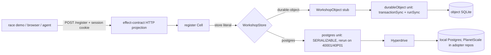
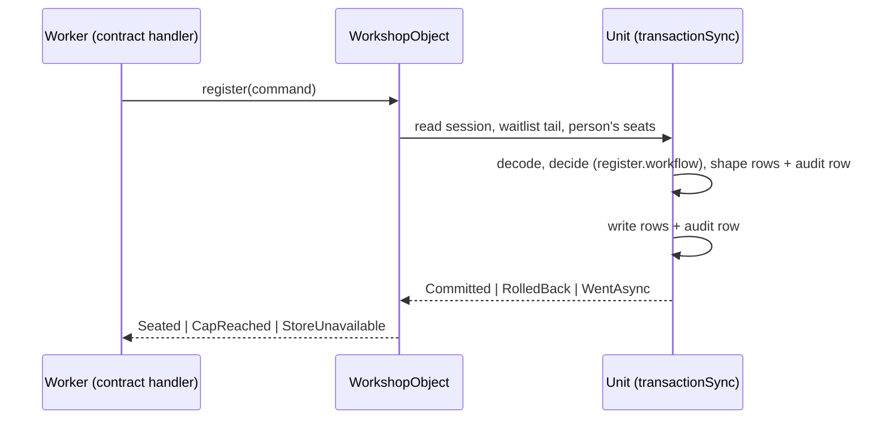
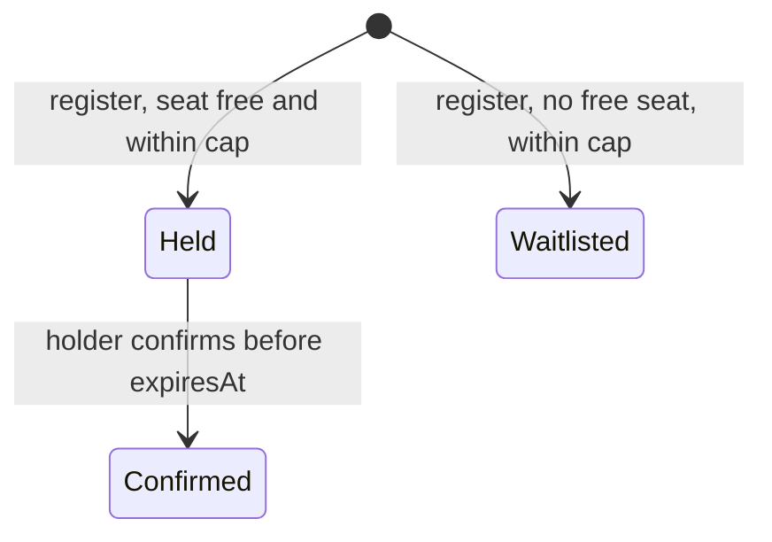

# Starter Lake 2: Registration Core - Plan

## Goal Capsule

- **Objective:** A seat request for a workshop session always gets one decided outcome (seats held, places on the waitlist, or a typed refusal by the cap) and never oversells a session, whether that workshop lives in a Durable Object or in Postgres. Anyone can prove it by running the race demo against the local stack with one command, and against a deployed preview in an adopter repo.
- **Means:** Registration decisions are pure, complexity-1 workflows. Each Cell runs whole inside one `@systemfsoftware/effect-unit-of-work` unit: a SQLite Durable Object per workshop by default, or Postgres SERIALIZABLE through Hyperdrive behind the same port. One shared law, race and conformance suite proves both adapters (KTD3-KTD10).
- **Product authority:** Ryan Lee owns scope. Kiro (conductor) answers as co-partner, sequences the systemfsoftware merges this lake consumes, and merges. `repos/constitution/` is the law. The origin plan's Product Contract governs every R-ID cited here.
- **Execution profile:** One omp session builds U0-U10 (order U0, U1-U6, U10, U7-U9) in `starter.worktrees/lake2` as layers on top of the Lake 1 stack (`lake1/previews`), opening each PR once its local gate is green. vitest always runs with `--maxWorkers=4`, turbo with `TURBO_CONCURRENCY=4`, one heavy suite at a time under `nice -n 10 ionice -c3` and only with at least 24 GB available. Mutation testing never runs on a developer host, the session does not review its own PRs, and no credential enters the template.
- **Stop conditions:** Stop and hand Kiro the evidence when a preset rule rejects a shape this lake needs (wait for the sfs fix, never add an override), Alchemy cannot bind a plain exported Durable Object class to the `Website.Vite` Worker under `alchemy dev` (U4's first test), `@effect/sql-pg` cannot reach Postgres from workerd through the Hyperdrive binding (U5's first test), the sandbox cannot host the heavy-job image (U0; bring the exact error and a compliant route), no non-HTTP channel reaches a deployed non-production stage for minting (U10), the race shows any oversell on the default adapter, or a needed sfs package is missing from the pinned flake's tarballs.
- **Open blockers:** U7-U9 need `@systemfsoftware/effect-contract` and `@systemfsoftware/effect-workerd-harness` from the systemfsoftware `main` commit carrying #606, #616 and #633, which Kiro names (Kiro Ruling 1). U0-U6 and U10 have none.
- **Who finishes:** This session builds every layer and opens its PR with QA evidence. Kiro reviews, checks each preview in a browser, and merges.

---

## Product Contract

### Summary

Lake 2 builds the worked example's core: one workshop's sessions, each with a seat capacity and a FIFO waitlist, where a person asks for N seats and gets held seats, waitlist places and a refusal for the rest, all within a per-person cap. The registration store has two adapters behind one port. A SQLite Durable Object per workshop is the deployed default. Postgres SERIALIZABLE through Hyperdrive is the second adapter, local through the one-command stack and deployable on PlanetScale by adopters. One suite runs the sfs store laws, the race, linearizability and command-sequence model tests over both adapters, and negative controls show the suite goes red on the shapes that oversell. A server-side session record names the person behind each request, and a race demo drives real concurrent requests through the HTTP projection from the heavy-job service and prints an `ok` or `FAIL` verdict per check.

### Problem Frame

rat-stack lists swappable stores but admits "No test swaps them yet" (`VISION.md:107`). sfs's doctrine on serializable units of work points at `examples/inventory-fulfillment`, which sfs Lake 7 deletes once this example carries the same rules. The brainstorm's probe showed why the Durable Object shape matters: every `Effect.runPromise` variant oversold a 100-seat session 3x, and only `transactionSync(() => Effect.runSync(...))` held (`docs/brainstorms/.scratch/probe-results.md` section 2). sfs has since published that shape as `@systemfsoftware/effect-unit-of-work` (sfs #603, #604, #608, #609).

### Key Decisions

Carried from the origin:

- **Store: one SQLite Durable Object per workshop by default, Postgres SERIALIZABLE via Hyperdrive as a second adapter of the same port, deployable on PlanetScale Postgres; D1 holds identity only.** (session-settled: user-approved — chosen over D1 and DO-per-session: D1 has no interactive transactions; a per-session object cannot hold both contended rows. Deployability of the Postgres adapter: user-directed.) Governs R19-R24, R89.
- **The DO unit runs as `transactionSync(() => Effect.runSync(...))`.** Every `runPromise` variant oversold 3x in the probe. Governs R20, R22.
- **Lifecycles are cells over tagged unions; no XState.** (session-settled: user-approved — chosen over XState and "both": XState guards escape the CC=1 gate and re-derive state by presence.) Governs R5.

Lake 2's own:

- **Lake 2's cap is counted inside the workshop.** The workshop object holds both contended rows, the session's seats and the person's seats across the workshop's sessions, as the store POV requires (`docs/brainstorms/.scratch/pov-registration-store.md`). The cross-workshop Allowance object and the register workflow that joins it arrive in Lake 4 (R3, R11). Governs R2.
- **Workshops are code.** A typed catalog in the site names each workshop, its sessions and capacities, and its store adapter; the adapter literal is the single value that selects the store (R21). Governs R19, R21.
- **The local heavy-job service ships in Lake 2 with the race demo.** (session-settled: user-directed — chosen over moving it to Lake 9: the Lake 1 ruling placed it with its first consumer.) Governs R83.
- **The person comes from a server-side session record, never a header.** `register` and `confirm` are restricted to a person principal resolved from a minted session cookie; sessions are minted only by an operator command on local and non-production stages, never over HTTP, and production answers both `Forbidden` until Lake 3 adds sign-in on the same record. (session-settled: user-directed — chosen over a person-naming request header: that is hand-set auth.) Governs R2, R24.

### Requirements

The origin owns each requirement's text. Lake 2 delivers the slice below; the rest lands in the named lake.

**Registration**

| R  | Lake 2 delivers                                                                                                                                          | Rest lands in                                                |
| -- | -------------------------------------------------------------------------------------------------------------------------------------------------------- | ------------------------------------------------------------ |
| R1 | Sessions with capacity and a FIFO waitlist, in one workshop object                                                                                       | none                                                         |
| R2 | The decided outcome (K held, W waitlisted, the rest refused by the cap) and the typed refusal when nothing is granted, with the cap counted per workshop | Lake 4: the cap across workshops (R3)                        |
| R5 | The whole closed union; `register` and `confirm` as Cells with complexity-1 decisions                                                                    | Lake 4: `cancel` and `expire` Cells, with promotion (R4, R6) |
| R7 | One audit row per committed decision, in the decision's unit, on both adapters                                                                           | Lake 4: ML-DSA signatures on audit rows (R105)               |

**Stores, adapters and proof**

| R   | Lake 2 delivers                                                                                                                                                                                                                                     | Rest lands in                                                                                                                 |
| --- | --------------------------------------------------------------------------------------------------------------------------------------------------------------------------------------------------------------------------------------------------- | ----------------------------------------------------------------------------------------------------------------------------- |
| R19 | The registration store port with the DO SQLite adapter and the Postgres SERIALIZABLE adapter, local through the one-command stack                                                                                                                   | Lake 6: the credits store (R15-R18)                                                                                           |
| R20 | The DO unit refuses reads and writes after its callback returns and any async step inside it, pinned against registration's own driver                                                                                                              | none                                                                                                                          |
| R21 | One suite over both adapters, the adapter chosen by the catalog's store literal                                                                                                                                                                     | none                                                                                                                          |
| R22 | The workerd input-gate test on registration's DO, named as the DO form of pin-dependency-semantics                                                                                                                                                  | none                                                                                                                          |
| R23 | Two controls that must fail: the split-sandwich DO variant and Postgres at READ COMMITTED                                                                                                                                                           | Lake 4: register without the Allowance step (Kiro Ruling 2)                                                                   |
| R24 | The race demo, local (DO and Postgres) and against a deployed preview, with the checks this lake can make: every request decided, cap filled exactly and held, every seat counted once, no seat lost or double-assigned, one audit row per decision | Lake 4: seated equals reservations, FIFO promotion, one confirmation per hold. Lake 6: balance never negative (Kiro Ruling 2) |
| R25 | Linearizability against a pure model and command-sequence model tests under real workerd                                                                                                                                                            | Lake 4: workflow interleavings (`effect-sim-kernel`) and the alarm path (Kiro Ruling 2)                                       |
| R89 | Hyperdrive and PlanetScale Postgres in the Alchemy stack, migrations applied by Alchemy, for adopters; the template proves Postgres locally, and the shared suite runs against PlanetScale only in adopter CI                                       | none                                                                                                                          |

**Carried platform items (deferred here by the Lake 1 plan)**

| R   | Lake 2 delivers                                                                                                                      |
| --- | ------------------------------------------------------------------------------------------------------------------------------------ |
| R59 | Registration's spans declared in a taxonomy and checked by a trace spec                                                              |
| R63 | Postgres in the one-command local stack                                                                                              |
| R64 | The binding-removal type test, with the Worker's first bindings                                                                      |
| R65 | The race suite on previews; per-preview Hyperdrive config and, in adopter repos, PlanetScale branch                                  |
| R68 | The removal checklist of the first example bin, `@endgame/registration`                                                              |
| R83 | The local heavy-job service, a Nix-built image under process-compose inside the sandbox, running the race and the local e2e journeys |

### Acceptance Examples

Carried from the origin: AE1 (R2, R3 within one workshop), AE5 (R22), AE6 (R23). New:

- AE25. **Covers R2.** Given a person already holding C seats in the workshop, when they request 1 seat in any session, then the answer is the typed refusal `CapReached` and only its audit row is written.
- AE26. **Covers R7, R24.** Given 300 concurrent single-seat requests from 300 people on a 100-seat session, then 100 are held, 200 are waitlisted or refused, and the audit holds exactly 300 rows, one per decided request.
- AE27. **Covers R5.** Given a held registration, when its holder confirms before `expiresAt`, then it is `Confirmed`; when someone else confirms it, or the holder confirms after `expiresAt`, then the answer is `NotHolder` or `HoldExpired` and the registration is unchanged.
- AE28. **Covers R21.** Given a workshop whose catalog store literal is `postgres`, when the shared suite runs, then every scenario that ran against the Durable Object runs against Postgres, and changing the literal is the only edit.
- AE29. **Covers R24.** Given the local stack, when `pnpm race` runs, then it prints one `ok` line per check for each adapter and exits 0. Given the READ COMMITTED control session, the cap check prints `FAIL (expected: control)` and the run still exits 0. Given an unexpected `FAIL`, it exits 1.
- AE30. **Covers R2 on production.** Given the production composition, when `register` or `confirm` is called with any body and any cookie, then the answer is `Forbidden` and no row is written; the production stack has no mint path.
- AE31. **Covers R64.** Given the Worker's environment type with the workshop namespace or the Hyperdrive binding removed, then `apps/site` fails to typecheck.
- AE32. **Covers R1, R2.** Given a workshop id the catalog does not name, when `register` is called, then the answer is `Rejected` and no Durable Object is addressed. Given a session id the workshop does not hold, then the answer is the typed refusal `SessionUnknown` with its audit row.
- AE33. **Covers R2, R24.** Given a session minted by the operator command for person P, when a real client sends its cookie with `register`, then the seat is held for P; given a cookie whose token has no record, then the answer is `Forbidden`.
- AE34. **Covers R83.** Given the heavy-job service started through the sandbox launcher, when a job runs, then it completes, a fetch to an outside host fails, and a read of a host path outside its binds fails.

### Scope Boundaries

#### Deferred to Follow-Up Work

- `cancel` and `expire`, hold expiry by alarm, waitlist promotion, the Allowance object and the register workflow (R3, R4, R6, R10-R13): Lake 4. A cancel without promotion would hand a freed seat to the next requester ahead of the waitlist, so neither ships before promotion.
- The Allowance negative control, the race checks for reservations, promotion and confirmations, workflow interleavings and the alarm path (R23-R25 remainders): Lake 4; "balance never negative": Lake 6. Each is written by name, with its acceptance test, into those lakes' lines in the origin plan (Kiro Ruling 2).
- Sign-in that writes the session record, and agent registration (R9, R34-R40): Lakes 3 and 4.
- CLI, MCP, browser RPC, code mode, A2A and gRPC projections (R27): Lake 5. U7 projects HTTP + OpenAPI only.
- The deployed heavy-job path, Containers through `ctx.container` (R82): Lake 9. The local service (R83) ships in Lake 2.
- Cloudflare Traces across the Durable Object hop (R60): Lake 8.
- The bin-removal CI matrix (R68's matrix half): Lake 9. Lake 2 ships the checklist and runs it once by hand.

#### Outside this product's identity

Carried from the origin:

- Effect 3 compatibility, a light preset, `warn` severity, or opt-outs.
- Any deploy target other than Cloudflare.
- Passwords anywhere, including tests.
- XState or any lifecycle engine outside Effect core.
- A model call inside a decision, and external newsletter-list sync.
- Capabilities that need the user's local machine; handlers run in workerd.

#### Considered and not built

- A hand-written register route, or a header that names a person: R27 forbids hand-written surfaces, and a claimed-identity header is hand-set auth (Kiro Rulings 1 and 4).
- D1 for the contended rows: no interactive transactions (origin Key Decision).
- `@cloudflare/vitest-pool-workers`: it needs vitest ^4.1, and the workspace is on vitest 5 (sfs `docs/plans/2026-10-06-0419-feat-unit-of-work-kit-plan.md`, KTD7).
- testcontainers or embedded Postgres in tests: sfs's throwaway server from the flake's `postgresql_17` already runs without Docker and never skips.

### Dependencies / Assumptions

- sfs Lake 2 is merged on systemfsoftware `main` (#603, #604, #608, #609; #610 was superseded by #608's race). systemfsoftware `main` has no tarball output; the starter reads `workspace-tarballs` from #606, pinned at `29ef725f` until it merges (Kiro Ruling 6).
- The contract kernel (#616), its HTTP, RPC and CLI surfaces (#633) and MCP (#637) go through review and merge after #606 in Kiro's sequence. Both `effect-contract` and `effect-workerd-harness` are publishable, so #606's builder emits them from that `main` commit (Kiro Ruling 1).
- The template holds no credentials (Ryan 2026-10-06) and proves Postgres against a throwaway local Postgres and Alchemy's local emulation. Adopter repos that deploy set `PLANETSCALE_SERVICE_TOKEN_ID`, `PLANETSCALE_SERVICE_TOKEN` and `PLANETSCALE_ORGANIZATION` beside their Cloudflare secrets, and deploy jobs fail naming any that are missing. Who deploys the hosted site, and with which organization, is Ryan's call at deploy time (Kiro Ruling 5).
- Alchemy stays on `2.0.0-beta.80`. Its `Planetscale/Postgres` resources (`PostgresDatabase`, `PostgresBranch`, `PostgresRole`, `PostgresMigrations`), `Cloudflare/Hyperdrive` (`Connection` with a `dev` origin, `Connect`), `SQL/Postgres` (`@effect/sql-pg` with a Hyperdrive URL) and SQLite Durable Object namespaces under local emulation are read from its installed source; U4 and U5 prove each under `alchemy dev` first.
- `R71` and `R75` (npm snapshots, exact npm pins) are superseded for `@systemfsoftware/*` by the U11b ruling: sfs packages arrive as `file:` tarballs from the flake input, certified by `pnpm check:sfs-sources`.
- The heavy-job service needs podman in the dev shell and a podman that can run inside the bubblewrap sandbox; U0 proves or refutes it.

---

## Planning Contract

### Key Technical Decisions

- KTD1. **Lake 2 is the next layers of the current stack.** Branches are `lake2/<slug>`, added with `gh stack add` on top of `lake1/previews`, trunk `main`. Graders change only in U9, an Evaluator unit with no graded code, carrying Kiro's approval (GATE1, CONST-E9).
- KTD2. **sfs packages come from the flake input.** U1 moves the `systemfsoftware` input to #606 at `29ef725f` (Kiro Ruling 6) and adds `file:.sfs-deps/<name>-<version>.tgz` catalog entries and matching overrides for `@systemfsoftware/effect-unit-of-work` 0.1.0 and `@systemfsoftware/conformance-spec` 1.0.0. U7 moves it to the systemfsoftware `main` rev Kiro names and adds `effect-contract` and `effect-workerd-harness`. Third-party additions are exact npm pins: `@effect/sql-pg` 4.0.1, `pg` 8.23.1 (Alchemy's PlanetScale migrations load it as an optional peer) and `tstyche` 7.2.5.
- KTD3. **`packages/registration` (`@endgame/registration`) is the first example bin.** It holds the schemas, workflows, Cells, the store port, the three drivers and the Durable Object class, organized by capability (`register/`, `confirm/`, `workshop-store/`, `workshop-object/`). `apps/site` composes it and holds the catalog. Its `mutation` script puts it in the release gate as its own shard. `packages/registration/REMOVAL.md` is its removal checklist (R68).
- KTD4. **Two decisions, each one `Match` dispatch at CC=1.** The read phase loads the session as `SessionFound { capacity, held or confirmed seats, waitlist tail }` or `SessionMissing`, a union rather than an absent field (CONST-D4). `register.workflow.ts` takes that plus the person's held and confirmed seats in this workshop, C, N, `now` and the hold TTL, and decides `Seated { held, waitlisted, refusedByCap }`, `CapReached` or `SessionUnknown`. With budget = C minus the person's seats: held = min(N, free seats, budget); waitlisted = min(N minus held, budget minus held); refusedByCap = N minus both. That reproduces AE1. Waitlist places take the next FIFO positions; each held seat gets `expiresAt` = `now` + TTL. `confirm.workflow.ts` reads the registration as found or missing and decides `Confirmed`, `NotHolder`, `HoldExpired`, `NotHeld` or `RegistrationUnknown`. N, C and the TTL are branded and decoded at the boundary (N is 1 to C). The clock is read in the read phase, never in a decision (CONST-P1).
- KTD5. **A Cell runs whole inside one unit.** The port is `WorkshopStore = UnitOfWork<WorkshopDriver, StoreFailure>`, and a command runs as `store((unit) => cell(unit))`. Read, decode, decide, shape and write happen in one unit, so the whole sandwich is one transaction on both adapters, and the audit row is part of the shape phase's writes (R7). `WorkshopDriver` is one interface with three implementations: memory (`UnitOfWork.memory`), SQLite (synchronous `sql.exec` calls) and Postgres (`SqlClient`). The two SQL drivers keep the same tables and columns.
- KTD6. **The Durable Object is a plain class bound by Alchemy's claim form.** `WorkshopObject` creates its tables in its constructor under `blockConcurrencyWhile` and runs each RPC method through `durableObject(ctx.storage, sqliteDriver)`, the sfs adapter, so the unit is `transactionSync` plus `runSync` (the origin's DO Key Decision). `apps/site/src/worker.ts` re-exports it, and `alchemy.run.ts` binds it with `Cloudflare.DurableObject` in claim form (`className`, no implementation) in the Website's `env`. The provider migrates it as a SQLite class (`WorkerProvider.ts:3904-3940`), and local emulation sets `sql: true` (`LocalWorkerProvider.ts:388-405`). One object per workshop through `idFromName(workshopId)`, where `workshopId` is a catalog key: the contract decodes it against the catalog, so a request can never mint an object the catalog does not name (AE32).
- KTD7. **Postgres goes through Hyperdrive and Alchemy's SQL layer.** The Worker builds `SqlClient` with Alchemy's `SQL/Postgres` layer, its URL taken from the Hyperdrive `Connect` binding, and runs units with sfs's `postgres` adapter under a `retryBudget` from config. The site Worker adds the `nodejs_compat` flag, which Cloudflare requires for `node-postgres` on Workers (version 8.16.3 or later); R111's unknown-flag check covers it. Hyperdrive pools in transaction mode and honours a `SET` inside `BEGIN`/`COMMIT` for that transaction, so the adapter's leading `SET TRANSACTION ISOLATION LEVEL SERIALIZABLE` holds (Cloudflare Hyperdrive docs, Connection pooling). The Hyperdrive `Connection` has caching disabled. Its `dev` origin is the local stack's Postgres. In adopter repos, cloud stages take as origin a PlanetScale `PostgresRole` on `PostgresDatabase` `endgame` (`prod`) or on a `PostgresBranch` per `pr-<N>`, and `PostgresMigrations` applies `packages/registration/migrations/*.sql`. Locally, process-compose runs `postgres` from the flake's `postgresql_17`, and a `postgres-migrate` one-shot applies the same files in order. The template never deploys PlanetScale (Kiro Ruling 5).
- KTD8. **One value selects the store.** Each catalog workshop carries `store: 'durable-object' | 'postgres'`. The composition root binds `WorkshopStore` per workshop from that literal, and the shared suite picks its subject from the same literal (R21). The READ COMMITTED control is a third literal, `postgres-read-committed`, admitted only by non-production catalogs, so production cannot select it.
- KTD9. **Two workerd harnesses, each for what it can prove.** Deploy-shape tests run the production stack under Alchemy emulation, the Lake 1 fixture, so the namespace has one declaration. The store suite and the input-gate test run a fixture Worker that bundles the production driver and Cells with esbuild under Miniflare at the pinned workerd, as sfs's own suite does. Only that fixture holds the tripwire variants (`runPromise` with an injected `Effect.yieldNow`, the split sandwich). U7 moves the fixture onto `@systemfsoftware/effect-workerd-harness`.
- KTD10. **The model is not the decision.** Conformance compares the stores against a hand-written reference model in `tests/__fixtures__/registration.model.ts` (seat and waitlist counters folded over commands), never against `register.workflow.ts` (CONST-T10). `Conformance.linearizable` runs over the memory adapter on the sim kernel, and `Conformance.sequential` command sequences run against the Durable Object under workerd, the store R25 names. Postgres is covered by the store suite's real-server rows, not a second model run.
- KTD11. **Registration is three contracts on the HTTP projection.** `workshop` (Read, Public: sessions, capacity, seats left and waitlist length, no person data), `register` and `confirm` (Write, Restricted to a person principal) go through `Contract.make` and `Contract.implement`, and `mount(registry).layer` serves them in the front door's router ahead of the page cell. That also brings `/openapi.json` forward from Lake 5. The person principal comes only from the session record (KTD14); no request header names a person. Non-production compositions add `openRaceSession` and `raceLedger`; the production composition has neither, a split the type system enforces, which AE30 checks on the deployed production QA run.
- KTD12. **The race demo is its own app.** `apps/race` (`@endgame/race`, private) provides `pnpm race --target <url> --store <literal>`. It opens a race session (300 claims at cap 100 on the Durable Object; 24 claims at cap 20 on Postgres with a 60-attempt rerun budget, the numbers sfs's suite proved), fires the claims concurrently through `register` with distinct people, each carrying a session the operator command minted (KTD14), reads `raceLedger`, and prints one verdict per check. A claim answered `SerializationBudgetExhausted` or `StoreUnavailable` is undecided, so "every request decided" prints `FAIL`; raising the Postgres numbers needs a measured run first. The control store's expected `FAIL` is labelled and does not fail the run (AE29). Its local leg runs in the heavy-job service (KTD15).
- KTD13. **Spans come from declarations.** `RegistrationTaxonomy.ts` declares `registration.register` and `registration.confirm`, and each Cell is `Sandwich.named(<span>.name)`, as the front door's are (Lake 1 KTD8). The Durable Object exports to the local collector when `OTLP_BASE_URL` is bound and mirrors into Workers tracing when deployed.
- KTD14. **A person comes from a server-side session record.** `person_sessions` maps the SHA-256 hash of an opaque 32-byte token to a person id and `expiresAt`, in the workshop's store on both adapters. The request carries the token in the `endgame_session` cookie (`HttpOnly`, `Secure`, `SameSite=Lax`), and `register` and `confirm` resolve the person in their read phase inside the decision's unit. Sessions are minted only by `pnpm operator mint-sessions --stage <stage> --workshop <id> --person <id>...`, which generates the tokens, prints them for the harness, and sends only hashes, person ids and expiries to a mint queue bound on local and non-production stages; the queue's consumer writes the records through `WorkshopStore`. The channel is a Cloudflare Queue (distilled's Queues client when deployed, Alchemy's local emulation locally), not the Worker's HTTP surface. Production binds no queue and no consumer, so it has no mint path and answers `Forbidden` until Lake 3 writes the same record at sign-in (Kiro Ruling 4).
- KTD15. **The heavy-job service is a Nix-built image run by podman inside the sandbox.** `nix/heavy-job-image.nix` builds the image with `dockerTools`, so the host never runs `podman build` on its vfs storage, and the digest is the same wherever Nix builds it. process-compose starts it through the sandbox launcher with `--network=none` and read-only binds of the job's inputs. The race's local leg and the local e2e journeys run in it (R83); the deployed path stays Containers in Lake 9 (R82). U0 proves the shape before any unit relies on it (Kiro Ruling 3).

#### Test Admission

| Test                                                                    | Layer                     | Admitted because                                                                                                                                                                                                                                                   |
| ----------------------------------------------------------------------- | ------------------------- | ------------------------------------------------------------------------------------------------------------------------------------------------------------------------------------------------------------------------------------------------------------------ |
| `register`, `confirm` `.workflow.property.test.ts`                      | Property, `src/`          | Universals over generated sessions and requests that no example reaches: conservation (K + W + refused = N), cap, FIFO tail                                                                                                                                        |
| `packages/registration/src/schema-laws.test.ts`                         | Generated codec laws      | Required for every non-error schema; catches a brand or union codec that disagrees with itself                                                                                                                                                                     |
| `tests/registration.integration.test.ts`                                | Behaviour, memory adapter | The published decision contract: AE1, AE25, AE27, AE32's `SessionUnknown`, R7's audit row                                                                                                                                                                          |
| `tests/registration.trace.test.ts`                                      | Trace spec, in-process    | R59's spans and attributes, which no answer shows                                                                                                                                                                                                                  |
| `tests/store-laws.integration.test.ts`                                  | Fake-vs-real contract     | R21, R23: one outline over the memory fake and both real adapters (sfs's seven laws, the race, registration's laws; AE28), plus tripwire rows (split sandwich, READ COMMITTED) that must report `Broken` (AE6). The real engines are the point of a contract suite |
| `tests/input-gate.integration.test.ts`                                  | Journey, workerd fixture  | R22 and AE5, named as its own test by R22: only real workerd shows the input gate opening                                                                                                                                                                          |
| `tests/registration.conformance.integration.test.ts`                    | Conformance               | R25: linearizability on the memory adapter and command sequences on the Durable Object, against an independent model                                                                                                                                               |
| `apps/site/tests/deploy-under-emulation.integration.test.ts` (extended) | Composition root          | The namespace and Hyperdrive binding exist under Alchemy's own emulation                                                                                                                                                                                           |
| `apps/site/test-types/worker-env.tst.ts`                                | Type test                 | AE31: removing a binding is a type error (R64)                                                                                                                                                                                                                     |
| `apps/site/tests/registration-http.integration.test.ts`                 | Behaviour, in-process     | The HTTP projection's answers, `Forbidden` on the production composition (AE30), `/openapi.json`                                                                                                                                                                   |
| `apps/site-e2e/tests/registration.integration.test.ts`                  | Journey                   | The built Worker with its Durable Object and Hyperdrive under `alchemy dev`, through HTTP                                                                                                                                                                          |
| `apps/race/tests/race-verdict.integration.test.ts`                      | Behaviour                 | AE29: the verdict lines and the exit status, including an expected control `FAIL`                                                                                                                                                                                  |
| `resolve-person.workflow.property.test.ts`                              | Property, `src/`          | Token resolution and expiry over generated records                                                                                                                                                                                                                 |
| `tests/person-session.integration.test.ts`                              | Behaviour, memory adapter | AE33: a minted session registers its person; tokens never stored in the clear                                                                                                                                                                                      |
| `sandbox-proofs/heavy-job.test.ts`                                      | Journey, process-isolated | AE34: only a real sandboxed podman run proves the network and host-path refusals; each with a sabotaged red                                                                                                                                                        |

Refused: a unit test of the drivers' SQL (the contract suite covers it through the port), an assertion that the composition root picked an adapter (a wiring check; AE28 observes the outcome), a Postgres command-sequence model run (the contract suite's real-server rows cover the adapter, and R25 names workerd), a separate controls file (its rows belong to the contract suite's outline), and a second race suite in `apps/site-e2e` (the race demo is that suite). `apps/site-e2e/tests/registration.integration.test.ts` is the fourth and last journey that app's cap of 2-4 allows.

### High-Level Technical Design

Directional sketches, not implementation specification.



One unit per command, on either adapter:



The Lake 2 slice of the origin's lifecycle; `Cancelled` and `Expired` exist in the union now and gain their transitions in Lake 4:



Tables, identical on both adapters: `sessions (session_id, capacity)`, `registrations (registration_id, session_id, person_id, state, expires_at, position, decided_at)`, `audit (seq, decision, command, outcome, decided_at)`, `person_sessions (token_hash, person_id, expires_at)`.

### Output Structure

```text
packages/registration/
  package.json  README.md  REMOVAL.md  migrations/0001_registration.sql
  src/mod.ts  src/RegistrationTaxonomy.ts  src/schema-laws.test.ts
  src/workshop.schema.ts                       ids, Registration union, catalog entry
  src/register/{register.schema.ts, register.workflow.ts, register.cell.ts, __tests__/}
  src/confirm/{confirm.schema.ts, confirm.workflow.ts, confirm.cell.ts, __tests__/}
  src/workshop-store/{workshop-store.schema.ts, workshop-driver.ts, memory-driver.ts, sqlite-driver.ts, postgres-driver.ts}
  src/workshop-object/workshop-object.ts
  src/contracts/{registration.contract.ts, race.contract.ts}       U7
  tests/  tests/__fixtures__/{workerd.fixture.ts, registration-gate.worker.ts, postgres-server.fixture.ts, registration.model.ts, subjects.fixture.ts}
apps/site/src/workshops/catalog.ts  apps/site/test-types/worker-env.tst.ts
apps/race/{package.json, src/main.ts, src/race-verdict.workflow.ts, tests/}
process-compose.yaml (postgres, postgres-migrate)  nix/local-stack.nix (postgresql_17)
nix/heavy-job-image.nix  process-compose.yaml (heavy-job)  sandbox-proofs/heavy-job.test.ts
packages/registration/src/person-session/  packages/registration/src/operator/mint-sessions.ts
```

### Stack Mechanics

- `gh stack add lake2/<slug>` from the top of the existing stack; before every push `gh stack view --json | jq -e '.trunk == "main" and any(.branches[]; .name == "'"$(git branch --show-current)"'")'` exits 0.
- A layer publishes with `gh stack submit --auto --open` once its local gate is green, then `gh pr edit` sets the title and a body with the QA evidence.
- Review fixes are commits on the flagged layer, then `gh stack rebase --upstack` and `gh stack push`.
- PR titles are conventional commits within commitlint's scopes, and the diff shape matches the type.

---

## Implementation Units

| U-ID | Title                                   | Key files                                                                                            | Depends on                     |
| ---- | --------------------------------------- | ---------------------------------------------------------------------------------------------------- | ------------------------------ |
| U0   | Heavy-job image in the sandbox (probe)  | `nix/heavy-job-image.nix`, `process-compose.yaml`, `sandbox-proofs/heavy-job.test.ts`                | none                           |
| U1   | Consume the unit-of-work kit            | `flake.nix`, `flake.lock`, `pnpm-workspace.yaml`, `pnpm-lock.yaml`                                   | #606 `29ef725f`                |
| U2   | Registration decisions                  | `packages/registration/src/{register,confirm}/`, `workshop.schema.ts`                                | U1                             |
| U3   | Cells in a unit of work                 | `packages/registration/src/workshop-store/`, `*.cell.ts`, `RegistrationTaxonomy.ts`                  | U2                             |
| U4   | The workshop Durable Object             | `src/workshop-object/`, `sqlite-driver.ts`, `apps/site/alchemy.run.ts`, `apps/site/src/worker.ts`    | U3                             |
| U5   | The Postgres adapter                    | `postgres-driver.ts`, `migrations/`, `process-compose.yaml`, `nix/local-stack.nix`, `alchemy.run.ts` | U4                             |
| U6   | One suite over both adapters            | `packages/registration/tests/**`                                                                     | U5                             |
| U10  | Session record and operator mint        | `src/person-session/`, `src/operator/mint-sessions.ts`, `apps/site/alchemy.run.ts`                   | U6                             |
| U7   | Registration over HTTP + OpenAPI        | `src/contracts/`, `apps/site/src/mod.ts`, `apps/site/src/workshops/catalog.ts`                       | U10; Kiro-named sfs `main` rev |
| U8   | The race demo and the removal checklist | `apps/race/**`, `packages/registration/REMOVAL.md`, `README.md`                                      | U0, U7, U10                    |
| U9   | Race and laws in CI (Evaluator)         | `.github/workflows/{ci,previews,release-gate}.yml`, `bin/stack-ci`, `.github/actions/`               | U8; Kiro's approval            |

### U0. Probe the heavy-job image inside the sandbox

- **PR:** `lake2/heavy-job-probe`, `build(repo): run the heavy-job image under process-compose inside the sandbox`.
- **Goal:** The heavy-job image starts under process-compose through the sandbox launcher, runs one job, and provably cannot reach the network or any host path beyond its binds.
- **Requirements:** R63, R83; AE34; KTD15; Kiro Ruling 3.
- **Dependencies:** none.
- **Execution note:** This unit is the probe, run before any unit that needs the service. If the sandbox cannot host the image, stop and bring Kiro the exact error and a compliant route within the sandbox rules. There is no unsandboxed fallback and no move to Lake 9.
- **Files:** `nix/heavy-job-image.nix` (`dockerTools.buildLayeredImage` holding Node 24 and the job entry), `flake.nix` (the image output and `podman` in the dev shell), `process-compose.yaml` (`heavy-job`), `bin/check-local-stack` (the probe lines), `sandbox-proofs/heavy-job.test.ts`.
- **Approach:** KTD15. Nix builds the image, so no `podman build` runs on the vfs-backed host; `podman load` takes it and the service runs it by digest with `--network=none` and read-only binds of the job's inputs only.
- **Test scenarios:**
  - `sandbox-proofs/heavy-job.test.ts`: "The heavy-job service runs one job and exits 0"; "A job that fetches an outside host fails"; "A job that reads `~/.ssh` or a path outside its binds fails"; each with a sabotaged run (a bind widened, the network flag removed) that must go red.
- **QA:** `pnpm check:ci-run` with the heavy-job probe lines recorded; the image digest from two builds, local and CI, recorded equal.
- **Verification:** `pnpm check:ci`; `pnpm check:ci-run`.

### U1. Consume the unit-of-work kit and the conformance spec from the sfs flake

- **PR:** `lake2/uow-deps`, `deps(deps): consume the unit-of-work kit and the conformance spec from the systemfsoftware flake`.
- **Goal:** `@systemfsoftware/effect-unit-of-work` and `@systemfsoftware/conformance-spec` resolve from `.sfs-deps`, and the new third-party pins are in the catalog.
- **Requirements:** R19-R22, R25 (their dependency), KTD2.
- **Dependencies:** #606 at `29ef725f` (Kiro Ruling 6).
- **Files:** `flake.nix`, `flake.lock`, `pnpm-workspace.yaml` (catalog and overrides), `pnpm-lock.yaml`.
- **Approach:** Follow the U11b procedure: move the input, check that `workspace-tarballs` emits both packages, add catalog and override entries, relock offline. `@effect/sql-pg`, `pg` and `tstyche` are exact npm pins under the release-age policy.
- **Test expectation:** none -- a dependency change; `pnpm check:sfs-sources` and the install are its gates.
- **QA:** `ls .sfs-deps | grep -E 'unit-of-work|conformance-spec'`; `pnpm check:sfs-sources`; `pnpm install --frozen-lockfile` inside the sandbox.
- **Verification:** `pnpm check:ci` passes except the known `check:sfs-sources` reds that #606 owns, which the PR body names.

### U2. Decide registration as pure workflows

- **PR:** `lake2/registration-decisions`, `feat(repo): decide workshop registration as pure workflows`.
- **Goal:** The register and confirm decisions exist as complexity-1 workflows over branded types, with the whole `Registration` union.
- **Requirements:** R1, R2, R5; AE1, AE25, AE27; KTD3, KTD4; origin Key Decisions (lifecycles as cells, governs R5).
- **Dependencies:** U1.
- **Files:** `packages/registration/{package.json, tsconfig.json, tsconfig.node.json, oxlint.config.ts, vitest.config.ts, stryker.config.ts, README.md}`, `src/mod.ts`, `src/workshop.schema.ts`, `src/register/register.schema.ts`, `src/register/register.workflow.ts`, `src/register/__tests__/register.workflow.property.test.ts`, the same three under `src/confirm/`, `src/schema-laws.test.ts`.
- **Approach:** KTD4. `Registration` is `Held { expiresAt } | Confirmed | Waitlisted { position } | Cancelled | Expired`, each carrying only its own fields (CONST-D4). Ids, seat counts, C and the TTL are branded (CONST-D3). `stryker.mutate` covers `src/**/*.workflow.ts`. Use `skill://architect-workflow` and `skill://architect-property-tests`.
- **Test scenarios:**
  - `register.workflow.property.test.ts`: for generated capacity, occupancy, person seats, C and N, held + waitlisted + refusedByCap = N; held never exceeds free seats; the person's held and confirmed seats after the decision never exceed C; nothing granted yields `CapReached`; waitlist positions continue from the tail without gaps; every held seat's `expiresAt` equals `now` + TTL; AE1's numbers as one named case.
  - `confirm.workflow.property.test.ts`: a held seat confirmed by its holder strictly before `expiresAt` is `Confirmed`; at or after `expiresAt` it is `HoldExpired`; a different person gets `NotHolder`; any non-held state gets `NotHeld`; a missing registration gets `RegistrationUnknown`.
  - `schema-laws.test.ts`: generated codec laws for every exported schema.
- **QA:** `pnpm --filter @endgame/registration test`; `pnpm --filter @endgame/registration lint`, recording zero overrides.
- **Verification:** `pnpm check:ci`; `scripts/mutation-shards.ts` lists `@endgame/registration`.

### U3. Run the registration Cells inside a unit of work

- **PR:** `lake2/registration-cells`, `feat(repo): run registration cells inside one unit of work with one audit row each`.
- **Goal:** `register` and `confirm` run as Cells whose five phases share one unit, behind the `WorkshopStore` port, proven on the memory adapter.
- **Requirements:** R2, R5, R7, R19, R59; AE1, AE25, AE27; KTD5, KTD13.
- **Dependencies:** U2.
- **Files:** `src/workshop-store/workshop-store.schema.ts`, `workshop-driver.ts`, `memory-driver.ts`, `src/register/register.cell.ts`, `src/confirm/confirm.cell.ts`, `src/RegistrationTaxonomy.ts`, `tests/registration.integration.test.ts`, `tests/registration.trace.test.ts`.
- **Approach:** KTD5. Each Cell reads through `UnitOfWork.use(unit, driver => ...)`, decides, shapes the registration rows plus one audit row, and writes through the same unit. A failure answers `StoreUnavailable` and the memory adapter discards its staged state. Read the sfs packs `store-unit-of-work-handle.md` and `fake-and-real-store-laws.md` before writing the port.
- **Test scenarios:**
  - `registration.integration.test.ts`: "A person asking for five seats is held two, waitlisted one and refused two by the cap" (AE1); "A person at the cap is refused and only the audit row is written" (AE25); "The holder confirms a held seat in time" and the `NotHolder` and `HoldExpired` cases (AE27); "A request for a session the workshop does not hold is refused as unknown" (AE32); "Every decided request writes exactly one audit row, and a failed unit writes none" (R7).
  - `registration.trace.test.ts`: a register run under an `ObservationWindow` emits `registration.register` with its `.read` and `.write` children and the decision tag attribute.
- **QA:** `pnpm --filter @endgame/registration test`, with the feature names recorded.
- **Verification:** `pnpm check:ci`.

### U4. Hold each workshop in a SQLite Durable Object

- **PR:** `lake2/workshop-object`, `feat(repo): hold each workshop in a sqlite durable object`.
- **Goal:** The site Worker carries `WorkshopObject`, bound by Alchemy, and registration runs in it under `alchemy dev` and in the emulated deploy.
- **Requirements:** R19, R20, R64; AE31; KTD6, KTD9; origin Key Decision (the DO unit, governs R20).
- **Dependencies:** U3.
- **Execution note:** Prove the binding first. Extend `deploy-under-emulation.integration.test.ts` with the claim-form namespace before writing the driver; if Alchemy cannot bind a plain exported class to a `Website.Vite` Worker, stop.
- **Files:** `packages/registration/src/workshop-store/sqlite-driver.ts`, `src/workshop-object/workshop-object.ts`, `apps/site/src/worker.ts` (re-export), `apps/site/alchemy.run.ts` (`env.WORKSHOP`), `apps/site/src/workshops/catalog.ts` (the hosted workshop on `durable-object`), `apps/site/test-types/worker-env.tst.ts`, `apps/site/tstyche.json`, `apps/site/package.json` (`typecheck` runs tstyche), `apps/site/tests/deploy-under-emulation.integration.test.ts`.
- **Approach:** KTD6. The SQLite driver's operations are `Effect.sync` over `sql.exec`, so nothing inside the unit suspends. The object's RPC methods answer the decision or `StoreUnavailable`; `UnitWentAsync` and `UnitEnded` are defects, never answers. The Worker's `env` type comes from the stack (`Cloudflare.InferEnv`), so AE31 is a type fact.
- **Test scenarios:**
  - `deploy-under-emulation.integration.test.ts`: "Alchemy creates the Worker with its workshop namespace locally" asserts the stack output and a `WORKSHOP` binding of type `durable_object_namespace` in local state.
  - `worker-env.tst.ts`: the Worker module's `env` parameter rejects an environment without `WORKSHOP` (AE31).
- **QA:** Under `alchemy dev`, call the object through a throwaway local script and record the rows under `.alchemy/local`; delete the script before the PR.
- **Verification:** `pnpm check:ci`; `pnpm stack:ci`.

### U5. Serve the same port from Postgres SERIALIZABLE through Hyperdrive

- **PR:** `lake2/postgres-adapter`, `feat(repo): serve workshops from postgres serializable through hyperdrive`.
- **Goal:** A catalog workshop with `store: 'postgres'` runs the same Cells in a SERIALIZABLE unit over Hyperdrive. The local stack starts Postgres with readiness and migrations, and cloud stages deploy PlanetScale behind Hyperdrive.
- **Requirements:** R19, R63, R65 (per-preview Hyperdrive and branch, in adopter repos), R89 (resources for adopters); KTD7, KTD8; Kiro Ruling 5.
- **Dependencies:** U4.
- **Execution note:** Prove the driver path first. One `alchemy dev` request through the Hyperdrive binding to the local Postgres must succeed before the driver is written; if `@effect/sql-pg` cannot connect from workerd, stop.
- **Files:** `packages/registration/migrations/0001_registration.sql`, `src/workshop-store/postgres-driver.ts`, `nix/local-stack.nix` (`postgresql_17`), `process-compose.yaml` (`postgres` ready on `pg_isready`, `postgres-migrate` one-shot, `site` depending on both), `local-stack/postgres/` (init config), `apps/site/site-worker.ts` (`nodejs_compat`), `apps/site/alchemy.run.ts` (Hyperdrive `Connection` with a `dev` origin, PlanetScale resources on cloud stages, `env.REGISTRATION_DB`), `apps/site/src/workshops/catalog.ts` (non-production `postgres` and `postgres-read-committed` workshops), `apps/site/test-types/worker-env.tst.ts`, `bin/check-local-stack` (probe Postgres).
- **Approach:** KTD7, KTD8. The Postgres driver uses the same columns as the SQLite driver; `SET TRANSACTION ISOLATION LEVEL SERIALIZABLE` is the adapter's first statement, and reruns follow sfs's rerun decision. `pr-<N>` stages create and destroy their own PlanetScale branch and Hyperdrive config. The control literal binds `Controls.postgresReadCommitted`.
- **Test scenarios:**
  - `deploy-under-emulation.integration.test.ts`: "Alchemy creates the Hyperdrive binding with a local origin" (`REGISTRATION_DB` in local state, origin `127.0.0.1`).
  - `worker-env.tst.ts`: removing `REGISTRATION_DB` is a type error (AE31).
  - `check-local-stack`'s probe line includes Postgres readiness and the migration's table count.
- **QA:** `pnpm dev`, then `psql` against the local stack showing the migrated tables, and one registration through a throwaway script for each store literal; record both; delete the script.
- **Verification:** `pnpm check:ci`; `pnpm check:ci-run`; `pnpm stack:ci`.

### U6. Prove both adapters with one suite

- **PR:** `lake2/store-proof`, `test(repo): prove both registration stores with one law, race and conformance suite`.
- **Goal:** One suite, with its subject selected by the store literal, runs sfs's store laws, the race law and registration's laws over the memory fake, the Durable Object under workerd and a real Postgres, and its tripwire rows go red as required. The input-gate test pins the DO shape, and conformance compares the stores against an independent model.
- **Requirements:** R20-R23, R25; AE5, AE6, AE26, AE28; KTD9, KTD10.
- **Dependencies:** U5.
- **Files:** `packages/registration/tests/store-laws.integration.test.ts`, `input-gate.integration.test.ts`, `registration.conformance.integration.test.ts`, `tests/__fixtures__/workerd.fixture.ts`, `registration-gate.worker.ts`, `postgres-server.fixture.ts`, `registration.model.ts`, `subjects.fixture.ts`; `packages/registration/package.json` (dev deps `miniflare`, `esbuild`).
- **Approach:** KTD9, KTD10. The fixture Worker exposes the production object plus the two tripwire shapes; the Postgres fixture starts a throwaway `postgresql_17` per file, applies the migrations, and dies with `PostgresUnavailable` rather than skipping. `subjects.fixture.ts` maps each store literal, tripwires included, to its subject. Use `skill://write-contract-test`, `skill://write-conformance-specs` and `skill://write-gherkin-integration-tests`.
- **Test scenarios:**
  - `store-laws.integration.test.ts`: a scenario outline over `memory`, `durable-object` and `postgres` running the seven store laws, `race` (300 at cap 100 on the object, 24 at cap 20 on Postgres), "every committed decision writes one audit row" (AE26) and "a seat is never assigned twice"; the outline's only per-row input is the literal (AE28). Tripwire rows `durable-object-split-sandwich` and `postgres-read-committed` run the race and expect `Broken` (AE6); a tripwire that holds fails the suite.
  - `input-gate.integration.test.ts`: "Three hundred claims on the transactionSync adapter hold exactly one hundred" (with an `Effect.yieldNow` inside the unit); "The same claims in a runPromise unit with the same yield oversell, and the race law reports Broken" (AE5); "A sleep inside the adapter unit fails every claim with UnitWentAsync and leaves no row" (R20).
  - `registration.conformance.integration.test.ts`: `Conformance.linearizable` over the memory adapter with 2 fibers and 4 operations; `Conformance.sequential` command sequences against the object under workerd, judged by `registration.model.ts`.
- **QA:** Run each file alone with `--maxWorkers=4` and record its timing and pass count; sabotage once (swap `transactionSync` for a plain call in the SQLite driver) and record the red, then restore.
- **Verification:** `pnpm check:ci`.

### U10. Resolve a person from a minted session record

- **PR:** `lake2/session-record`, `feat(repo): resolve the registering person from a server-side session record`.
- **Goal:** A request's person comes only from a session cookie whose opaque token the workshop's store maps to a person id, and sessions are minted only by an operator command on local and non-production stages, never over HTTP.
- **Requirements:** R2 (who registers), R24 (race persons), AE33; KTD14; Kiro Ruling 4.
- **Dependencies:** U6.
- **Execution note:** Prove the mint channel first: one record minted locally through the channel KTD14 names, read back in the workshop's store, before the cell work. If no non-HTTP channel reaches a deployed non-production stage, stop with the error.
- **Files:** `packages/registration/src/person-session/{person-session.schema.ts, resolve-person.workflow.ts, __tests__/resolve-person.workflow.property.test.ts}`, the drivers (`person_sessions` table in both), `migrations/0002_person_sessions.sql`, `src/workshop-object/workshop-object.ts`, `packages/registration/src/operator/mint-sessions.ts`, `apps/site/alchemy.run.ts` (the mint queue on non-production stages only), `apps/site/src/worker.ts` (its consumer in the non-production composition only), `package.json` (`operator` script through the sandbox launcher), `packages/registration/tests/person-session.integration.test.ts`, `apps/site/test-types/worker-env.tst.ts`.
- **Approach:** KTD14. The record stores a hash of the token, never the token. `register` and `confirm` resolve the person in their own read phase, inside the same unit as the decision, so a session and the decision it authorizes are one transaction. The production composition has neither the queue nor the consumer, a fact `worker-env.tst.ts` pins.
- **Test scenarios:**
  - `resolve-person.workflow.property.test.ts`: a token resolves only to the person its record names and only before the record's `expiresAt`; a missing record yields `NoSession`.
  - `person-session.integration.test.ts`: "A minted session registers its person and no other"; "An expired session is refused"; "The token is never stored in the clear".
  - `worker-env.tst.ts`: the production environment type has no mint queue binding.
- **QA:** Mint three sessions locally with `pnpm operator mint-sessions`, register through `curl --cookie` with each, and record the answers and the stored hashes.
- **Verification:** `pnpm check:ci`; `pnpm stack:ci`.

### U7. Project registration over HTTP and OpenAPI

- **PR:** `lake2/registration-http`, `feat(repo): serve registration as contracts over http and openapi`.
- **Goal:** `workshop`, `register` and `confirm` are contracts projected by `effect-contract`'s HTTP surface, `register` and `confirm` resolve their person from the session cookie, and production answers both `Forbidden`.
- **Requirements:** R2, R26 (registration's contracts), R27 (HTTP + OpenAPI), AE30, AE32, AE33; KTD11, KTD14.
- **Dependencies:** U10; the systemfsoftware `main` commit carrying #606, #616 and #633 that Kiro names, pinned per KTD2 (Kiro Ruling 1).
- **Files:** `flake.nix`, `flake.lock`, `pnpm-workspace.yaml`, `pnpm-lock.yaml` (the two new sfs packages), `packages/registration/src/contracts/registration.contract.ts`, `race.contract.ts`, `apps/site/src/mod.ts` (mount ahead of the page cell), `apps/site/src/worker.ts` (production versus non-production composition), `apps/site/tests/registration-http.integration.test.ts`, `apps/site-e2e/tests/registration.integration.test.ts`, `packages/registration/tests/__fixtures__/workerd.fixture.ts` (onto `effect-workerd-harness`).
- **Approach:** KTD11. Each contract's Cell is the U3 Cell behind `Contract.implement`; refusals are the decision's refusal variants, so the HTTP answer carries the same tag the decision produced.
- **Test scenarios:**
  - `registration-http.integration.test.ts` (a real `HttpClient` with a cookie jar against the in-process router): "A visitor reads a workshop's seats without person data"; "The production composition answers register with Forbidden for any cookie and writes nothing" (AE30); "A person whose minted session cookie is sent is held a seat" (AE33); "A cookie with no session record is Forbidden"; "A workshop the catalog does not name is rejected before any object is addressed" (AE32); "`/openapi.json` documents the three contracts".
  - `apps/site-e2e/tests/registration.integration.test.ts` (project `local`): against `alchemy dev`, a session minted by the operator command, then a register on the object workshop and on the Postgres workshop each answer `Seated` through a real client carrying the cookie, and `workshop` reflects the held seat.
- **QA:** Open `http://localhost:1337/openapi.json` and `/workshop?...` in the browser tool and record the rendered output and response headers; confirm `/` still renders under the strict CSP with no console violation.
- **Verification:** `pnpm check:ci`; `pnpm stack:ci`.

### U8. Run the race demo, document the example, write the removal checklist

- **PR:** `lake2/race-demo`, `feat(repo): race every registration store from one command in the heavy-job service`.
- **Goal:** `pnpm race` proves the cap against the running stack on both adapters and the control, from inside the heavy-job image that process-compose runs through the sandbox launcher, as do the local e2e journeys (R83). The README explains the example, and the registration bin can be removed by checklist.
- **Requirements:** R24, R63, R68 (checklist), R83; AE29, AE34; KTD12, KTD15.
- **Dependencies:** U0, U7, U10.
- **Files:** `apps/race/{package.json, tsconfig.json, oxlint.config.ts, vitest.config.ts, stryker.config.ts, src/main.ts, src/race-verdict.workflow.ts, src/__tests__/race-verdict.workflow.property.test.ts, tests/race-verdict.integration.test.ts}`, `nix/heavy-job-image.nix`, `flake.nix` (the image output), `process-compose.yaml` (`heavy-job` service by digest), `bin/stack-ci` and `bin/check-local-stack` (journeys and race through the service), `package.json` (`race` script through the sandbox launcher), `packages/registration/REMOVAL.md`, `packages/registration/README.md`, `README.md`.
- **Approach:** KTD12. The verdict is a pure workflow over the ledger and the answers. The checklist names every file and line outside the package that the bin owns: the catalog entries, the worker re-export, the namespace and Hyperdrive bindings, the PlanetScale resources, the contracts' mount, the process-compose services, `apps/race`, and the CI steps U9 adds.
- **Test scenarios:**
  - `race-verdict.workflow.property.test.ts`: over generated ledgers, "cap filled exactly and held" is `ok` exactly when held equals capacity and no person holds a seat twice; any undecided answer makes "every request decided" `FAIL`.
  - `race-verdict.integration.test.ts`: against a hand-written ledger fixture, the printed lines and exit 0; an oversold ledger exits 1; a ledger with one budget-exhausted claim prints `FAIL` for "every request decided"; the control label turns its `FAIL` into an expected line (AE29).
- **QA:** `pnpm dev`, mint sessions with the operator command, then `pnpm race --target http://localhost:1337 --store durable-object`, `--store postgres` and `--store postgres-read-committed` from the heavy-job service, transcripts recorded. Run the checklist once in a scratch worktree and record that `pnpm check:ci` stays green with the bin deleted. Open the workshop in the browser tool before and after a race and record both.
- **Verification:** `pnpm check:ci`; `pnpm stack:ci`.

### U9. Run the race and the laws in CI (Evaluator)

- **PR:** `lake2/race-ci`, `ci(repo): race every store on the stack, on previews and against the deployed database`.
- **Goal:** CI's stack job runs the race on both local adapters inside the heavy-job service. In adopter repos with their own credentials, each preview runs it against the deployed Worker, and the release gate runs the shared suite against the adopter's PlanetScale database.
- **Requirements:** R24 (deployed), R65, R89; KTD1.
- **Dependencies:** U8; Kiro's approval of this Evaluator change.
- **Files:** `bin/stack-ci`, `.github/workflows/ci.yml`, `.github/workflows/previews.yml`, `.github/workflows/release-gate.yml`, `.github/actions/cloudflare-secrets/action.yml` (name the PlanetScale secrets too), `AGENTS.md` (the CI notes).
- **Approach:** The stack job runs `pnpm race` for both adapters after the journeys, in the heavy-job service. Preview jobs mint sessions through the operator command and run it against `pr-<N>`; the destroy job removes the branch and Hyperdrive config with the stage. The release gate's QA job runs `store-laws.integration.test.ts` with the Postgres subject pointed at the adopter's PlanetScale branch through the role from Alchemy state. Every credentialed job keeps `if: ${{ !github.event.repository.is_template }}` and fails naming any missing secret; the hosted site's deploy is Ryan's call (Kiro Ruling 5).
- **Test expectation:** none -- an Evaluator change; actionlint and the jobs' own runs are its proof.
- **QA:** `nix run nixpkgs#actionlint -- .github/workflows/*.yml`; `pnpm stack:ci` locally with the race lines recorded.
- **Verification:** CI on the PR runs the stack job with the race lines; the template's preview and deploy jobs are skipped.

---

## Verification Contract

| Gate              | Command                                                                                | Where                                           | Units     |
| ----------------- | -------------------------------------------------------------------------------------- | ----------------------------------------------- | --------- |
| PR gate           | `pnpm check:ci`                                                                        | local; CI `check` (Linux legs and macOS)        | all       |
| sfs sources       | `pnpm check:sfs-sources`                                                               | local; CI `sfs-sources`                         | U1, U7    |
| Local stack       | `pnpm check:ci-run` and `pnpm stack:ci`                                                | local; CI `local-stack` and `stack`             | U4 onward |
| Sandbox probe     | U0's probe run through the sandbox launcher                                            | local; CI `stack`                               | U0, U8    |
| Race              | `pnpm race --target <url> --store <literal>`                                           | local; CI `stack` from U9; previews in adopters | U8, U9    |
| Deployed database | `store-laws.integration.test.ts` with the Postgres subject on PlanetScale              | adopter release gate only; never the template   | U9        |
| Workflow lint     | `nix run nixpkgs#actionlint -- .github/workflows/*.yml`                                | local                                           | U9        |
| Release gate      | `pnpm --filter @endgame/registration run mutation` and `@endgame/race` at `break: 100` | CI on `main` only; never on a developer host    | U2 onward |
| QA evidence       | Transcripts and browser records in each PR body                                        | local                                           | all       |

vitest runs with `--maxWorkers=4` everywhere this session runs it. Mutation and the deployed suites never run on this host, and the session runs no self-review; Kiro prompts review per PR.

---

## Definition of Done

- U0-U10 are merged to `main` with their gates green, including the stack job's race lines from the heavy-job service.
- The release gate has passed with `@endgame/registration` and `@endgame/race` shards at 100.
- `pnpm dev` then `pnpm race --store durable-object` and `--store postgres` print only `ok` lines on a fresh clone with no credentials, and the control prints its expected `FAIL`.
- In an adopter repo with its own credentials, the preview prints the race verdicts against its deployed Worker, and its release gate passes the shared suite against its PlanetScale database.
- Production has no mint path and answers `register` and `confirm` with `Forbidden` (AE30), and `/openapi.json` documents the three contracts.
- `packages/registration/REMOVAL.md` has been run once with the build green.
- The heavy-job image runs the race and the local e2e journeys under process-compose through the sandbox launcher, with no network and no host path beyond its binds (AE34).
- No probe code, throwaway QA script or abandoned attempt is in any PR.

---

## Kiro Rulings (2026-10-06)

Recorded before any unit starts; these amend the plan above.

1. **Contract kernel: build U0-U6 and U10 now.** Kiro sequences systemfsoftware: #606 first, then #616, #633 and #637 through review and merge. U7 starts on the first systemfsoftware `main` commit carrying #606, #616 and #633, which Kiro names. No hand-written route, ever (R27).
2. **Re-slicing by dependency is ordering, not deferral.** Cancel and expire, the Allowance negative control, the reservation, promotion and confirmation race checks, and workflow interleavings with the alarm path move to Lake 4; "balance never negative" moves to Lake 6. Each is written by name, with its acceptance test and R-number, into those lakes' lines in the origin plan's "How This Work Fits Together".
3. **R83 stays in Lake 2 with the race demo** (Kiro's earlier ruling; the Lake 1 plan records it as user-directed, and the origin's lake list yields). U0 probes the sandbox first. If the sandbox cannot host the image, the evidence is the exact error plus a compliant route within the sandbox rules: no unsandboxed fallback and no move to Lake 9.
4. **No identity by header.** A request header that claims an identity is hand-set auth. Lake 2 adds a minimal server-side session record (opaque token to person id, in the workshop's store) and an operator command that mints sessions for test harnesses and the race, on local and non-production stages only and never over HTTP. Requests carry the minted session cookie. Production has no mint path and answers `Forbidden` until Lake 3 adds sign-in on the same record. Tests drive the real cookie path through a real client (U10).
5. **No PlanetScale for the hosted site now.** The template stays credential-free and proves Postgres against a throwaway local Postgres from the Nix dev shell plus Alchemy's local emulation. The PlanetScale Alchemy resources ship for adopters. Who deploys `endgame.systemfsoftware.com`, and with which organization, is Ryan's call at deploy time; this plan does not plan around it.
6. **U1 pins #606 at `29ef725f`.** The input moves to systemfsoftware `main` once #606 merges, on Kiro's word.

Build limits: vitest `--maxWorkers=4`, `TURBO_CONCURRENCY=4`, one heavy suite at a time.

---

## Appendix

### Pins as of 2026-10-06

- systemfsoftware flake input: #606 head `29ef725f` (release-tooling's head, Kiro 2026-10-06), carrying `effect-unit-of-work` 0.1.0, `conformance-spec` 1.0.0 and `effect-sim-kernel` 1.0.0; repinned to systemfsoftware `main` when #606 merges, on Kiro's word.
- `@effect/sql-pg` 4.0.1 (no runtime dependencies; peer `effect` ^4.0.1); `pg` 8.23.1 (Hyperdrive needs 8.16.3 or later, with `nodejs_compat`); `tstyche` 7.2.5.
- Already pinned: `alchemy` 2.0.0-beta.80, `effect` 4.0.1, workerd 1.20261005.1, `miniflare` 5.20261001.0-alpha, `vite` 8.3.2, `vitest` 5.0.3.
- Local Postgres: the flake's `postgresql_17`, as sfs's suite uses. Heavy-job image: built by Nix (`dockerTools`), loaded into podman by digest.

### Sources

- Origin: `docs/brainstorms/2026-10-06-1703-feat-starter-full-stack-exemplar-plan.md` (Requirements, Key Decisions, How This Work Fits Together, Acceptance Examples).
- Lake 1: `docs/plans/2026-10-06-1703-feat-starter-lake-1-foundation-plan.md` (Deferred to Follow-Up Work, format).
- Probes: `docs/brainstorms/.scratch/probe-results.md` section 2; `docs/brainstorms/.scratch/pov-registration-store.md`.
- systemfsoftware `main` at `834f430b`: `packages/effect-unit-of-work` (adapters `src/durable-object/durable-object.adapter.ts:63-111`, `src/postgres/unit-of-work.adapter.ts:34-179`, laws `src/laws/store-laws.ts`, `race.ts`, `controls.ts`, the workerd input-gate test and fixtures), `packages/sim/conformance-spec`, `packages/trace/trace-taxonomy`, `compound-packs/cell-architecture/store-unit-of-work-handle.md`, `compound-packs/boundary-testing/fake-and-real-store-laws.md`, `docs/plans/2026-10-06-0419-feat-unit-of-work-kit-plan.md`.
- systemfsoftware PRs #606 (head `7b7b6e3`), #616 (head `aa78d77`), #633, #637 (head `86a6923`) and `docs/plans/2026-10-05-2156-feat-contract-kernel-agent-surfaces-plan.md`.
- Alchemy 2.0.0-beta.80 source: `src/Cloudflare/Workers/DurableObject.ts`, `DurableObjectState.ts`, `WorkerProvider.ts:3904-3940`, `LocalWorkerProvider.ts:388-405,496-505`, `src/Cloudflare/LocalRuntime.ts:84-121`, `src/Cloudflare/Hyperdrive/Connection.ts:43-115,333-352`, `src/Planetscale/Postgres/*`, `src/SQL/Postgres.ts`, `src/Test/Core.ts`.
- rat-stack `VISION.md:107` ("No test swaps them yet").
- Cloudflare docs: Hyperdrive [Connection pooling](https://developers.cloudflare.com/hyperdrive/concepts/connection-pooling/) (transaction mode; `SET` inside a transaction) and [node-postgres](https://developers.cloudflare.com/hyperdrive/examples/connect-to-postgres/postgres-drivers-and-libraries/node-postgres/) (`pg` 8.16.3 or later, `nodejs_compat`).
