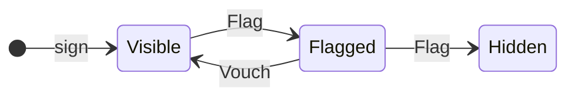
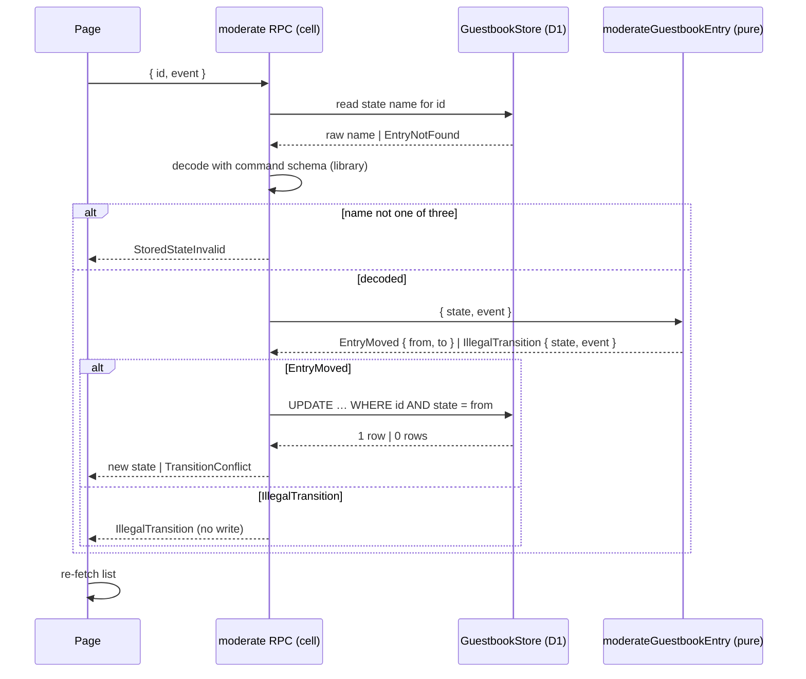

# Guestbook Moderation Lifecycle - Plan

## Goal Capsule

- **Objective:** Any visitor can flag and vouch for a guestbook entry. Two flags with no vouch between them hide it. The lifecycle runs as a pure transition on a machine from our XState fork, over a state name stored in D1, behind effect/rpc. The repo gains a stateful decision that agents can copy.
- **Scope:** Area A of the origin document (R1-R12, F1, AE1-AE4). Area C has its own plan (`docs/plans/2026-10-08-0705-feat-gates-bind-and-inline-suppression-plan.md`).
- **Authority:** The origin document's R-IDs win on behavior. This plan's KTDs win on mechanism within those R-IDs. The conductor reviews this plan before U2 starts.
- **Stop conditions:** If U1 shows the fork can't do what R3 needs, A stops and goes back to Ryan. There is no fallback to upstream xstate or npm (origin Q1). If U1 shows the house lint refuses every way a decision can reach the fork, A stops and goes back to the conductor (KTD3).
- **Execution profile:** A `gh stack` on `main` with two layers (see Sequencing), plain pushes only. No local Stryker; mutation runs only at the release gate.

## Product Contract

### Summary

The guestbook gets a three-state lifecycle (`Visible`, `Flagged`, `Hidden`) driven by two visitor events (`Flag`, `Vouch`). Each request reads the stored state name, decodes it, decides with the fork's pure `transition`, and writes only if the row still holds the state it read. The public list leaves out `Hidden` entries. A journey against `pnpm dev` walks one entry from signing to hidden.

### Problem Frame

See the origin document's Problem Frame and Key Decisions "A pure transition over a stored state name" and "When a decision uses a machine". The starter has a one-shot decision (signing) and no worked stateful one.

### Requirements

The origin document owns the requirement text. This plan carries R1-R12 unchanged:

- R1 states, events and the legal-move table (3 legal pairs, 3 illegal, `Hidden` final).
- R2 the fork as a `file:.sfs-deps` tarball, covered by `check:sfs-sources`.
- R3 the per-request sandwich; R4 illegal-event refusal; R5 compare-on-state write; R6 typed decode error.
- R7 the public `list` returns `Visible` and `Flagged` only.
- R8 the six property-test laws; R9 mutation 100 with no `stryker.mutate` change and no directives.
- R10 the journey; R11 no privileged actor; R12 the README removal procedure.

### Acceptance Examples

From the origin document: AE1 (R4), AE2 (R5), AE3 (R6), AE4 (R7, R10).

### Outcomes that must not count

From the origin document, area A, all eight bullets. The ones this plan's mechanisms touch most: a machine that exists only in tests; a refusal delivered as a throw, defect or 500; persisting anything beyond the state name; a machine with actions, `after` or actors; transition tests whose expected pairs come from the machine; mutation 100 reached by narrowing; a journey that passes on a `page.route()` stub or a pre-seeded row; any role, login, token or allow-list on `Flag` or `Vouch`.

### Scope Boundaries

- Signing stays as it is. Its handler is not migrated to the cell shape KTD5 uses for moderation.
- No moderator UI, audit trail or un-hide. `Hidden` is final (R1).
- The Effect 4.0.2 bump and deployed traces stay deferred (origin "Deferred for later").

## Planning Contract

### Key Technical Decisions

- KTD1. **`Hidden` is an atomic state with no outgoing transitions, not `type: 'final'`.** A `type: 'final'` target makes `Flagged` → `Hidden` return one `@xstate.terminate` effect (fork `packages/xstate/src/transitionActions.ts:1029-1053`; `test/final.test.ts:1619-1621`). That breaks R8's "every transition returns an empty action list". With no outgoing transitions, every event on `Hidden` is unhandled, so `Hidden` is final in R1's sense, and R8's "Hidden absorbs every event" law is what proves it. U1 confirms both readings. Governs R1, R8.
- KTD2. **The decode guards `resolveState`.** The fork's `resolveState` throws a raw `Error` on an unknown state name (`src/stateUtils.ts:908-910`; `test/rehydration.test.ts:144-147`), and a decision may not throw (CONST-P1). So the decision's command carries the state as the three-name literal schema, and a stored `Banished` never reaches the machine (R6). Governs R3, R6.
- KTD3. **The decision reaches the fork only through the module-private machine constant.** The dmmf `make-body-purity` rule reports a reference to any imported binding outside `effect` and a relative `*.schema.ts` as `unsealedImportReference` (`oxlint-plugin-dmmf-workflow/dist/index.mjs:1154-1185`, `:1637`). A non-exported `const` declared in the same file passes (`:1541-1560`), and `workflow-file-export-topology` ignores it (`:211-330`). So `decide` calls `lifecycle.resolveState(...)` and `lifecycle.transition(...)` on that constant, and never references the free functions `transition` or `isUnhandled`. The refusal predicate is `isUnhandled`'s own definition (same snapshot object, no effects; `src/transition.ts:118-123`), written as one exhaustive `Match` with no unreachable arm. Aliasing an import into a module constant to get past the rule (`const unhandled = isUnhandled`) is banned, because it hides an unsealed import from the gate that grades this file (CONST-E9). If U1 finds that the rule refuses the method form too, the remedy is to propose sealing the fork's core in the dmmf purity rule to systemfsoftware. That rule is a judgment surface the conductor owns, so A waits for it. Governs R3, R9.
- KTD4. **The fork arrives the way `stryker-js-effect` does.** A new flake input `systemfsoftware-xstate` (`github:systemfsoftware/xstate`, locked at `84e602e`). Its `workspace-tarballs` joins the `sfs-deps` copy loop (`flake.nix:57`) and its `index.json` joins the `jq -s add` merge (`flake.nix:60`). That copies the fork's six public tarballs into `.sfs-deps`. Only `xstate-6.0.0-alpha.64.tgz` is referenced (fork `nix/from-source/pack.mjs:17-18`). One `catalog:` line and its `overrides:` mirror in `pnpm-workspace.yaml`, and `"@systemfsoftware/xstate": "catalog:"` in `apps/site` `dependencies`. The core package has no `dependencies` or `peerDependencies`, ships ESM with no `node:` imports, and so bundles into the Worker. `check:sfs-sources` covers it unedited, because its filter keys on the scope (`scripts/check-sfs-sources.ts:4,19-22`). **No `follows` on `systemfsoftware` or `pnpm-release-management`:** the fork's lockfile integrity and its fetch `hash` (fork `flake.nix:175`) are tied to its own pins, so redirecting them would break its tarball build. `nixpkgs.follows` is kept only if U2's build still passes with it. Governs R2.
- KTD5. **Moderation is an effect-cell-types `Sandwich` cell, so the types carry the order.** `Sandwich.named('guestbook.moderate')`: `read` loads the stored state name for the entry, plus the event. The library's `decode` runs the command schema, so a stored `Banished` goes to the `CommandRejected` handler (R6). Then `decide` runs, and the `write` handlers cover every outcome tag. Deleting a handler, or adding one for an impossible tag, stops the file compiling (effect-cell-types 12.0.0 `README.md:73-141`, "Quick start" and "How a run works"). That is CONST-B6's phase chain, from a package the site already depends on. Nothing in the repo uses `Sandwich` yet, so U4 starts by proving that a cell's `run` fits an `RpcGroup` handler. The existing sign handler predates this and stays out of scope. Governs R3, R4, R6.
- KTD6. **The write compares on the stored state, in SQL.** `UPDATE guestbook_entries SET state = ?to WHERE id = ?id AND state = ?from`. Zero changed rows becomes the typed conflict refusal (R5). The read is a plain `SELECT state … WHERE id = ?`. A missing row becomes a typed not-found refusal. Store unavailability stays a defect, as `list` and `sign` handle it today (`guestbook-handlers.ts:11-17`). Governs R5.
- KTD7. **The migration adds a state column, with no `CHECK`.** `0002_add_guestbook_entry_state.sql`: `ALTER TABLE guestbook_entries ADD COLUMN state TEXT NOT NULL DEFAULT 'Visible'`. Existing rows and new signatures start `Visible` (R1). The column has no `CHECK`, because R6 puts enforcement in the decode, and AE3 needs a row holding `Banished`. Alchemy applies migrations under `alchemy dev` as well as on deploy, so `pnpm dev` picks it up. Governs R1, R6.
- KTD8. **`list` filters with `state IN ('Visible', 'Flagged')`, not `state != 'Hidden'`.** A corrupt row then drops out of the public list, so a bad row can't break `list` with a decode defect. Each listed entry carries its state so the page can show `Flagged`. Governs R7.

### High-Level Technical Design

_Directional. It shows shape, not code._

`Hidden` has no outgoing edges (KTD1). The three pairs not drawn (`Visible`/Vouch, `Hidden`/Flag, `Hidden`/Vouch) are unhandled, and the decision refuses them.

### Sequencing

U1 first, alone. If it passes, layer 1 is U2 + U3 (the dependency and the decision, inert until wired), plus the README's xstate removal lines. Layer 2, stacked on layer 1, is U4 + U5 + U6 (migration, store, RPC, page, journey, and the rest of R12's README steps). Layer 1 changes `flake.nix` and `flake.lock`, which are judgment surfaces on the origin's R24 list, and its PR body declares them.

### Risks & Dependencies

- **The fork is alpha and has no other consumer.** U1 is there to catch a behavior gap before any code lands.
- **The fork's flake brings its own input tree.** That includes `release-tools` with its own nixpkgs, so the first `nix develop` after U2 evaluates more. If a missing `.drv` shows up, clear `~/.cache/nix/eval-cache-v*`. Never touch `/nix`.
- **AE2 can't be forced over RPC.** No request can make two handlers read before either writes. A race test passes whenever the race doesn't happen, so it might stay green with the compare removed. U5 admits it only if sabotage turns it red (see Test Admission).

### Test Admission

Every proposed test was run through the layer gate (default refuse; e2e is for what only the live Worker can show).

- **Admitted: one decision property file** (U3), colocated as `*.property.test.ts`. It carries R8's six laws and AE3's refusal, as hand-written refusals at the command schema.
- **Admitted: one moderation journey** (U5, R10 merged with AE4). This is a seam-only observation: live Worker RPC plus D1 persistence across a fresh page load.
- **Admitted: one representative failure** (U5, AE1). A refusal crosses the RPC boundary as a typed error and not a 500, and the entry is unchanged. The rest of the refusal taxonomy stays in U3.
- **Conditional: the AE2 race** (U5). It is admitted only if U5's sabotage probe shows it goes red with `AND state = ?from` removed, in each of 3 runs. Otherwise R5 is carried by review of KTD6's SQL, and the layer-2 PR says so.
- **Refused: an e2e scenario that stages a `Banished` row.** Staging needs SQL access to Alchemy's local storage, which is an implementation detail of the dev server. R6 is carried without it:
  - the command schema refuses `Banished` (a U3 hand-written refusal);
  - the cell routes every decode failure to `CommandRejected`, and the compiler requires that handler (KTD5);
  - that handler maps it to `StoredStateInvalid` and has no store call, so no write can happen.
- **Refused: schema codec-law files** for `EntryState` and `LifecycleEvent`. They are literal schemas with identity encoding, so a law would test Effect Schema rather than domain code, and U3's laws already decode every state the fold reaches.
- **Refused: unit tests for the store, handler or page.** These are shell, with one real D1 and no fake (CONST-T8).

### Challenge Record

A destructive review (Edge-First lens) tested three assumptions in the first draft:

1. The decision can reach the fork through the machine constant's methods under the purity rule. Kept as KTD3, with U1 item 6 as its falsifier and a stop condition.
2. The e2e process can stage and observe AE1-AE3 by writing to the local D1 file. Broken: it depends on Alchemy's local storage layout and on sandbox file access, and nothing proves either. Replaced by the admissions above.
3. Five new e2e scenarios are worth their upkeep. Broken: R10 and AE4 observe the same seam, and AE3's refusal sits below it. Collapsed to two scenarios plus the conditional race.

The radical alternative was an in-process D1 fake with no e2e. It was rejected: it needs a fake with no contract test against real D1, or a new package (Miniflare), and the brief forbids new packages.

### Assumptions

Agent bets the conductor has not confirmed:

- An unknown entry id gets a typed `EntryNotFound` refusal. R6 forbids a 500 for bad stored data, and this extends the same treatment to a bad id.
- The moderation RPC is one method, `moderate`, with payload `{ id, event }`, not one method per event. One decision serves both events.
- The page shows `Flagged` next to a flagged entry and gives each listed entry `Flag` and `Vouch` buttons. R10's journey needs a visible handle for each step.
- A successful `moderate` returns the entry's new state.

### Open Questions

- **Resolve before U6: R12's grep matches the planning docs.** `git grep -nI xstate -- . ':!*.lock'` already exits 0 on `main` because of `docs/brainstorms/2026-10-08-0340-…` (checked 2026-10-09), and this plan adds another match. Either the predicate excludes `docs/` (recommended: these docs are records, not wiring), or the removal procedure deletes those docs. That is the conductor's call, because it changes R12's text.
- **Decide before layer 2 merges: is review enough proof for R5?** If U5's probe shows the race test can't catch a missing compare, R5 rests on review of KTD6's SQL. A deterministic test would need a test-only delay hook in the Worker, or an in-process D1 (Miniflare, a new package). The brief rules out the package, and the hook puts test code in production. Recommended: accept review, declared in the layer-2 PR.

## Implementation Units

- U1. **Spike: does the fork do what R3 needs?**
  - **Goal:** Settle, on fork main `84e602e`, that `resolveState` on a decoded state name, then `transition` and `isUnhandled`, behave as R3 needs. Also settle the two mechanisms R3 and R9 rest on: KTD1's finality and KTD3's lint fit.
  - **Requirements:** R1, R3, R4, R8, R9. **Decisions:** KTD1, KTD2, KTD3.
  - **Files:** None committed. Work in `.cache/xstate-spike/` (gitignored). Build the tarball with `nix build github:systemfsoftware/xstate/84e602e#workspace-tarballs`, then run a scratch ESM script and a scratch `.ts` file type-checked against the extracted package. The lint probe is a throwaway `apps/site/src/features/guestbook/moderate-guestbook-entry.workflow.ts`, deleted afterwards. oxlint's AST rules don't resolve the import, so the probe needs no install.
  - **Approach:** Build the R1 machine (no context, actions, `after` or actors; `Hidden` atomic with no `on`) and check:
    1. `resolveState({ value })` for each of the three names gives a snapshot with that value and status `active`.
    2. For all six (state, event) pairs, both the free `transition(machine, s, e)` and the method `machine.transition(s, e)` behave as follows. The 3 legal pairs return a new snapshot with R1's target and an empty effect list. The 3 illegal pairs return the same snapshot object and an empty list. `isUnhandled` is true for exactly the illegal three.
    3. A `type: 'final'` `Hidden` makes `Flagged`/Flag return `@xstate.terminate`, which confirms KTD1's reason.
    4. `resolveState` on `Banished` throws, which confirms KTD2.
    5. Types: `snapshot.value` comes out as the three-name union, so `EntryMoved.to` needs no cast. Also record the effect element type for this machine.
    6. Lint: a scratch decision written per KTD3 passes `make-body-purity`, complexity 1 and `workflow-match-exhaustive`, and its refusal agrees with `isUnhandled` on all six pairs. A scratch reference to the free `isUnhandled` inside `decide` is reported, which confirms KTD3's reading.
    7. Pick how R8's "empty action list" law is observed from the public decision (the machine is module-private, CONST-T8). It must add no unreachable branch, because a NoCoverage mutant fails `break: 100`. Candidates: the outcome carries the transition's effect count as data and the law pins it at zero; or a type-level `never` on the effect list from item 5, plus a law over the outcome.
  - **Verification:** The PR body for layer 1 records each item's command and output. Stop and go back to Ryan if item 1, 2 or 4 shows behavior R3 can't be built on. Stop and go back to the conductor if item 6 shows that every form reaching the fork from `decide` is refused (KTD3). The throwaway workflow file is gone before layer 1 is committed.

- U2. **The fork as a starter dependency.**
  - **Goal:** `@systemfsoftware/xstate` resolves from `.sfs-deps` in the devshell, in CI and in the Worker bundle. Nothing resolves from npm.
  - **Requirements:** R2. **Decisions:** KTD4.
  - **Files:** `flake.nix` (input, `outputs` arguments, copy loop, jq merge), `flake.lock`, `pnpm-workspace.yaml` (catalog line and overrides mirror), `apps/site/package.json`, `pnpm-lock.yaml` (from `pnpm install`, never hand-edited).
  - **Approach:** Mirror the `stryker-js-effect` input. Start with no `follows`, then try `nixpkgs.follows` and keep it only if the build passes.
  - **Test expectation:** none. This is dependency wiring, and `check:sfs-sources` plus the U3 tests that import the package are its proof.
  - **Verification:** `nix develop` builds and `.sfs-deps/xstate-6.0.0-alpha.64.tgz` exists. `pnpm install --frozen-lockfile` and `pnpm check:sfs-sources` pass, and the lockfile key for the fork starts with `file:`.

- U3. **The lifecycle decision and its properties.**
  - **Goal:** A pure decision `moderateGuestbookEntry({ state, event })` returns `EntryMoved { from, to }` or `IllegalTransition { state, event }` by running the fork's machine.
  - **Requirements:** R1, R3, R4, R6, R8, R9; AE3 (refusal half). **Decisions:** KTD1, KTD2, KTD3; U1 item 7.
  - **Files:** `apps/site/src/features/guestbook/guestbook.schema.ts` (`EntryState` and `LifecycleEvent` literal schemas), `apps/site/src/features/guestbook/moderate-guestbook-entry.workflow.ts` (new), `apps/site/src/features/guestbook/__tests__/moderate-guestbook-entry.workflow.property.test.ts` (new).
  - **Approach:**
    - The command class `ModerateGuestbookEntry` carries the instrumentation brand map (state, event).
    - `EntryMoved` is a family-branded tagged class. `IllegalTransition` is a tagged error whose message names the state and the event.
    - The machine is a module-private `const` in the same file (origin Key Decision "The machine lives inside the existing decision shape").
    - `Workflow.make` with one success class and one error satisfies the exclusive-outcome law (effect-cell-types README, "Decisions").
  - **Execution note:** Write the property file first, against the hand-written table, and watch it fail before the decision exists.
  - **Test scenarios:** One `it.prop` file. Event sequences are generated from `LifecycleEvent`, and each sequence is folded from `Visible` through the decision: a success moves to `to`, a refusal stays put. The oracle is a 3×2 table typed into the test (origin Key Decision "The oracle for the transition table is written by hand"). Each law must refute a constant impostor of the subject (`@systemfsoftware/vitest` VacuousProperty gate).
    - Every state reached decodes as `EntryState`.
    - A refusal returns `IllegalTransition` with the input state and event, and the fold's state is unchanged.
    - From `Hidden`, both events are refused.
    - For each of the six pairs, the decision succeeds exactly when the table has the pair, with the table's target.
    - Each legal pair is taken by some sequence from `Visible`. This is an existential claim, so it is proved by witnesses: `[Flag]`, `[Flag, Vouch]` and `[Flag, Flag]`. They sit beside the generated laws, never in place of them.
    - The empty-action-list law, in the form U1 item 7 picked.
    - AE3, hand-written refusal (CONST-T10): the command schema refuses `{ state: 'Banished', event: 'Flag' }`, and also an empty string and a lowercase `visible`.
  - **Verification:** `pnpm --filter @endgame/site test` and `lint` pass with no directive, and `pnpm typecheck` passes. The file matches `stryker.mutate` unchanged (`apps/site/package.json:51-54`). Sabotage (CONST-T10): swap one target in the machine, and at least one law goes red; then revert.

- U4. **Migration, store, RPC and handler.**
  - **Goal:** `moderate` runs F1 end to end against D1, with every refusal typed on the RPC error channel.
  - **Requirements:** R3, R4, R5, R6, R7, R11. **Decisions:** KTD5, KTD6, KTD7, KTD8.
  - **Files:** `apps/site/src/features/guestbook/migrations/0002_add_guestbook_entry_state.sql` (new), `apps/site/src/features/guestbook/guestbook.schema.ts` (`state` on `GuestbookEntry`; `TransitionConflict`, `StoredStateInvalid`, `EntryNotFound`), `apps/site/src/features/guestbook/guestbook-store.ts` (`stateOf`, `move`, filtered `latest`, `state` in `sign`'s `RETURNING`), `apps/site/src/features/guestbook/guestbook-rpcs.ts` (`moderate`), `apps/site/src/features/guestbook/guestbook-handlers.ts`.
  - **Approach:**
    - First, a throwaway cell over the U3 decision must typecheck as the `moderate` handler, with `run`'s error channel matching the RPC error schema. If it doesn't, stop and rework KTD5 before writing the store methods.
    - The cell's `read` decodes the row with a schema, never a cast. Its `write` handlers:
      - `EntryMoved` → `move` (conflict on zero rows).
      - `IllegalTransition` → fail with it.
      - `CommandRejected` → fail with `StoredStateInvalid`.
    - The RPC error schema is the union of the four refusals.
    - The handler checks no identity, role or token (R11).
  - **Test expectation:** No new unit test. The store and handler are shell, with one real D1 implementation and no fake (CONST-T8). U5's scenarios prove them, and the typecheck proves the cell covers every outcome tag.
  - **Verification:** `pnpm typecheck` and `pnpm lint` pass. Under `pnpm dev`, the migration applies on start (`.journeys/dev.log`).

- U5. **Page, journey and the representative failure.**
  - **Goal:** A visitor flags and vouches from the page. R10's journey, AE4 and AE1 pass against `pnpm dev`. AE2 passes if its race test is admitted.
  - **Requirements:** R4, R5, R7, R10, R11; AE1, AE2 (conditional), AE4.
  - **Files:** `apps/site/src/features/guestbook/guestbook-page.tsx`, `apps/site-e2e/tests/features/guestbook/guestbook-moderation.integration.test.ts` (new), `apps/site-e2e/tests/features/guestbook/__fixtures__/guestbook.fixture.ts` (flag, vouch and entry-state helpers).
  - **Approach:**
    - Each entry in `ol[aria-label=Entries]` gets `Flag` and `Vouch` buttons and shows its state when `Flagged`. Each button's accessible name names its entry (for example "Flag Ada's entry"). Both buttons are disabled while a request is in flight, the way the sign button uses `ready` today. Otherwise a double-click would send two Flags and hide the entry with one gesture.
    - The page catches all four refusal tags into the `role=alert` notice and re-fetches after each action.
    - Every step is a real click, so a real RPC. No `page.route()` stub and no seeded row.
  - **Test scenarios** (Gherkin, `effect-gherkin-spec`, a unique message per entry per run):
    - **Journey (R10 + AE4).** Sign entries A, B and C. Walk A through R10's steps, one click each: Flag (shows `Flagged`), Vouch (shown without the label), Flag, Flag. Flag B once and leave C alone. A fresh browser context lists B as `Flagged` and C, and doesn't list A.
    - **Representative failure (AE1).** Vouch on a fresh `Visible` entry shows the refusal naming `Visible` and `Vouch`. The entry's listed guest, message and state are identical before and after. Those are every column except `id`, which is the lookup key.
    - **Race (AE2), conditional.** Before writing it, run a throwaway probe: on fresh `Flagged` entries, send Vouch and Flag concurrently from two contexts, K times, with `AND state = ?from` removed from `move`. Admit the scenario only if each of 3 probe runs ends with some pair where both succeed and the final state isn't `Flagged`. The admitted scenario asserts that every pair ends as one of:
      - one success and one conflict;
      - Flag succeeds, then Vouch is refused as illegal (final `Hidden`);
      - both succeed and the final state is `Flagged` (Vouch, then Flag).
  - **Verification:**
    - `pnpm journeys` passes.
    - Sabotage (CONST-T10): make `latest` return `Hidden` rows, and the journey goes red; map `IllegalTransition` to a defect, and AE1 goes red. Then revert both.
    - The layer-2 PR records the AE2 probe output and whether the race test was admitted.

- U6. **README removal procedure.**
  - **Goal:** Removing the guestbook is still one procedure, and it takes the lifecycle with it.
  - **Requirements:** R12.
  - **Files:** `README.md` (section 4, `:117-128`).
  - **Approach:** Add these steps:
    - Remove both `@systemfsoftware/xstate` lines from `pnpm-workspace.yaml` and the `apps/site` dependency.
    - Remove the `systemfsoftware-xstate` flake input and its place in the `sfs-deps` copy loop and jq merge.
    - Run `pnpm install`.
    - Extend the D1 note: also delete the `0002_add_guestbook_entry_state.sql` row from `__alchemy_migrations`.
    - Layer 1 adds the dependency lines; layer 2 adds the migration line.
  - **Test expectation:** none. This is documentation, proved by running it.
  - **Verification:** In a scratch clone of the layer-2 head, follow the README steps literally. `pnpm install` succeeds. `git grep -nI xstate` exits 1 under the pathspec the Open Question settles.

## Verification Contract

- Before each layer's PR: `pnpm format:check`, `pnpm lint`, `pnpm typecheck`, `pnpm test`, `pnpm check:ci`, and for layer 2 `pnpm journeys`. Large output goes to `.cache/`, and only the tail is read.
- R9's score is read from the release gate's mutation job after layer 1 merges to `main`. Never run Stryker locally. The score counts killed mutants over the declared set, and CompileError mutants sit outside it (origin, "Outcomes that must not count").
- Never `--no-verify`, never force-push.

## Definition of Done

- U1's seven items are recorded in the layer-1 PR, with no stop condition hit.
- R1-R12 hold. U3's property file, U5's scenarios, `check:sfs-sources` and the release gate's 100 on the moderation decision show them, and Test Admission names what carries R5 and R6.
- None of the "Outcomes that must not count" for area A is present.
- Layer 1 declares its judgment surfaces (`flake.nix`, `flake.lock`).
- The R12 grep question is settled by the conductor and U6 passes under that answer.
- No spike file, throwaway workflow or sabotage edit is left behind.
